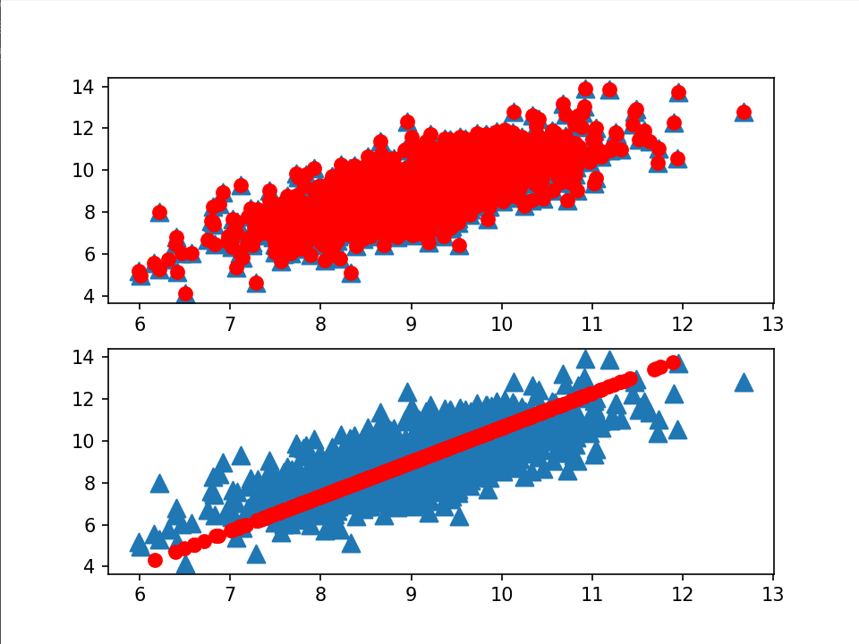

# 利用PCA来简化数据

|          | 描述                                 |
| -------- | ------------------------------------ |
| 优点     | 降低数据复杂性，识别最重要的多个特征 |
| 缺点     | 非必要，可能损失信息                 |
| 适用范围 | 数值型                               |

## 降维技术

**数据降维的原因**：

- 使得数据集更易使用；
- 降低很多算法的计算开销；
- 去除噪声；
- 使得结果易懂；

**降维的方法**：

- 主成分分析（Principal Component Analysis, PCA）。数据从原来的坐标系转化到了新的坐标系，新坐标系的选择是由数据本身决定的。第一个新坐标轴选择的是原始数据中方差最大的方向，第二个新坐标轴的选择和第一个坐标轴正交且具有最大方差的方向。重复选择新坐标轴，**即依次在保证正交前提下选择具有最大方差的方向**，最终大部分方差都包含在最前面的几个新坐标轴中。因此，忽略余下的坐标轴，达到降维的目的。

- 因子分析（Factor Analysis）。在因子分析中，我们假定在观察数据的生成中有一些观察不到的隐变量（latent variable）。假设观察数据时这些隐变量和某些噪声的线性组合。通过找到隐变量就可以实现数据的降维。
- 独立主成分分析（Independent Component Analysis, ICA）。ICA假设数据是从N个数据源生成的。假设数据位多个数据源的混合观察结果，这些数据源之间在统计上是相互独立的，而在PCA中假设数据是不相关的。同因子分析一样，如果数据源的数目少于观察数据的数目，则可以实现降维过程。

## PCA

### 移动坐标轴

在PCA中，对数据的坐标进行旋转，该旋转的过程取决于数据的本身。

第一条坐标轴旋转到覆盖数据的最大方差位置，即直线B。数据的最大方差给出了数据的最重要的信息。

第二条坐标轴与第一条正交（orthogonal）。利用PCA，将数据坐标轴旋转至数据角度上的那些最重要的方向。


### 降维

旋转并没有减少数据的维度。下面是旋转后的图像：


通过PCA进行降维处理,我们就可以同时获得 SVM和决策树的优点（**简单且效果好**）：

- 一 方面 ,得到了和决策树一样简单的分类器,同时分类间隔和SVM一样好，如上图，其中的数据来自于上面的图并经过PCA转换之后绘制而成的，如果仅使用原始数据,那么这里的间隔会比决策树的间隔更大。
- 另外 ,由于只需要考虑一维信息,因此数据就可以通过比SVM简单得多的很容易采用的规则进行区分 。

上图中，我们只需要一维信息即可，因为另一维信息只是对分类缺乏贡献的噪声数据。这样的好处在高纬度下会更加突出。


### PCA的实现

第一个主成分是从数据差异性最大（即方差最大）的方向提取出来的。第二个主成分来自数据差异性次大的方向，并且该方向与第一个主成分方向正交。通过数据集的协方差矩阵及其特征值分析，即可得这些主成分的值。得到协方差矩阵的特征向量，保留最大的N个值，这些特征向量也给出了N个最重要特征的真实结构。将数据乘上这N个特征值对应的特征向量将其转换到新的空间。

**也就是**：

1. 计算数据集的协方差矩阵
2. 计算协方差举证的特征值和特征向量
3. 取最大的N个特征值的特征向量
4. 将数据转换到由这N个特征向量构建的新空间中

**协方差**：

协方差是用来度量两个随机变量关系的统计量。它表现了两个变量在变化过程中是同方向变化？还是反方向变化？同向或反向程度如何？**从数值来看，协方差的数值越大，两个变量同向程度也就越大**。反之亦然。

$$
COV(X,Y)=E[(X-\mu_x)(Y-\mu_y)]
$$
**代码**

```python
# PAC算法
def pca(data_mat, top_n_feat=9999999):
    mean_vals = mean(data_mat, axis=0)              # 计算数据集的均值
    mean_removed = data_mat - mean_vals             # 数据集去中心化
    cov_mat = cov(mean_removed, rowvar=0)           # 计算协方差矩阵
    eig_vals, eig_vects = linalg.eig(mat(cov_mat))     # 计算协方差矩阵的特征值和特征向量
    eig_val_ind = argsort(eig_vals)                 # 对特征值进行排序，
    eig_val_ind = eig_val_ind[:-(top_n_feat + 1):-1]    # 得到前top_n_feat个特征值的索引
    red_eig_vects = eig_vects[:, eig_val_ind]       # 取对应的特征向量
    low_d_data_mat = mean_removed * red_eig_vects   # 转换到新空间
    recon_mat = (low_d_data_mat * red_eig_vects.T) + mean_vals      # 重构数据集
    return low_d_data_mat, recon_mat
```

**测试**

```python
from numpy import *
import matplotlib
import matplotlib.pyplot as plt

def load_data_set(file_name, delim="\t"):
    with open(file_name) as fr:
        string_arr = [line.strip().split(delim) for line in fr.readlines()]
        dat_arr = [list(map(float, line)) for line in string_arr]
    return mat(dat_arr)


# PAC算法
def pca(data_mat, top_n_feat=9999999):
    mean_vals = mean(data_mat, axis=0)              # 计算数据集的均值
    mean_removed = data_mat - mean_vals             # 数据集去中心化
    cov_mat = cov(mean_removed, rowvar=0)           # 计算协方差矩阵
    eig_vals, eig_vects = linalg.eig(mat(cov_mat))     # 计算协方差矩阵的特征值和特征向量
    eig_val_ind = argsort(eig_vals)                 # 对特征值进行排序，
    eig_val_ind = eig_val_ind[:-(top_n_feat + 1):-1]    # 得到前top_n_feat个特征值的索引
    red_eig_vects = eig_vects[:, eig_val_ind]       # 取对应的特征向量
    low_d_data_mat = mean_removed * red_eig_vects   # 转换到新空间
    recon_mat = (low_d_data_mat * red_eig_vects.T) + mean_vals      # 重构数据集
    return low_d_data_mat, recon_mat


if __name__ == '__main__':
    # test1
    data_mat = load_data_set("testSet.txt")
    low_d_mat, recon_mat = pca(data_mat, 2)

    fig = plt.figure()
    ax = fig.add_subplot(211)	# 不降维
    ax.scatter(data_mat[:, 0].flatten().A[0], data_mat[:, 1].flatten().A[0], marker="^", s=90)
    ax.scatter(recon_mat[:, 0].flatten().A[0], recon_mat[:, 1].flatten().A[0], marker="o", s=50, c="red")

    d_mat, recon_mat = pca(data_mat, 1)
    ax = fig.add_subplot(212)	# 降维
    ax.scatter(data_mat[:, 0].flatten().A[0], data_mat[:, 1].flatten().A[0], marker="^", s=90)
    ax.scatter(recon_mat[:, 0].flatten().A[0], recon_mat[:, 1].flatten().A[0], marker="o", s=50, c="red")

    plt.show()
```

原始数据是个二维数据，当`low_d_mat, recon_mat = pca(data_mat, 2)`，即不对数据进行降维时，可以得到与原输出重合的图像。



## 示例 利用PCA对半导体制造数据降维

**用平均值代替NaN值**

几乎所有的数据都存在缺失值（用NaN代替）

```
# 用平均数值代替NaN值
def replace_nan_with_mean():
    dat_mat = load_data_set('secom.data', ' ')
    num_feat = shape(dat_mat)[1]
    for i in range(num_feat):
        mean_val = mean(dat_mat[nonzero(~isnan(dat_mat[:, i].A))[0], i])  # 非 NaN 值的均值
        dat_mat[nonzero(isnan(dat_mat[:, i].A))[0], i] = mean_val  # 将 NaN 值替换为均值
    return dat_mat
```

**测试**

```python
if __name__ == '__main__':
    # test2
    data_mat = replace_nan_with_mean('secom.data')
    mean_vals = mean(data_mat, axis=0)
    mean_removed = data_mat - mean_vals
    cov_mat = cov(mean_removed, rowvar=0)
    eig_vals, eig_vects = linalg.eig(mat(cov_mat))
    # print eigVals
    print('方差总和：', sum(eig_vals))
    print(f'前1的方差和：{sum(eig_vals[:1])},占比为:{round((sum(eig_vals[:1]) / sum(eig_vals)) * 100, 3)}%')
    print(f'前3的方差和：{sum(eig_vals[:3])},占比为:{round((sum(eig_vals[:3]) / sum(eig_vals)) * 100, 3)}%')
    print(f'前6的方差和：{sum(eig_vals[:6])},占比为:{round((sum(eig_vals[:6]) / sum(eig_vals))*100,3)}%')
    print(f'前20的方差和：{sum(eig_vals[:20])},占比为:{round((sum(eig_vals[:20]) / sum(eig_vals)) * 100, 3)}%')
    plt.plot(eig_vals[:20])  # 对前20个画图观察
    plt.show()
```

**结果**


从图像上可以看出前20个主要成分的方差占比表现出比较大的衰减趋势，说明少数主要成分就包含了绝大部分的信息。


从这张占比结果可以更直接地展示累积占比的结果，只要6个主要成分就可以覆盖数据96.8的方差。