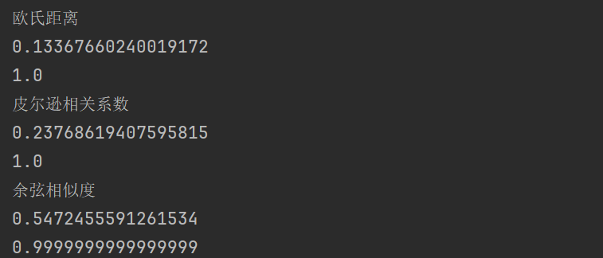
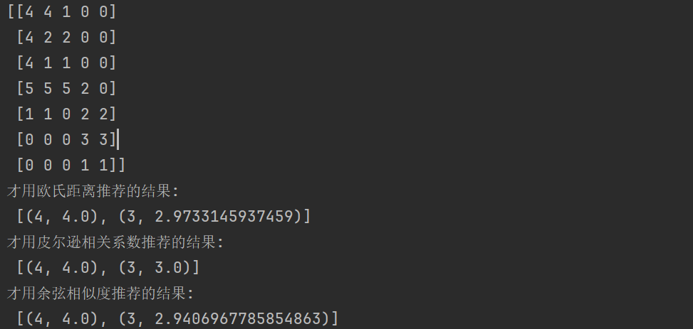
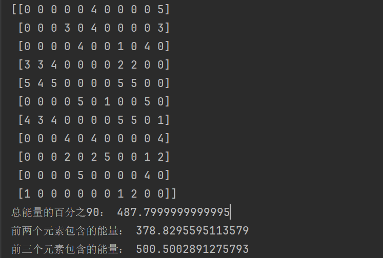
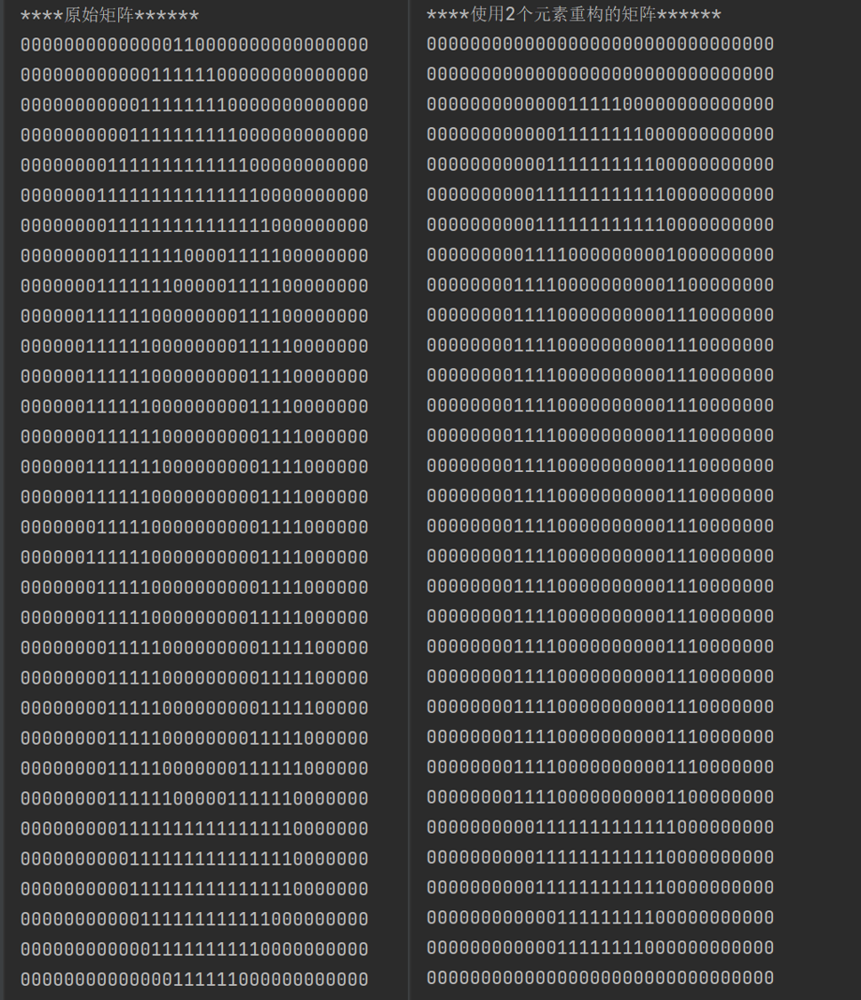

# 利用SVD简化数据

|          | 描述                               |
| -------- | ---------------------------------- |
| 优点     | 简化数据，去除噪声，提高算法的结果 |
| 缺点     | 数据的转换可能难以理解             |
| 适用类型 | 数值型                             |

## 奇异值分解的应用

奇异值分解(Singular Value Decomposition,SVD)。

在隐性语义索引中(Latent Semantic Indexing，LSI)，我们将一个文档用一个矩阵(term-document)表示，在这个矩阵的基础上运用SVD对其分解，便可以得到它的某个低秩逼近，在这个低秩逼近下，可以为每个文档产生一个新的表示(奇异值)。这些奇异值代表了文档的概念或者主题，因此可以用于加快文档检索。

SVD的另一个应用就是推荐系统。简单版本的推荐系统能够计算项或者人之间的相似度。更先进的方法则先利用SVD从数据中构建一个主题空间，然后再在该空间下计算其相似度。

## 矩阵分解

SVD是矩阵分解的一种类型，矩阵分解的目的是将矩阵分成多个独立的部分。我们可以将这种分解的过程想象成代数中的因子分解。如何将12分解成两个数的乘积？(1,12)(2,6)(3,4)都是合理的答案。

不同矩阵分解技术有不同的性质，运用于不同方面，而SVD则是最常见的一种分解技术。它将矩阵$Data$分解成三个矩阵$U 、\Sigma和V^T$

假如矩阵$Data$的维度是$m \times n$，$U 、\Sigma和V^T$这三个矩阵的维度分别是$m \times m、m \times n 、n \times n$，所以用公式表达就是

$$Data_{m \times n} = U_{m \times m}\Sigma_{m \times n}V^T_{n \times n}$$

其中$\Sigma$是一个对角矩阵，也就是奇异值矩阵，而且其对角元素是从大到小排列的，被称为奇异值。而且在科学和工程中，一直存在着一个普遍的事实：在某个奇异值的数目($r$个)之后，其他奇异值都置为0。这意味着数据集中仅有$r$个重要特征，而其余特征都是噪声或者是冗余特征。$U$被称为左奇异矩阵，$V^T$则是右奇异矩阵，两者都是单位正交矩阵。SVD的目的是，对任意$m\times n$的矩阵，找到一组正交基使得经过它变换后还是正交基。

## SVD的实现

python的numpy库中有一个称为linalg的工具，有svd函数可以对矩阵进行svd处理

```python
def load_ex_data():
    return array([
        [1, 1, 1, 0, 0],
        [2, 2, 2, 0, 0],
        [1, 1, 1, 0, 0],
        [5, 5, 5, 0, 0],
        [1, 1, 0, 2, 2],
        [0, 0, 0, 3, 3],
        [0, 0, 0, 1, 1]
    ])  # 为了方便运算，使用array格式


if __name__ == '__main__':
    # test1
    data_arr = load_ex_data()
    m, n = np.shape(data_arr)
    U, Sigma, VT = la.svd(data_arr)  # 调用linalg中封装好的svd函数
```

奇异值越大的时候，代表的信息越多，可以观察到后两个数值非常小，我们可以将它们去掉，那么原始数据集$Data$与分解出来的矩阵$U 、\Sigma和V^T$的关系就变成了近似关系。即:
$$
Data_{m \times n} \approx U_{m \times m}\Sigma_{m \times n}V^T_{n \times n}
$$
但是就算后面的数值再小，当我们去掉越多这样奇异值，我们的近似关系会变得不理想。

不过，我们可以观察到，奇异值是下降非常快的。一般来说取前30%左右的奇异值就能还原绝大部分的数据。我们也可以根据我们想要保留的数据程度选择奇异值的数量，这跟PCA非常相似。

**方法**1：

我们去除后面两个奇异值之后，采用前面三个奇异值来重新构建$Data$

我们去除后面两个奇异值之后，采用前面三个奇异值来重新构建$Data$

```python
if __name__ == '__main__':
    # test1
    data_arr = load_ex_data()
    m, n = np.shape(data_arr)
    U, Sigma, VT = la.svd(data_arr)  # 调用linalg中封装好的svd函数
    print("Sigma:\n:", Sigma)

    Sig3 = np.mat(np.array([[Sigma[0], 0, 0], [0, Sigma[1], 0], [0, 0, Sigma[2]]]))
    print("重构:\n", U[:, :3] * Sig3 * VT[:3, :])
```

**输出结果**

```
Sigma:
: [9.72140007e+00 5.29397912e+00 6.84226362e-01 4.11502614e-16
 1.36030206e-16]
重构结构:
 [[ 1.00000000e+00  1.00000000e+00  1.00000000e+00  7.75989921e-16
   7.71587483e-16]
 [ 2.00000000e+00  2.00000000e+00  2.00000000e+00  3.00514919e-16
   2.77832253e-16]
 [ 1.00000000e+00  1.00000000e+00  1.00000000e+00  2.18975112e-16
   2.07633779e-16]
 [ 5.00000000e+00  5.00000000e+00  5.00000000e+00  3.00675663e-17
  -1.28697294e-17]
 [ 1.00000000e+00  1.00000000e+00 -5.48397422e-16  2.00000000e+00
   2.00000000e+00]
 [ 3.21319929e-16  4.43562065e-16 -3.48967188e-16  3.00000000e+00
   3.00000000e+00]
 [ 9.71445147e-17  1.45716772e-16 -1.52655666e-16  1.00000000e+00
   1.00000000e+00]]
```

由于$Sig$只是$3x3$矩阵，因此也只需要使用矩阵$U$的前$3$列与$V^T$的前三行。可以看到重构出来的矩阵与原始矩阵的数值非常接近。

如果你不理解为什么只需要使用矩阵$U$的前$3$列与$V^T$的前三行，也可以看下面的代码，我们沿用上面重构矩阵的代码展示Sigma的值。

**方法2：**

可以看到Sigma应该是一个$m \times n$矩阵，但是只有左上角才存在值其余都为零。显然，一整列或行都是零的话，在矩阵相乘运算中得到的结果也是零，对结果不产生影响 。因此可以取矩阵$U$的前$3$列与$V^T$的前三行简化计算，也可以节省空间。

```python
Sig = Sigma[:3]#取前3个特征值
if m > n:
    for i in range(m - len(Sig)):
        Sig = np.append(Sig,0)
else:
    for i in range(n - len(Sig)):
        Sig = np.append(Sig,0)
print(np.diag(Sig)[:m,:n])
#现在的数据类型是numpy.array,所以要用np.dot()进行矩阵乘法
print(np.dot(np.dot(U,np.diag(Sig)[:m,:n]),VT))
```

**输出结果**

```
[[9.72140007 0.         0.         0.         0.        ]
 [0.         5.29397912 0.         0.         0.        ]
 [0.         0.         0.68422636 0.         0.        ]
 [0.         0.         0.         0.         0.        ]
 [0.         0.         0.         0.         0.        ]
 [0.         0.         0.         0.         0.        ]
 [0.         0.         0.         0.         0.        ]]
array([[ 1.00000000e+00,  1.00000000e+00,  1.00000000e+00,
        -2.84366098e-16, -2.94015497e-16],
       [ 2.00000000e+00,  2.00000000e+00,  2.00000000e+00,
         4.47489534e-16,  4.28190736e-16],
       [ 1.00000000e+00,  1.00000000e+00,  1.00000000e+00,
         3.09573758e-16,  2.99924358e-16],
       [ 5.00000000e+00,  5.00000000e+00,  5.00000000e+00,
        -1.47703573e-16, -1.95842150e-16],
       [ 1.00000000e+00,  1.00000000e+00, -5.70229711e-16,
         2.00000000e+00,  2.00000000e+00],
       [-7.49390630e-17,  9.96896569e-16, -1.34350906e-15,
         3.00000000e+00,  3.00000000e+00],
       [-8.18314124e-17,  2.75447132e-16, -3.13743829e-16,
         1.00000000e+00,  1.00000000e+00]])
```

可以看到两种计算方法得出的结果是一致的，而且显然U[:,:3]*Sig3*VT[:3,:]需要的存储空间、运算次数都要比前一种少，因此是推荐使用U[:,:3]*Sig3*VT[:3,:]来进行计算。

## 基于协同过滤的推荐引擎

### 相似度计算

在聚类的时候，我们知道，非常相近或相似的数据容易被归成一类。在这里，我们也可以通过计算用户或物品之间的相似度，得到用户或物品之间的相似度。这样就可以预测到未知的用户的喜好。比如,我们尝试对某个用户喜欢的电影进行预测，推荐引擎会发现有一部电影该用户没看过，然后计算该电影与用户看过的电影之间的相似度，如果其相似度很高，推荐算法就认为用户喜欢这部电影。

所以我们得先了解一下相似度应该怎么计算。

#### **欧式距离**

在聚类当中，相似度可以通过距离来体现。在这里也是如此。最常见的距离度量就是欧氏距离。 对于下面这个矩阵：

|       | 鳗鱼饭 | 日式炸鸡排 | 寿司饭 | 烤牛肉 | 手撕猪肉 |
| ----- | ------ | ---------- | ------ | ------ | -------- |
| Jim   | 2      | 0          | 0      | 4      | 4        |
| John  | 5      | 5          | 5      | 3      | 3        |
| Sally | 2      | 4          | 2      | 1      | 2        |

我们用欧氏距离来计算手撕猪肉和烤牛肉之间的相似度：

$$\sqrt{(4-4)^2+(3-3)^2+(2-1)^2} = 1$$

而手撕猪肉和鳗鱼饭的欧氏距离为：

$$\sqrt{(4-2)^2+(3-5)^2+(2-2)^2} = 2.83$$

我们可以将距离归一化到$(0,1]$之间。当距离为$0$时，相似度为$1$.如果距离非常大，那么相似度也趋于$0$.

$$相似度 = \frac{1}{1+距离}$$

#### **皮尔逊相关系数**

第二种可以用来计算距离的方法是皮尔逊相关系数。皮尔逊系数相对于欧氏距离有个优势在于，它对用户评级的量级不敏感。比如说一个人对所有物品的评分都是5分，而另一个人对所有物品的评分是1分，皮尔逊相关系数会认为这两个向量是相等的。皮尔逊相关系数的取值范围在$[-1,+1]$之间，我们用$0.5+0.5*corrcoef()$计算它并将它归一化到0到1之间。

#### **余弦相似度**

第三种则是余弦相似度，它计算两个向量夹角的余弦值，如果夹角为$90^o$，则相似度为0;如果两个向量的方向相同，其相似度就为$1$。余弦相似度的取值范围也在$-1$到$1$之间

向量$A$与$B$夹角的余弦相似度计算如下： $$cos\theta = \frac{A\cdot B}{\left\|A\right\|\left\|B\right\|}$$

$\left\|A\right\|$、$\left\|B\right\|$表示向量$A、B$的$2$范数.我们可以使用linalg.norm()来计算它

#### **代码实现**

```python
# 计算欧式距离
def eclud_sim(a, b):
    return 1.0 / (1.0 + la.norm(a - b))


# 皮尔逊相关系数
def pears_sim(a, b):
    if len(a) < 3:
        return 1.0
    return 0.5 + 0.5 * np.corrcoef(a, b, rowvar=0)[0][1]


# 余弦相似度
def cos_sim(a, b):
    num = float(a.T * b)
    denom = la.norm(a) * la.norm(b)
    return 0.5 + 0.5 * (num / denom)
```

**结果**



###  基于物品的相似度和基于用户的相似度

**菜肴之间的距离：**基于物品（item-based）的相似度

**用户之间的距离：**基于用户（user-based）的相似度

行与行之间比较的是基于用户的相似度，列与列之间比较的则是基于物品的相似度。

选择依据是基于物品和用户的数量，哪个多就选哪个对于大部分产品导向的推荐系统而言，用户的数量往往大于物品的数量，即购买商品的用户数会多于出售的商品种类。

### 推荐引擎的评价

采用**交叉测试**的方法

具体做法就是我们将某些已知的评分值去掉，然后对它们进行预测，最后计算预测值与真实值之间的差异。通常使用的指标为**最小均方根误差**（Root Mean Squared Error, RMSE）。

## 示例 餐馆菜肴推荐引擎

假设他不知道去哪里吃饭，该点什么菜，则我们的系统可以推荐给他。

**步骤：**

1）构建一个基本引擎，能够寻找用户没有品尝过的菜肴

2）通过SVD来减少特征空间，并提高推荐效果

3）将程序打包并通过用户可读的人机界面提供给人们使用

### 推荐未尝过的菜肴

给定一个用户，系统会为此用户返回N个最好的推荐菜。需要：

1. 寻找用户没有评级的菜肴，即在用户-物品矩阵中的0值。
2. 在用户没有评级的所有物品中，对每个物品预计一个可能的评级分数。
3. 对这些物品的评分从高到低进行排序，返回前N个物品。

```python
import numpy as np
from numpy import linalg as la


def load_ex_data():
    return np.array([
        [1, 1, 1, 0, 0],
        [2, 2, 2, 0, 0],
        [1, 1, 1, 0, 0],
        [5, 5, 5, 0, 0],
        [1, 1, 0, 2, 2],
        [0, 0, 0, 3, 3],
        [0, 0, 0, 1, 1]
    ])  # Using np.array for convenience


# 计算欧式距离
def eclud_sim(a, b):
    return 1.0 / (1.0 + la.norm(a - b))


# 皮尔逊相关系数
def pears_sim(a, b):
    if len(a) < 3:
        return 1.0
    return 0.5 + 0.5 * np.corrcoef(a, b, rowvar=0)[0][1]


# 余弦相似度
def cos_sim(a, b):
    num = float(a.T * b)
    denom = la.norm(a) * la.norm(b)
    return 0.5 + 0.5 * (num / denom)


def stand_est(in_data_mat, user, sim_meas, item):
    # 数据中行为用于，列为物品，n即为物品数目
    n = np.shape(in_data_mat)[1]  # 获取物品数目
    sim_total = 0.0  # 相似度总和
    rat_sim_total = 0.0  # 评分与相似度乘积的总和
    # 用户的第j个物品
    for j in range(n):
        user_rating = in_data_mat[user, j]  # 用户对物品的评分
        if user_rating == 0:
            continue
        # 寻找两个用户都评级的物品
        overLap = np.nonzero(np.logical_and(in_data_mat[:, item].A > 0, in_data_mat[:, j].A > 0))[0]

        if len(overLap) == 0:
            similarity = 0
        else:
            similarity = sim_meas(in_data_mat[overLap, item], in_data_mat[overLap, j])  # 计算相似度

        sim_total += similarity  # 更新相似度总和
        rat_sim_total += sim_total * user_rating  # 更新评分与相似度乘积的总和

    if sim_total == 0:
        return 0
    else:
        return rat_sim_total / sim_total  # 返回评分估计值


def recommend(in_data_mat, user, N=3, sim_meas=cos_sim, est_method=stand_est):
    unrated_items = np.nonzero(in_data_mat[user, :].A == 0)[1]  # 找出用户未评分的物品
    if len(unrated_items) == 0:
        return '这里没有你喜欢吃的'
    item_scores = []
    for item in unrated_items:
        estimated_score = est_method(in_data_mat, user, sim_meas, item)  # 使用指定方法估计用户对物品的评分
        item_scores.append((item, estimated_score))
    return sorted(item_scores, key=lambda jj: jj[1], reverse=True)[:N]  # 返回前N个评分最高的物品
    
if __name__ == '__main__':
    # 推荐系统
    # 重新设计矩阵
    data_mat = np.mat(load_ex_data())
    data_mat[0, 1] = data_mat[0, 0] = data_mat[1, 0] = data_mat[2, 0] = 4
    data_mat[3, 3] = 2
    print(data_mat)
    print("才用欧氏距离推荐的结果:\n", recommend(data_mat, user=2, sim_meas=eclud_sim))
    print("才用皮尔逊相关系数推荐的结果:\n", recommend(data_mat, user=2, sim_meas=pears_sim))
    print("才用余弦相似度推荐的结果:\n", recommend(data_mat, user=2, sim_meas=cos_sim))
```

**推荐结果**



### 利用SVD提高推荐的效果

#### **能量分析**

```
def load_ex_data2():
    return [[0, 0, 0, 0, 0, 4, 0, 0, 0, 0, 5],
            [0, 0, 0, 3, 0, 4, 0, 0, 0, 0, 3],
            [0, 0, 0, 0, 4, 0, 0, 1, 0, 4, 0],
            [3, 3, 4, 0, 0, 0, 0, 2, 2, 0, 0],
            [5, 4, 5, 0, 0, 0, 0, 5, 5, 0, 0],
            [0, 0, 0, 0, 5, 0, 1, 0, 0, 5, 0],
            [4, 3, 4, 0, 0, 0, 0, 5, 5, 0, 1],
            [0, 0, 0, 4, 0, 4, 0, 0, 0, 0, 4],
            [0, 0, 0, 2, 0, 2, 5, 0, 0, 1, 2],
            [0, 0, 0, 0, 5, 0, 0, 0, 0, 4, 0],
            [1, 0, 0, 0, 0, 0, 0, 1, 2, 0, 0]]

if __name__ == '__main__':
    # 利用svd进行评分估计
    data_mat = np.mat(load_ex_data2())
    print(data_mat)

    U, sigma, VT = la.svd(data_mat)
    sig2 = sigma**2
    print("总能量的百分之90：", sum(sig2)*0.9)
    print("前两个元素包含的能量：", sum(sig2[:2]))
    print("前三个元素包含的能量：", sum(sig2[:3]))
```

**结果**



首先从能量来看，前三个元素包含的能量就已经超过百分之90了，这就已经足够了。因此可以将一个11维度的矩阵转换成一个3维的矩阵。

```python
# 对转换后的三维函数构造出一个相似度计算函数
def svd_est(in_data_mat, user, sim_meas, item):
    n = np.shape(in_data_mat)[1]
    sim_total = 0.0
    rat_sim_total = 0.0
    U, sigma, VT = la.svd(in_data_mat)
    sig3 = np.mat(np.eye(3) * sigma[:3])  # 化为对角阵
    xformed_items = in_data_mat.T * U[:, :3] * sig3.I  # 构造转换后的物品
    for j in range(n):
        userRating = in_data_mat[user, j]
        if userRating == 0 or j == item:
            continue
        similarity = sim_meas(xformed_items[item, :].T, xformed_items[j, :].T)
        print("the %d and %d similarity is: %f" % (item, j, similarity))
        sim_total += similarity
        rat_sim_total += similarity * userRating
    if sim_total == 0:
        return 0
    else:
        return rat_sim_total / sim_total
```

#### **分析效果**

```
if __name__ == '__main__':
    # 利用svd进行评分估计
    data_mat = np.mat(load_ex_data2())
    print(data_mat)

    U, sigma, VT = la.svd(data_mat)
    sig2 = sigma**2

    print("采用欧氏距离推荐的结果:\n", recommend(data_mat, user=2, sim_meas=eclud_sim, est_method=svd_est))
    print("采用皮尔逊相关系数推荐的结果:\n", recommend(data_mat, user=2, sim_meas=pears_sim, est_method=svd_est))
    print("采用余弦相似度推荐的结果:\n", recommend(data_mat, user=2, sim_meas=cos_sim, est_method=svd_est))
```

**结果**

```python
采用欧氏距离推荐的结果:
#  [(6, 2.946520651960309), (5, 2.9428763095508192), (10, 2.9341544767772625)]
# the 0 and 4 similarity is: 0.541944
# the 0 and 7 similarity is: 0.996672
# ...
# the 10 and 7 similarity is: 0.037735
# the 10 and 9 similarity is: 0.608674
# 采用皮尔逊相关系数推荐的结果:
#  [(5, 3.917667222165057), (10, 3.9088240993359507), (3, 3.9069463839564924)]
# the 0 and 4 similarity is: 0.489848
# the 0 and 7 similarity is: 0.997586
# the 0 and 9 similarity is: 0.489417
# ...
# the 10 and 7 similarity is: 0.519452
# the 10 and 9 similarity is: 0.502871
# 采用余弦相似度推荐的结果:
#  [(6, 3.24791771539204), (3, 3.0151494007822794), (5, 3.0028191340584653)]
```

### 构建推荐引擎面临的挑战

**存在的问题**

- 在大规模的数据集上，SVD分解会降低程序的速度
- 存在其他很多规模扩展性的挑战性问题，比如矩阵的表示方法和计算相似度得分消耗资源。
- 如何在缺乏数据时给出好的推荐-称为冷启动【简单说：用户不会喜欢一个无效的物品，而用户不喜欢的物品又无效】

**解决的方法**

- 在大型系统中，SVD分解(可以在程序调入时运行一次)每天运行一次或者其频率更低，并且还要离线运行。
- 在实际中，另一个普遍的做法就是离线计算并保存相似度得分。(物品相似度可能被用户重复的调用)
- 对于冷启动问题，解决方案就是将推荐看成是搜索问题，将物品的标签／属性特征作为相似度进行计算，进行**基于内容的推荐**。

## 示例 基于SVD的图像压缩

使用手写体“0”来展开SVD对图像的压缩，原始图像大小为32*32=1024，进行图像压缩以后，就可以节省空间或带宽开销了。

```python
def print_mat(in_mat, thresh=0.8):
    for i in range(32):
        for k in range(32):
            if float(in_mat[i, k]) > thresh:
                print(1,end='')
            else:
                print(0,end='')
        print('')


def img_compress(num_sv=3, thresh=0.8):
    myl = []
    for line in open('0_5.txt').readlines():
        new_row = []
        for i in range(32):
            new_row.append(int(line[i]))
        myl.append(new_row)
    my_mat = np.mat(myl)
    print("****原始矩阵******")
    print_mat(my_mat, thresh)
    U, sigma, VT = la.svd(my_mat)
    sig_recon = np.mat(np.zeros((num_sv, num_sv)))
    for k in range(num_sv):
        sig_recon[k, k] = sigma[k]
    recon_mat = U[:, :num_sv] * sig_recon * VT[:num_sv, :]
    print(f"****使用{num_sv}个元素重构的矩阵******")
    print_mat(recon_mat, thresh)


if __name__ == '__main__':
    # 基于SVD的图像压缩
    img_compress(2)
```

**结果比较**



可以看到需要2个奇异值就可以得到相当精准的重构。*U*和*V*<sup>T</sup>都是32×2的矩阵，有两个奇异值，因此一共只有64+64+2=130个数字，而原本有32×32=1024个数字，相当于得到了十倍的压缩。

