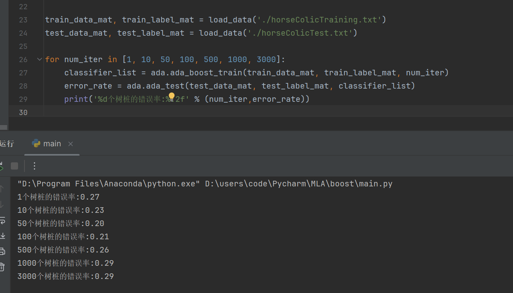

# AdaBoost元算法

## AdaBoost

|          | 说明                                                       |
| -------- | ---------------------------------------------------------- |
| 适用类型 | 数值型和标称型                                             |
| 优点     | 泛化错误率低，易编码，可以应用在大部分分类器上，无参数调整 |
| 缺点     | 对离群点敏感                                               |

### 元算法

又叫作集成方法，是对其他算法进行组合的一种方式，其背后的思路就是考虑吸取**多个专家**而不只是一个人的意见。

组合的方式有很多种可以是：

- 不同算法的组合
- 也可以是同意算法在不同设置下的组合
- 还可以时数据集不同部分分配给不同分类器之后的组合


### bagging：基于数据随机重抽样的分类器构建方法

自举汇聚法（bootstrap aggregating），也称bagging方法，是在从原始数据集选择s次后得到s个新数据集的一种技术。新数据集和原数据集**大小相等**。每个数据集都是通过在原始数据集中随机选择一个样本来进行替换而得到的。这里的替换就意味着可以多次地选择同一个样本。这一性质就**允许新数据集中可以有重复的值**，而原始数据集的某些值在新集合中则不再出现。  

在s个数据集建好之后，将某个学习算法分别作用于每个数据集就得到了s个分类器。当我们要对新数据进行分类时，就可以应用这s个分类器进行分类。与此同时，选择分类器投票结果中最多的类别作为最后的分类结果。 


### boosting

是一种与bagging很类似的技术。下面是两者的对比表：

|            | boosting                                 | bagging                            |
| ---------- | ---------------------------------------- | ---------------------------------- |
| 分类器类型 | 相同类型                                 | 相同类型                           |
| 训练方式   | 串行，下一个分类器侧重于前一个错分的数据 | 并行，每个分类器独立而且平等地训练 |
| 分类器权重 | 分类器权重不同，依据它们的错误率加权     | 所有分类器权重相等                 |
| 分类结果   | 加权求和                                 | 多数投票                           |


boosting的版本有很多，Adaboost（自适应boosting）则是boosting最流行的一个版本。

其运行过程如下：

1. 训练数据中的每个样本，并赋予其一个权重，这些权重构成了向量D。这些权重会被**初始化成相等的值**
2. 在训练数据上训练一个弱分类器并计算其错误率
3. 同一数据集上再次训练弱分类器，并调整权重，分对的样本的权重将会**降低**，分错的样本的权重**提高**
4. 计算每个分类器的权重值 α 
5. 分类结果为所有分类器的加权和

其中，

错误率定义为：
$$
\varepsilon=\frac{未正确分类的样本数}{总样本数}
$$
分类器的权重值α定义为：
$$
\alpha = \frac{1}{2}ln(\frac{1-\varepsilon}{\varepsilon})
$$
权重向量D的更新方法：

- 如果被正确分类

$$
D_i^{(t+1)}=\frac{{D_i^{(t)}}e^{-\alpha}}{Sum(D)}
$$


- 如果被分类错误:

$$
D_i^{(t+1)}=\frac{{D_i^{(t)}}e^{\alpha}}{Sum(D)}
$$

由于二分类的分类取值为±1，故分类正确时原标签与预测标签的乘积为1，错误时为-1，因此上述公式中的符号可以用下式确定：
$$
sign=-(label^{old}*label^{est})
$$


最终的更新公式为：
$$
D_i^{(t+1)}=\frac{{D_i^{(t)}}e^{sign*\alpha}}{Sum(D)}
$$


### 训练算法：基于错误提升分类器的性能

### 基于单层决策树构建弱分类器

单层决策树是一种简单的决策树。由于这棵树只有一次分裂过程，因此实际上它只是一个树桩。

```python
def stump_classify(data_mat, dimen, thresh_val, thresh_ineq):
    """
    :param data_mat:    输入的数据矩阵
    :param dimen:       选择的特征的索引
    :param thresh_val:  分类阈值
    :param thresh_ineq: 阈值的比较运算符，"lt"小于等于,"gt"大于
    :return:分类结果数组
    """
    ret_array = np.ones((np.shape(data_mat)[0], 1))
    if thresh_ineq == 'lt':
        ret_array[data_mat[:, dimen] <= thresh_val] = -1.0
    else:
        ret_array[data_mat[:, dimen] > thresh_val] = -1.0
    return ret_array


def build_stump(data_arr, class_labels, d_vector):
    """
    :param data_arr:        输入的数据数组
    :param class_labels:    输入样本的标签数组
    :param d_vector:        样本权重的向量
    :return:                详细信息 best_stump、最小错误率 min_error和最佳分类结果 best_class
    """
    data_mat_in = np.mat(data_arr)
    label_mat = np.mat(class_labels).T
    m, n = np.shape(data_mat_in)
    num_steps = 10.0
    best_stump = {}
    best_class = np.mat(np.zeros((m, 1)))

    min_error = inf
    # 对样本的每个特征
    for i in range(n):
        range_min = data_mat_in[:, i].min()
        range_max = data_mat_in[:, i].max()
        step_size = (range_max - range_min) / num_steps
        # 对每个步长
        for j in range(-1, int(num_steps) + 1):
            # 对每个不等号
            for inequal in ['lt', 'gt']:
                thresh_val = (range_min + float(j) * step_size)
                predicted_vals = stump_classify(data_mat_in, i, thresh_val, inequal)
                err_arr = np.mat(np.ones((m, 1)))
                # 降低分类正确的样本的权重，将分类正确的设置错误权重为0，错误的为1
                err_arr[predicted_vals == label_mat] = 0
                # 计算加权错误率
                weighted_err = (d_vector.T * err_arr)
                # print(weighted_err)
                # print("split:dim%d,thresh: %0.2f,thresh inequal:%s,the weighted error is %0.3f" % (i,thresh_val,inequal,weighted_err))
                # 如果当前的加权错误率较小，则当前分类为最佳分类best_class，更新min_error的值和best_step字典
                if weighted_err < min_error:
                    min_error = weighted_err
                    best_class = predicted_vals.copy()
                    best_stump['dim'] = i
                    best_stump['thresh'] = thresh_val
                    best_stump['ineq'] = inequal
    # print("best_stump=%s" % best_stump)
    return best_stump, min_error, best_class
```

### 完整的AdaBoost算法

- 通过与真实类别标签 class_labels 比较，生成一个布尔值的数组，表示哪些样本被错误分类

  `np.sign(agg_class_est) != np.mat(class_labels_in).T`

```python
def ada_boost_train(data_mat_in, class_labels_in, num_iter=40):
    """

    :param data_mat_in:         输入的数据矩阵
    :param class_labels_in:     输入样本的标签数组
    :param num_iter:            最大迭代次数，默认40
    :return:                    弱分类器列表
    """
    # 弱分类器列表
    weak_class_arr = []
    m, n = data_mat_in.shape
    # 每个样本的权重向量
    d_vector = np.mat(np.ones((m, 1)) / m)
    # 累积预测结果
    agg_class_est = np.mat(np.zeros((m, 1)))

    for _ in range(num_iter):
        # 寻找最佳的单层决策树
        stump, error, class_est = build_stump(data_mat_in, class_labels_in, d_vector)
        # 计算权重值alpha
        alpha = float(0.5 * np.log((1.0 - error) / error))  # 使用 max(error, 1e-16) 是为了避免发生除零错误
        stump['alpha'] = alpha
        weak_class_arr.append(stump)
        # 更新权重向量D
        expon = np.multiply(-1 * alpha * np.mat(class_labels_in).T, class_est)
        d_vector = np.multiply(d_vector, np.exp(expon))
        d_vector = d_vector / d_vector.sum()

        # 分类的结果是各分类器权重的加权和
        agg_class_est += alpha * class_est
        # 通过与真实类别标签 class_labels 比较，生成一个布尔值的数组，表示哪些样本被错误分类
        agg_errors = np.multiply(np.sign(agg_class_est) != np.mat(class_labels_in).T, np.ones((m,1)))
        error_rate = agg_errors.sum()/m

        print('class_est:', class_est.T)
        print('agg_class_est:', agg_class_est)
        print('total error:', error_rate, '\n')
        if error_rate == 0.0:
            break

    return weak_class_arr
```

### 测试算法：基于AdaBoost的分类

```python
def ada_classify(data_in, weak_classifier_list):
    data_mat_in = np.mat(data_in)
    m, n = data_mat_in.shape
    # 累积预测结果
    agg_class_est = np.mat(np.zeros((m, 1)))

    # 对每个弱分类器
    for classifier in weak_classifier_list:
        # 得到当前分类器的分类预估值
        class_est = stump_classify(data_mat_in, classifier['dim'], classifier['thresh'], classifier['ineq'])
        # 得到分类结果
        agg_class_est += classifier['alpha'] * class_est
        print(agg_class_est)

    return np.sign(agg_class_est)
```

## 示例：马疝病

### 数据的处理

- 与之前不同的是，需要将标签处理成±1，而不是原本的1,0

```python
def load_data(file_path):
    with open(file_path, 'r') as f:
        num_feat = len(f.readline().split('\t'))

        data_mat = []
        label_mat = []
        for line in f.readlines():
            line_arr = []
            line = line.strip().split('\t')
            for i in range(num_feat - 1):
                line_arr.append(float(line[i]))
            data_mat.append(line_arr)
            if float(line[-1]) == 1.0:
                label_mat.append(1.0)
            else:
                label_mat.append(-1.0)
        return data_mat, label_mat
```

### 测试函数

```python
def ada_test(test_data_mat, data_label, classifier_list):
    test_data_mat = np.mat(test_data_mat)
    m, n = test_data_mat.shape
    label_est = ada_classify(test_data_mat, classifier_list)

    err_arr = np.ones((m, 1))
    err_rate = err_arr[label_est != np.mat(data_label).T].sum() / m

    return err_rate
```

### 运行结果



根据结果可以发现，增加树桩的数量可以降低错误率达到更好的分类效果，但是当随着树桩的数量超过某一个值之后就会出现过拟合的现象，错误率反而增加