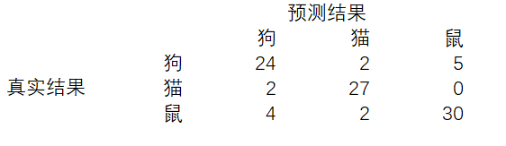
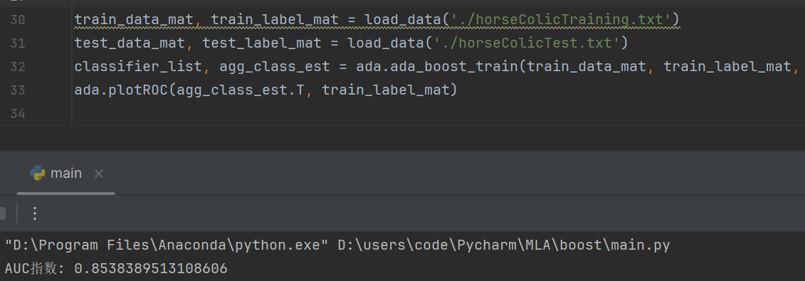
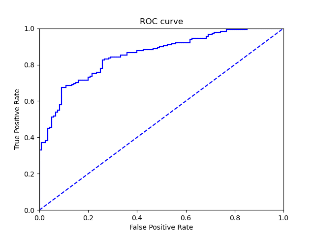
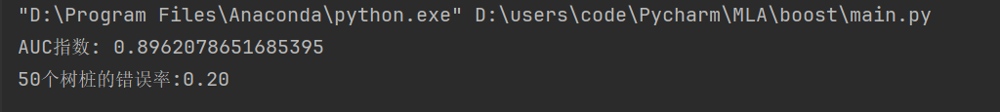
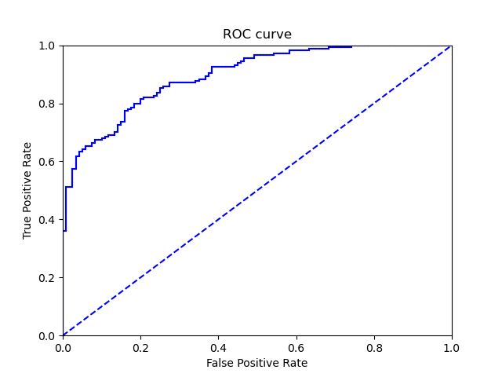
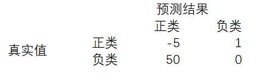

# 非均衡分类问题

预测是存在错误率的，在现实中，不同类别的分类代价是不同的，比如被预测会病死的马可能会被主人安乐死、患病的人得不到及时的救护等等，这些都会导致严重的后果。所以我们需要思考一些新的分类器性能度量方法。

## 混淆矩阵

下图是一个三类问题的混淆矩阵，通过混淆矩阵可以更好地理解分类中的错误了。如果混淆矩阵是个对角矩阵，则是一个完美的矩阵。



对于二分类问题，如果一个正类分类成正类称为真正例（TP）；如果一个负类分类成负类称为真反例（TN）；相应的有伪正例（FP），伪反例（FN）。


## 其他分类指标：正确率、召回率和ROC曲线

- **正确率**：预测为正例的样本中的真正正例的比例（ TP / ( TP + FP ) ）
- **召回率**：预测为正例的真实正例占所有真实正例的比例 （ TP / ( TP + FN ) ）
- **ROC曲线**：ROC代表接收者操作特征；
  - 横轴是伪正例的比例（假阳率），纵轴是真正例的比例（真阳率）；
  - ROC曲线给出的是当阙值变化时假阳率和真阳率的变化情况，虚线给出的是随机猜测的结果曲线；
  - ROC曲线不但可以用于比较分类器，还可以基于成本效益分析来做出决策；
  - 在理想的情况下，最佳的分类器应该尽量地处于左上角，这就意味着在假阳率很低地情况下同时获得了很高地正阳率。
  - ROC 曲线的比较指标是AUC（曲线下地面积 ），AUC 给出的是分类器的平均性能值，一个完美分类器的AUC 为 1.0 。

### 绘制ROC曲线

```python
def plotROC(pred_strengths, class_labels):
    import matplotlib.pyplot as plt
    # 保存绘制光标的位置
    cur = (1.0, 1.0)
    # 用于计算AUC的值
    y_sum = 0.0
    num_pos_clas = np.sum(np.array(class_labels) == 1.0)
    # 得到步长
    y_step = 1 / float(num_pos_clas)
    x_step = 1 / float(len(class_labels) - num_pos_clas)
    sorted_indices = pred_strengths.argsort()

    fig = plt.figure()
    fig.clf()
    ax = plt.subplot(111)
    for index in sorted_indices.tolist()[0]:
        if class_labels[index] == 1.0:  # 真阳
            del_x = 0
            del_y = y_step
        else:                           # 假阳
            del_x = x_step
            del_y = 0
            # 对小矩形面积进行累加
            y_sum += cur[1]
        # 绘制实线
        ax.plot([cur[0], cur[0] - del_x], [cur[1], cur[1] - del_y], c='b')
        cur = (cur[0] - del_x, cur[1] - del_y)
    # 绘制虚线
    ax.plot([0, 1], [0, 1], 'b--')
    plt.xlabel('False Positive Rate')
    plt.ylabel('True Positive Rate')
    plt.title('ROC curve')
    ax.axis([0, 1, 0, 1])
    plt.show()
    print("AUC指数:", y_sum * x_step)
```

### 运行结果

- 树桩数为10





- 树桩数为50





对比AUC指数和ROC曲线可以发现树桩数为50时的分类效果更好，与之前的结论是一致的。

## 基于代价函数的分类器决策控制

除了调节分类器的阙值之外，还可以采用代价矩阵处理非均匀代价问题。

如下表的代价计算为：-5* TP + 1 * FP + 50 * FN + 0 * TN



这样一来，对于分类正确的收益和分类错误的代价就是不同的，如此选择代价最小的分类器。例如：

- 在AdaBoost中可以基于代价函数来调整权重向量D
- 在SVM中可以对于不同的类别选择不同的C
- 在朴素贝叶斯中，可以选择具有最小期望代价也不是最大概率的类作为结果

## 处理非均衡问题的数据抽样方法

对分类器的训练数据进行改造，这可以通过欠抽样和过抽样来实现。过抽样意味着可以复制样例，而欠抽样则意味着可能会删除样例。

