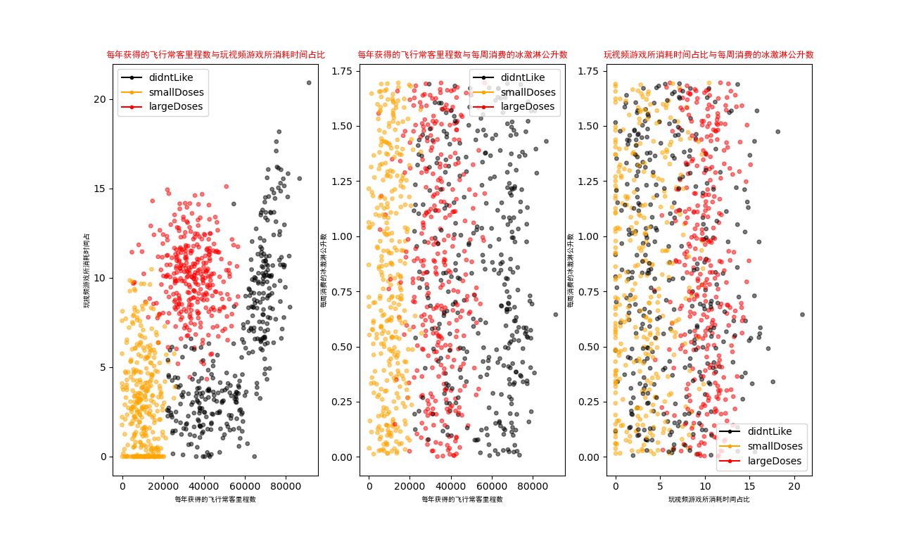

# KNN

## K-近邻算法

通过测量不同特征值之间的距离方法进行分类

​	使用范围：数值型和标称型

​	优点：精度高、对异常值不敏感、无数据输入假设

​	缺点：计算复杂度高，空间复杂度高

### 数据处理

即将数据集处理成矩阵，同时将标签成列表。矩阵的每一行就是一个样本，每一列对应一个特征值，标签列表与矩阵每一行的样本一一对应。

```python
def createDateSet():
    group = np.array([[1.0, 1.1], [1.0, 1], [0, 0], [0, 0.1]])
    labels = ['A', 'A', 'B', 'B']
    return group, labels
```

### 算法实现

1.计算当前点到数据集中的点的距离，距离用欧式公式计算

2.将距离从低到高排序

3.取离当前点最近的k个点

4.确定这k个点中个标签出现的频率

5.取频率最高的标签作为本次预测的结果

```python
def classify0(inX: np.array, dataSet: np.array, labels: list, k: int):
    # 距离计算
    data_set_size = dataSet.shape[0]  # 获得数据集行数
    diff_mat = np.tile(inX, (data_set_size, 1)) - dataSet  # 与数据集各行对应元素做差
    sq_diff_mat = diff_mat ** 2  # 取平方
    sq_distances = sq_diff_mat.sum(axis=1)  # 把每一行的差的平方加起来
    distance = sq_distances ** 0.5  # 取根号即最终的距离值
    sorted_dist_indices = distance.argsort()  # 对距离值排序返回原索引值
    class_count = {}
    # 选择距离最小的k点
    for i in range(k):
        # i访问的是当前最小的值，返回其对应的索引，即在原数据集中的行数，取得对应的标签
        vote_label = labels[sorted_dist_indices[i]]
        # 统计每个标签出现的次数
        class_count[vote_label] = class_count.get(vote_label, 0) + 1
    # iteritems讲字典变成(key, value)的元组，operator.itemgetter(1)将排序依据设置为元组的1位元素，并从大到小排
    sorted_class_count = sorted(class_count.items(), key=operator.itemgetter(1), reverse=True)
    # 返回出现最多的标签
    return sorted_class_count[0][0]
```

### 分析数据

使用matplotlib创建散点图8

```python
import KNN
import numpy as np
import matplotlib
# 设置图例
import matplotlib.lines as mlines	
# 绘图
import matplotlib.pyplot as plt
# 导入字体
from matplotlib.font_manager import FontProperties

mat, label = KNN.file2mat("./hailun.txt")
# 设置汉字格式
font = FontProperties(fname=r"c:\windows\fonts\simhei.ttf", size=14)
# 将fig画布分隔成1行3列,不共享x轴和y轴,fig画布的大小为(13,8)
# 当nrow=1,nclos=3时,代表fig画布被分为三个区域,axs[0]表示第一行第一个区域
fig, axs = plt.subplots(nrows=1, ncols=3, sharex=False, sharey=False, figsize=(13, 8))
count_label = len(label)
label_colors = []

# 给不同类型设置颜色
for i in label:
    if 1 == i:
        label_colors.append('black')
    if 2 == i:
        label_colors.append('orange')
    if 3 == i:
        label_colors.append('red')

# 画出散点图,以datingDataMat矩阵的第一、第二列数据画散点数据,散点大小为15,透明度为0.5
axs[0].scatter(x=mat[:, 0], y=mat[:, 1], color=label_colors, s=15, alpha=.5)
# 设置标题,x轴label,y轴label
axs0_title_text = axs[0].set_title('axs0_title_text', fontproperties=font)
axs0_xlabel_text = axs[0].set_xlabel('axs0_xlabel_text', fontproperties=font)
axs0_ylabel_text = axs[0].set_ylabel('axs0_ylabel_text', fontproperties=font)
plt.setp(axs0_title_text, size=9, weight='bold', color='red')
plt.setp(axs0_xlabel_text, size=7, weight='bold', color='black')
plt.setp(axs0_ylabel_text, size=7, weight='bold', color='black')

# 设置图例
didntLike = mlines.Line2D([], [], color='black', marker='.',
                          markersize=6, label='label1')
smallDoses = mlines.Line2D([], [], color='orange', marker='.',
                           markersize=6, label='label2')
largeDoses = mlines.Line2D([], [], color='red', marker='.',
                           markersize=6, label='label3')
# 添加图例
axs[0].legend(handles=[didntLike, smallDoses, largeDoses])
axs[1].legend(handles=[didntLike, smallDoses, largeDoses])
axs[2].legend(handles=[didntLike, smallDoses, largeDoses])

# 展示散点图
plt.show()
```

### 归一化

为了避免某一特质的数值仅因为数字上大于别的特征的数值而对计算结果影响很大，因此要对特征值进行归一化处理。

1.获得最大最小值

2.确定数值的取值范围

3.确定一个相对最小值的相对值值

4.相对值/范围 = 归一化值

```python
# 归一化
def autoNorm(data_set):
    min_val = data_set.min(0)  # 取数据集的最小值
    max_val = data_set.max(0)  # 取数据集的最大值
    ranges = max_val - min_val  # 确定取值的范围
    norm_date_set = np.zeros_like(data_set)  # 准备一个用于存放归一化数据的矩阵
    m = data_set.shape[0]
    norm_date_set = data_set - np.tile(min_val, (m, 1))  # 与最小值的相对值
    norm_date_set = norm_date_set / np.tile(ranges, (m, 1))  # 相对值/范围 = 归一化值
    return norm_date_set, ranges, min_val
```

### 测试算法

随机取一部分数据库作为测试值测试

```python
def datingClassTest():
    ho_ratio = 0.10  # 取百分之十的数据作为测试数据
    dating_data_mat, dating_labels = file2mat("./hailun.txt")
    norm_data_mat, ranges, min_val = autoNorm(dating_data_mat)
    m = norm_data_mat.shape[0]
    num_test_vec = int(m * ho_ratio)
    error_count = 0.0
    # 因为数据集本身是随机的，所以任取百分之十即可，这里取了前百分之10
    for i in range(num_test_vec):
        classifier_result = classify0(norm_data_mat[i, :], dating_data_mat[num_test_vec:m, :], dating_labels, 3)
        print(f"{dating_data_mat[i, :]}，分类结果是{classifier_result}，正确结果是{dating_labels[i]}")
        # 记录错误的次数
        if classifier_result != dating_labels[i]:
            error_count += 1.0
    print(f"共测试了{num_test_vec}次，总的错误率是：{error_count / float(num_test_vec)}")
```

### 构建完整可用的系统

### **海伦线上约会**

#### 数据准备

```python
def file2mat(filename):
    f = open(filename, 'r', encoding="UTF-8")
    array_lines = f.readlines()
    count_lines = len(array_lines)
    date_mat = np.zeros((count_lines, 3))
    class_label = []
    f.close()
    i = 0
    for line in array_lines:
        line = line.strip()
        new_line = line.split('\t')
        date_mat[i, :] = new_line[0:3]
        if "didntLike" == new_line[-1]:
            class_label.append(1)
        if "smallDoses" == new_line[-1]:
            class_label.append(2)
        if "largeDoses" == new_line[-1]:
            class_label.append(3)
        i += 1
    return date_mat, class_label


def file2person(filename):
    f = open(filename, 'r', encoding="UTF-8")
    array_lines = f.readlines()
    count_lines = len(array_lines)
    person_mat = np.zeros((count_lines, 3))
    i = 0
    person_name = []
    for line in array_lines:
        line = line.strip()
        new_line = line.split(',')
        person_mat[i, :] = new_line[0:3]
        person_name.append(new_line[-1])
        i += 1
    return person_mat, person_name
```

#### 算法实现

```python
def classify0(inX: np.array, dataSet: np.array, labels: list, k: int):
    # 距离计算
    data_set_size = dataSet.shape[0]  # 获得数据集行数
    diff_mat = np.tile(inX, (data_set_size, 1)) - dataSet  # 与数据集各行对应元素做差
    sq_diff_mat = diff_mat ** 2  # 取平方
    sq_distances = sq_diff_mat.sum(axis=1)  # 把每一行的差的平方加起来
    distance = sq_distances ** 0.5  # 取根号即最终的距离值
    sorted_dist_indices = distance.argsort()  # 对距离值排序返回原索引值
    class_count = {}
    # 选择距离最小的k点
    for i in range(k):
        # i访问的是当前最小的值，返回其对应的索引，即在原数据集中的行数，取得对应的标签
        vote_label = labels[sorted_dist_indices[i]]
        # 统计每个标签出现的次数
        class_count[vote_label] = class_count.get(vote_label, 0) + 1
    # iteritems讲字典变成(key, value)的元组，operator.itemgetter(1)将排序依据设置为元组的1位元素，并从大到小排
    sorted_class_count = sorted(class_count.items(), key=operator.itemgetter(1), reverse=True)
    # 返回出现最多的标签
    return sorted_class_count[0][0]
```

#### 归一化

```python
def autoNorm(data_set):
    min_val = data_set.min(0)  # 取数据集的最小值
    max_val = data_set.max(0)  # 取数据集的最大值
    ranges = max_val - min_val  # 确定取值的范围
    norm_date_set = np.zeros_like(data_set)  # 准备一个用于存放归一化数据的矩阵
    m = data_set.shape[0]
    norm_date_set = data_set - np.tile(min_val, (m, 1))  # 与最小值的相对值
    norm_date_set = norm_date_set / np.tile(ranges, (m, 1))  # 相对值/范围 = 归一化值
    return norm_date_set, ranges, min_val
```

#### 测试

```python
def datingClassTest():
    ho_ratio = 0.10  # 取百分之十的数据作为测试数据
    dating_data_mat, dating_labels = file2mat("./hailun.txt")
    norm_data_mat, ranges, min_val = autoNorm(dating_data_mat)
    m = norm_data_mat.shape[0]
    num_test_vec = int(m * ho_ratio)
    error_count = 0.0
    # 因为数据集本身是随机的，所以任取百分之十即可，这里取了前百分之10
    for i in range(num_test_vec):
        classifier_result = classify0(norm_data_mat[i, :], norm_data_mat[num_test_vec:m, :], dating_labels, 3)
        print(f"分类结果是{classifier_result}，正确结果是{dating_labels[i]}")
        # 记录错误的次数
        if classifier_result != dating_labels[i]:
            error_count += 1.0
    print(f"共测试了{num_test_vec}次，总的错误率是：{error_count / float(num_test_vec)}")
    
# 测试结果
# 共测试了100次，总的错误率是：0.05
```

#### 构建系统

```python
def classifyPerson(person_data, person_name):
    result_list = ['不喜欢的', '一般有魅力的', '很有魅力的']
    love_person_list = []

    dating_mat, dating_labels = file2mat('./hailun.txt')
    norm_mat, ranges, min_val = autoNorm(dating_mat)
    i = 0
    person_num = len(person_name)
    for person in person_data:
        in_arr = np.array(person)
        classify_result = classify0((in_arr - min_val) / ranges, norm_mat, dating_labels, 5)
        # 　print(f"你对这个人的感觉是：{result_list[classify_result-1]}")
        if '一般有魅力的' == result_list[classify_result - 1] or '很有魅力的' == result_list[classify_result - 1]:
            love_person_list.append(person_name[i])
        i += 1
    print(f"有{person_num}个人")
    print(f"你可能喜欢的人是：{love_person_list}")

```

#### main.py内

```python
import KNN

person_data, person_name = KNN.file2person('./udata.txt')
KNN.classifyPerson(person_data, person_name)

# 结果
"""
有17个人
你可能喜欢的人是：['Alice', 'Grace', 'Hannah', 'Isaac', 'Jacob', 'Kate', 'Liam', 'Nina', 'Olivier', 'Peter', 'Quincy']
"""
```

#### 数据分析

散点图

```python
import numpy as np
import matplotlib
import matplotlib.lines as mlines
import matplotlib.pyplot as plt
from matplotlib.font_manager import FontProperties

import KNN

mat, label = KNN.file2mat("./hailun.txt")
# 设置汉字格式
font = FontProperties(fname=r"c:\windows\fonts\simhei.ttf", size=14)
# 将fig画布分隔成1行3列,不共享x轴和y轴,fig画布的大小为(13,8)
# 当nrow=1,nclos=3时,代表fig画布被分为三个区域,axs[0]表示第一行第一个区域
fig, axs = plt.subplots(nrows=1, ncols=3, sharex=False, sharey=False, figsize=(13, 8))
count_label = len(label)
label_colors = []

# 给不同类型设置颜色
for i in label:
    # 不喜欢是黑色
    if 1 == i:
        label_colors.append('black')
    # 一般有魅力是橘色
    if 2 == i:
        label_colors.append('orange')
    # 很有魅力是红色
    if 3 == i:
        label_colors.append('red')

# 画出散点图,以datingDataMat矩阵的第一(飞行常客例程)、第二列(玩游戏)数据画散点数据,散点大小为15,透明度为0.5
axs[0].scatter(x=mat[:, 0], y=mat[:, 1], color=label_colors, s=15, alpha=.5)
# 设置标题,x轴label,y轴label
axs0_title_text = axs[0].set_title('每年获得的飞行常客里程数与玩视频游戏所消耗时间占比', fontproperties=font)
axs0_xlabel_text = axs[0].set_xlabel('每年获得的飞行常客里程数', fontproperties=font)
axs0_ylabel_text = axs[0].set_ylabel('玩视频游戏所消耗时间占', fontproperties=font)
plt.setp(axs0_title_text, size=9, weight='bold', color='red')
plt.setp(axs0_xlabel_text, size=7, weight='bold', color='black')
plt.setp(axs0_ylabel_text, size=7, weight='bold', color='black')

# 画出散点图,以datingDataMat矩阵的第一(飞行常客例程)、第三列(冰激凌)数据画散点数据,散点大小为15,透明度为0.5
axs[1].scatter(x=mat[:, 0], y=mat[:, 2], color=label_colors, s=15, alpha=.5)
# 设置标题,x轴label,y轴label
axs1_title_text = axs[1].set_title('每年获得的飞行常客里程数与每周消费的冰激淋公升数', fontproperties=font)
axs1_xlabel_text = axs[1].set_xlabel('每年获得的飞行常客里程数', fontproperties=font)
axs1_ylabel_text = axs[1].set_ylabel('每周消费的冰激淋公升数', fontproperties=font)
plt.setp(axs1_title_text, size=9, weight='bold', color='red')
plt.setp(axs1_xlabel_text, size=7, weight='bold', color='black')
plt.setp(axs1_ylabel_text, size=7, weight='bold', color='black')

# 画出散点图,以datingDataMat矩阵的第二(玩游戏)、第三列(冰激凌)数据画散点数据,散点大小为15,透明度为0.5
axs[2].scatter(x=mat[:, 1], y=mat[:, 2], color=label_colors, s=15, alpha=.5)
# 设置标题,x轴label,y轴label
axs2_title_text = axs[2].set_title('玩视频游戏所消耗时间占比与每周消费的冰激淋公升数', fontproperties=font)
axs2_xlabel_text = axs[2].set_xlabel('玩视频游戏所消耗时间占比', fontproperties=font)
axs2_ylabel_text = axs[2].set_ylabel('每周消费的冰激淋公升数', fontproperties=font)
plt.setp(axs2_title_text, size=9, weight='bold', color='red')
plt.setp(axs2_xlabel_text, size=7, weight='bold', color='black')
plt.setp(axs2_ylabel_text, size=7, weight='bold', color='black')

# 设置图例
didntLike = mlines.Line2D([], [], color='black', marker='.',
                          markersize=6, label='didntLike')
smallDoses = mlines.Line2D([], [], color='orange', marker='.',
                           markersize=6, label='smallDoses')
largeDoses = mlines.Line2D([], [], color='red', marker='.',
                           markersize=6, label='largeDoses')
# 添加图例
axs[0].legend(handles=[didntLike, smallDoses, largeDoses])
axs[1].legend(handles=[didntLike, smallDoses, largeDoses])
axs[2].legend(handles=[didntLike, smallDoses, largeDoses])

# 展示散点图
plt.show()
```



### 手写识别系统

#### 数据处理

将32×32的二进制图像矩阵转换成1×1024的向量

```python
def img2vector(filename):
    return_vec = np.zeros((1, 1024))
    f = open(filename, 'r', encoding='UTF-8')
    # 将32×32的二进制图像矩阵转换成1×1024的向量
    # readline()每次读一行，每次读32个二进制数，一共读32次
    for i in range(32):
        line_str = f.readline()
        for j in range(32):
            return_vec[0, 32*i+j] = int(line_str[j])
    return return_vec
```

#### 算法实现

同上

#### 归一化

本次的训练数据集都是二进制数据，不需要归一化

#### 测试算法

因为数据是保存在一个一个的txt文件里，需要通过os导入listdir获得目录名去访问

通过`"{:.4f}%".format(num)`去将小数变为百分数的形式，其中`.4`控制小数点位数，`num`=原始数据×100

```python
def handwritingClassTest():
    hw_labels = []
    # 通过os导入listdir获得目录名
    training_file_list = listdir('./digits/trainingDigits')
    m_training = len(training_file_list)
    training_mat = np.zeros((m_training, 1024))
    # 准备训练数据集
    for i in range(m_training):
        # 通过解析文件名获得标签
        file_name_str = training_file_list[i]
        file_str = file_name_str.split('.')[0]
        class_label_str = int(file_str.split('_')[0])
        hw_labels.append(class_label_str)
        training_mat[i, :] = img2vector(f'./digits/trainingDigits/{file_name_str}')
    # 准备测试数据集
    test_file_list = listdir('./digits/testDigits')
    m_test = len(test_file_list)
    error = 0
    for i in range(m_test):
        file_name_str = test_file_list[i]
        file_str = file_name_str.split('.')[0]
        class_label_str = int(file_str.split('_')[0])
        test_vec = img2vector(f'./digits/testDigits/{file_name_str}')

        classifier_result = classify0(test_vec, training_mat, hw_labels, 5)
        print(f"预测分类是：{classifier_result}，正确结果是{class_label_str}")
        if classifier_result != class_label_str:
            error += 1
    error_rate = "{:.4f}%".format(error/float(m_test))
    print(f"总共测试了{m_test}组数据\n最终的错误率是{error_rate}")

# 测试结果
# 总共测试了946组数据
#　最终的错误率是1.7970%
```