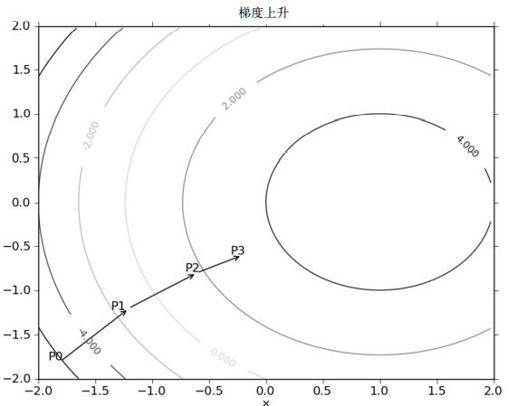
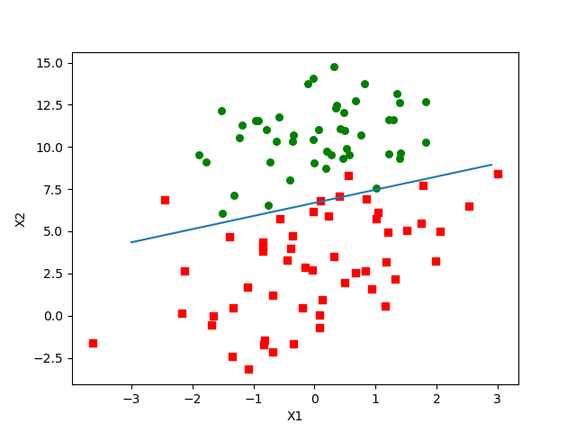
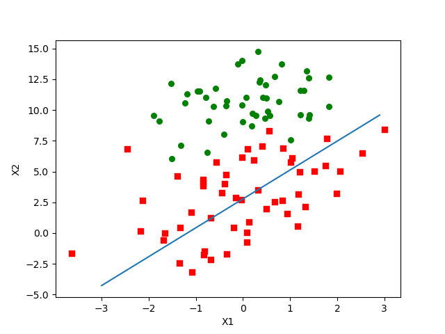
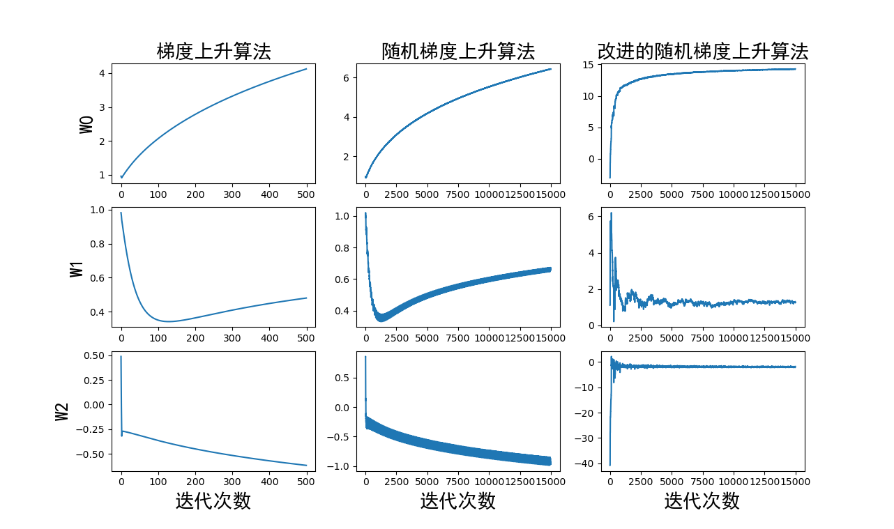

# logistic回归

## logistic回归

根据现有数据对**分类边界线建立回归公式**，以此进行分类

|          | 说明                         |
| -------- | ---------------------------- |
| 适用范围 | 数值型、标称型               |
| 优点     | 计算代价不高，易于理解和实现 |
| 缺点     | 容易欠拟合，分类精度可能不高 |

Logistic回归是一种二分类算法，它利用的是Sigmoid函数（是一种阶跃函数）阈值在[0,1]这个特性。

**Sigmoid函数**
$$
{\sigma}(z) = \frac{1}{1+e^{-z}}
$$
为了实现Logistic回归分类器，我们将每个特征乘上一个回归系数，然后将所有值相加，将这个总和带入Sigmoid函数中，得到一个范围在0~1之间的数值，大于0.5归为1，小于0.5归为0。

**基于最优化方法的最佳回归系数确定**

Sigmoid函数的输入记为z，由下面公式得出：
$$
z=w_0x_0+w_1x_1+w_2x_2+...+w_nx_n=w^Tx
$$
其中向量X是分类器的输入数据，向量W是最佳参数，也就是回归系数。为了找到最佳参数，需要用到一些最优化的理论。

1. **梯度上升法**

基本思想：要找到模函数的最大值，最好的方法是沿着该函数的梯度方向探寻。函数f(x, y)的梯度由下式表示：
$$
{\nabla}f(x,y)=(\frac{{\partial}f(x,y)}{{\partial}x},
\frac{{\partial}f(x,y)}{{\partial}y})
$$
其中，f(x, y)在待计算的点上必须有定义且可谓。一个具体的例子如下图：



图中梯度上升算法在到达每个点后都会重新估计移动方向（即计算该点的梯度），一直循环迭代，直到满足停止条件。在这一过程中，梯度算子总是指向函数上升最快的方向。梯度上升算法的迭代公式如下：
$$
w:=w+\alpha{\nabla}_wf(w)
$$
该公式将一直被迭代执行，直到达到摸个结束条件为止，比如迭代次数达到某个指定的值或算法达到某个可以允许的误差范围。

​	2.**梯度下降算法**

类似于梯度上升算法，用于求最小值，只需要将加法改为减法，对应公式如下：
$$
w:=w-\alpha{\nabla}_wf(w)
$$

### 准备数据

```python
def loadDataSet():
    data_mat = []
    label_mat = []
    f = open('./testSet.txt', 'r')
    for line in f.readlines():
        line = line.strip().split()
        data_mat.append([1.0, float(line[0]), float(line[1])])
        label_mat.append(int(line[2]))
    return data_mat, label_mat
```

### 训练算法

#### 梯度上升算法

使用梯度上升找到最佳参数

```python
import numpy as np
def gradAscent(data_mat_in, class_labels):
    data_mat = np.mat(data_mat_in)
    label_mat = np.mat(class_labels).transpose()   # 取转置
    m, n = np.shape(data_mat)
    alpha = 0.001                                   # 步进大小
    max_cycles = 500                                # 退出条件，迭代500次
    weights = np.ones((n, 1))                       # 回归系数初始化为1
    for i in range(max_cycles):
        h = sigmoid(data_mat * weights)
        error = (label_mat - h)                     # 实际类别与预测类别的差值
        weights = weights + alpha * data_mat.transpose() * error
    return weights.getA()

```

##### **测试结果**

```python
if __name__ == '__main__':
    data_mat1, label_mat1 = loadDataSet()
    print(gradAscent(data_mat1, label_mat1))

# 结果
[[ 4.12414349]
 [ 0.48007329]
 [-0.6168482 ]]
```

##### 分析数据

画出决策边界

拟合直线的计算公式如下：
$$
w_0+w_1*x_1+w_2*x_2=0
$$
解直线方程得：
$$
y=w_0+w_1*x_1+w_2*x_2
$$

```python
def plotBestFit(weights):
    import matplotlib.pyplot as plt
    data_mat, label_mat = loadDataSet()
    data_arr = np.array(data_mat)
    m = np.shape(data_arr)[0]
    xcord1 = []
    ycord1 = []
    xcord2 = []
    ycord2 = []
    for i in range(m):
        if int(label_mat[i]) == 1:                              # 类别为1
            xcord1.append(data_arr[i, 1])
            ycord1.append(data_arr[i, 2])
        else:
            xcord2.append(data_arr[i, 1])
            ycord2.append(data_arr[i, 2])
    fig = plt.figure()
    ax = fig.add_subplot(111)
    ax.scatter(xcord1, ycord1, s=30, c='red', marker='s')
    ax.scatter(xcord2, ycord2, s=30, c='green')
    x = np.arange(-3.0, 3.0, 0.1)
    y = (-weights[0]-weights[1]*x)/weights[2]                   # 直线方程为 w0 + w1*x1 + w2*x2 = 0，w0是偏移量
    ax.plot(x, y)
    plt.xlabel('X1')
    plt.ylabel('X2')
    plt.show()
```



这个分类结果相当不错，从上图可以看出，只分错了几个点而已。但是，尽管例子简单切数据集很小，但是这个方法却需要大量的计算(300次乘法)。因此下面将对改算法稍作改进，从而减少计算量，使其可以应用于大数据集上。

#### 随机梯度上升

```python
def stocGradAscent0(data_mata, class_labels):
    m, n = np.shape(data_mata)
    alpha = 0.01
    weights = np.ones(n)
    for i in range(m):
        h = sigmoid(sum(data_mata[i]*weights))
        error = class_labels[i] - h
        weights = weights + alpha * error * np.array(data_mata[i]).astype(float)
    return weights
```

随机梯度上升算法是一种在线学习算法，每次更新权重都只使用一个样本，而不是使用所有样本。相比于梯度上升算法有以下几点不同：

- `weights`变成了一个一维的数组，节省了内存空间的使用
- 每次迭代只选择一个样本计算梯度而不是全部的样本，将矩阵运算转变成了一维数组运算`sum(data_mata[i]*weights)`，在面对大量样本时可以减少的运算次数。
- 随机梯度上升算法每次迭代中立即更新权重，而梯度上升算法在迭代500次之后再更新权重。这意味着随机梯度上升算法可以**实时地对数据进行学习和调整权重。**

##### 分析数据



随机梯度上升算法执行结果如上图所示，可以看到大概分错了三分之一的样本，并不如梯度上升算法完美。这是因为梯度上升算法是在迭代了500次之后得到的。一个判断优化算法优劣的可靠方法是看它是否收敛，也就是说参数是否达到了稳定值，是否还会不断变化。下面对随机梯度上升算法进行修改，使其在数据集上运行200次

#### 改进的随机梯度上升算法

```python
def stocGradAscent1(data_mata, class_labels, num_iter=200):
    m, n = np.shape(data_mata)
    weights = np.ones(n)
    for j in range(num_iter):
        data_index = list(range(m))                                                     # 数据集的索引列表
        for i in range(m):
            alpha = 4/(1.0+j+i)+0.01                                                    # 动态学习率
            rand_index = int(np.random.uniform(0, len(data_index)))                     # 随机选取样本
            h = sigmoid(sum(data_mata[data_index[rand_index]]*weights))                 # 选择随机选取的一个样本，计算h
            error = class_labels[data_index[rand_index]] - h
            weights = weights + alpha * error * data_mata[data_index[rand_index]]
            del (data_index[rand_index])                                                # 删除用过的索引
    return weights
```

改进：

- 使用了动态学习率`alpha` 。`alpha`每次减少1/(i+j).这样的设计使得学习率在训练初期较大，能够快速收敛；而在训练后期，随着迭代次数和已经训练过的样本数量的增加，学习率逐渐减小，能够使算法更加稳定，最终收敛到最优解。而加上一个常数项0.01能够保证学习率不会降至过小。
- 通过随机选取样本来更新回归系数。可以减少周期性的波动，避免算法在训练过程中对样本的顺序造成过多的依赖，从而增加算法的鲁棒性和泛化能力。

三种算法迭代次数与回归系数之间的关系对比如下图：

 可以看到随机梯度上升算法比梯度上升算法收敛得更快，例如对于W1，前者要100次才能收敛，而后者只要20次就可以收敛。但是随即梯度上升存在一些小的周期波动，这是由于数据集中存在一些不能正确分类的点导致的。

而改进后的随机梯度上升算法，不仅收敛速度更快（动态学习率在前期可以帮助快速收敛），而且没有出现随机梯度上升算法有周期性波动的问题（随机取样）。

## 示例：从疝气病症预测病马死亡率

### 准备数据

**处理数据中的缺失值**

一些可取的方法：

- 使用可用特征的均值来填补缺失值；
- 使用特殊值来填补缺失值，如-1；
- 忽略有缺失值的样本；
- 使用相似样本的均值添补缺失值；
- 使用另外的机器学习算法预测缺失值。

预处理数据做两件事：

- 如果测试集中一条数据的特征值已经确实，那么我们选择实数0来替换所有缺失值，因为本文使用Logistic回归。因此这样做不会影响回归系数的值。

  sigmoid(0)=0.5，即它对结果的预测不具有任何倾向性。

- 如果测试集中一条数据的类别标签已经缺失，那么我们将该类别数据丢弃，因为类别标签与特征不同，很难确定采用某个合适的值来替换

### **测试算法**

#### 使用随机梯度上升算法

```python
import random
import numpy as np


def sigmoid(z):
    return 1.0 / (1 + np.exp(-z))


def stocGradAscent1(data_mata, class_labels, num_iter=150):
    m, n = np.shape(data_mata)
    weights = np.ones(n)
    for j in range(num_iter):
        data_index = list(range(m))  # 数据集的索引列表
        for i in range(m):
            alpha = 4 / (1.0 + j + i) + 0.01  # 动态学习率
            rand_index = int(random.uniform(0, len(data_index)))  # 随机选取样本
            h = sigmoid(sum(data_mata[data_index[rand_index]] * weights))  # 选择随机选取的一个样本，计算h
            error = class_labels[data_index[rand_index]] - h
            weights = weights + alpha * error * data_mata[data_index[rand_index]]
            del (data_index[rand_index])  # 删除用过的索引
    return weights


def classifyVector(inX, weights):
    prob = sigmoid(sum(inX * weights))
    if prob > 0.5:
        return 1.0
    else:
        return 0.0


def colicTest():
    f_train = open('./horseColicTraining.txt')
    f_test = open('./horseColicTest.txt')
    training_set = []
    training_labels = []
    for line in f_train.readlines():
        curr_line = line.strip().split('\t')
        line_arr = []
        for i in range(21):
            line_arr.append(float(curr_line[i]))
        training_set.append(line_arr)
        training_labels.append(float(curr_line[21]))
    train_weights = stocGradAscent1(np.array(training_set), training_labels, num_iter=500)
    error = 0
    num_test_vec = 0.0
    for line in f_test.readlines():
        num_test_vec += 1
        curr_line = line.strip().split('\t')
        line_arr = []
        for i in range(21):
            line_arr.append(float(curr_line[i]))
        if int(classifyVector(line_arr, train_weights)) != float(curr_line[21]):
            error += 1
    rate_err = (error / num_test_vec) * 100
    print("错误率为：%.2f%%" % rate_err)
    return rate_err


def multiTest(num_test=10):
    error = 0.0
    for i in range(num_test):
        error += colicTest()
    print("%d次测试总的错误率是：%.2f%%" % (num_test, error / num_test))


if __name__ == '__main__':
    multiTest()
```

**测试结果**

```python
错误率为：31.34%
# 错误率为：25.37%
# 错误率为：29.85%
# 错误率为：25.37%
# 错误率为：53.73%
# 错误率为：34.33%
# 错误率为：34.33%
# 错误率为：28.36%
# 错误率为：19.40%
# 错误率为：37.31%
# 10次测试总的错误率是：31.94%
```

使用随机梯度上升算法时，错误率较高且运算时间较长，错误率高的时候可能达到50%多。原因有一下几点：

- 样本中存在百分之三十的数据丢失
- 由于随机梯度上升算法每次只使用一个样本来更新模型参数，因此更新的方向可能存在较大的随机性。这样一来，模型参数的更新可能会出现较大的波动，导致模型参数的估计结果具有较大的方差。
- 由于每次更新时只考虑单个样本，无法充分利用整个数据集的特征分布信息。随机梯度上升算法由于更新的随机性，可能会导致算法在优化过程中陷入局部极值点，而无法达到全局最优解。
- 随机梯度上升算法的更新频率通常较高。这样一来，算法的收敛速度会较快，但也增加了计算的复杂度和时间消耗。在数据集较小时会比批量梯度上升算法耗时。

#### 使用梯度上升算法

```python
import random
import numpy as np


def sigmoid(z):
    return 1.0 / (1 + np.exp(-z))


def gradAscent(data_mat_in, class_labels):
    data_mat = np.mat(data_mat_in)
    label_mat = np.mat(class_labels).transpose()  # 取转置
    m, n = np.shape(data_mat)
    alpha = 0.001  # 步进大小
    max_cycles = 500  # 退出条件，迭代500次
    weights = np.ones((n, 1))  # 回归系数初始化为1
    weights_arr = np.array([])
    for i in range(max_cycles):
        h = sigmoid(data_mat * weights)
        error = (label_mat - h)  # 实际类别与预测类别的差值
        weights = weights + alpha * data_mat.transpose() * error
    return weights


def stocGradAscent1(data_mata, class_labels, num_iter=150):
    m, n = np.shape(data_mata)
    weights = np.ones(n)
    for j in range(num_iter):
        data_index = list(range(m))  # 数据集的索引列表
        for i in range(m):
            alpha = 4 / (1.0 + j + i) + 0.01  # 动态学习率
            rand_index = int(random.uniform(0, len(data_index)))  # 随机选取样本
            h = sigmoid(sum(data_mata[data_index[rand_index]] * weights))  # 选择随机选取的一个样本，计算h
            error = class_labels[data_index[rand_index]] - h
            weights = weights + alpha * error * data_mata[data_index[rand_index]]
            del (data_index[rand_index])  # 删除用过的索引
    return weights


def classifyVector(inX, weights):
    prob = sigmoid(sum(inX * weights))
    if prob > 0.5:
        return 1.0
    else:
        return 0.0


def colicTest():
    f_train = open('./horseColicTraining.txt')
    f_test = open('./horseColicTest.txt')
    training_set = []
    training_labels = []
    for line in f_train.readlines():
        curr_line = line.strip().split('\t')
        line_arr = []
        for i in range(21):
            line_arr.append(float(curr_line[i]))
        training_set.append(line_arr)
        training_labels.append(float(curr_line[21]))
    train_weights = gradAscent(np.array(training_set), training_labels)
    error = 0
    num_test_vec = 0.0
    for line in f_test.readlines():
        num_test_vec += 1
        curr_line = line.strip().split('\t')
        line_arr = []
        for i in range(21):
            line_arr.append(float(curr_line[i]))
        if int(classifyVector(line_arr, train_weights)) != float(curr_line[21]):
            error += 1
    rate_err = (error / num_test_vec) * 100
    print("错误率为：%.2f%%" % rate_err)
    return rate_err


def multiTest(num_test=10):
    error = 0.0
    for i in range(num_test):
        error += colicTest()
    print("%d次测试总的错误率是：%.2f%%" % (num_test, error / num_test))


if __name__ == '__main__':
    colicTest()
```

使用梯度算法时，计算时间较短，错误率稳定且较低

#### 总结

得到如下结论：

- 当数据集较小时，我们使用梯度上升算法
- 当数据集较大时，我们使用改进的随机梯度上升算法