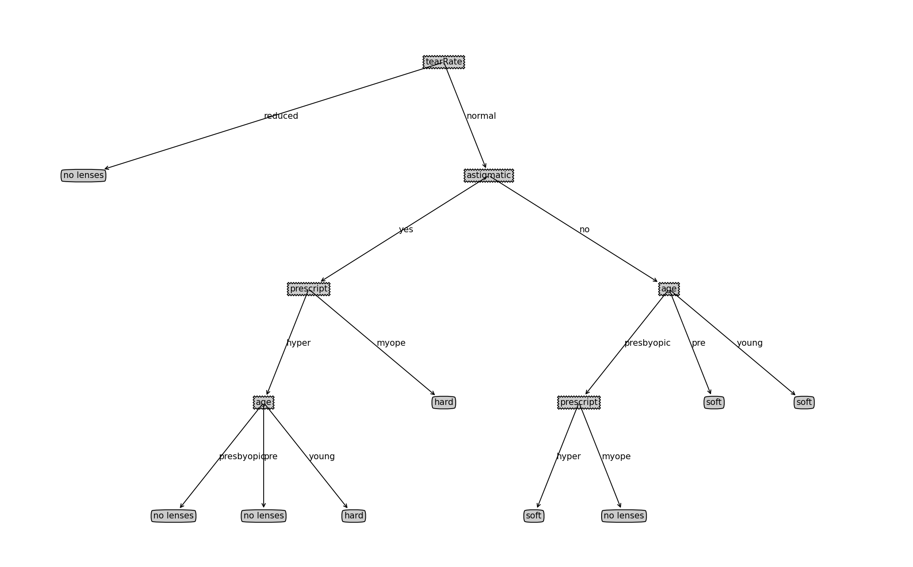

# Tree

## 决策树算法

通过信息增益确定最好最优方案划分数据集，直到数据集的所有数据归属于**同一类**（带标签的，表示监督学习）。

|          | 说明                                                         |
| -------- | ------------------------------------------------------------ |
| 适用类型 | 数值型和标称型                                               |
| 优点     | 计算复杂度不高，结果易于理解，对中间值确实不敏感，可以处理不相关特征数据 |
| 缺点     | 可能会产生过度匹配的问题                                     |

**过度匹配**

过度匹配指的是在训练阶段过度适应训练数据，导致模型在新的未见数据上表现不佳。这是因为决策树会尽可能将训练数据中的每个样本都划分到纯净的叶节点，以实现数据的完美拟合。

决策树的过度匹配可能**发生的原因**包括以下几个方面：

1. 数据噪声：如果训练数据中存在噪声或异常值，决策树可能会过度关注这些异常情况，从而导致模型过度适应训练数据的噪声部分，而不是真正的数据模式。

   

2. 样本量不足：如果训练数据集很小，决策树可能会过度拟合这些有限的样本，无法很好地泛化到新的数据。即对少量的数据集过度的依赖。

   

3. 树的复杂度：决策树的复杂度指的是树的深度和节点数等。如果决策树过于复杂，它可能会过度适应训练数据的细节和噪声，而没有捕捉到更一般的模式和规律。

对于决策树过度匹配的问题，有一些常见的**应对策略**：

1. 剪枝：通过剪枝操作，减小决策树的复杂度，降低过拟合的风险。剪枝分为预剪枝（在构建过程中提前终止生长）和后剪枝（先构建完整的决策树再进行剪枝）两种方式。

   

2. 数据清洗：对于噪声或异常值较多的训练数据，可以考虑对数据进行清洗、去除异常值，以提高模型的鲁棒性。

   

3. 增加样本量：增加训练数据的数量，有助于决策树更好地学习到数据的模式和规律，并减少过拟合的风险。

   

4. 特征选择：通过选择合适的特征，可以避免决策树过度关注噪声或不重要的特征，从而提高模型的泛化能力。

### 数据处理

决策树算法只适用于标称型数据，因此数值型数据必须离散化。

#### 计算给定数据集的香农熵

**信息增益**

划分数据集的大原则：将无序的数据变得有序。

划分前后数据的信息变化称为信息增益，如果按照一个特征值进行划分数据集时可以取得最大的信息增益，那么这个特征就是最好的选择。

度量方式：熵

```python
# 计算香农熵
def calcShannonEnt(dataSet):
    num_entries = len(dataSet)
    label_count = {}
    # 计算每个标签出现的概率
    for feat_vec in dataSet:
        current_label = feat_vec[-1]
        if current_label not in label_count.keys():
            label_count[current_label] = 0
        label_count[current_label] += 1
    # 计算香农熵
    shannon_ent = 0.0
    for key in label_count:
        prob = float(label_count[key]) / num_entries
        shannon_ent -= prob * log(prob, 2)
    return shannon_ent
```

#### 划分数据集

按照给定特征值划分数据集

```python
# 按照给定特征划分数据集
def splitDataSet(data_set, axis, value):
    return_data_set = []
    for feat_vec in data_set:
        # 对指定的特征值进行筛选
        if feat_vec[axis] == value:
            # 如果特征值符合，将样本中这个特征剔除后的新向量归类到新的列表里
            reduced_feat_vec: list = feat_vec[:axis]
            reduced_feat_vec.extend(feat_vec[axis+1:])
            return_data_set.append(reduced_feat_vec)
    return return_data_set
```

#### 选择最好的划分方式

对每一个特征求一次条件熵，并得到信息增益。获得最大信息增益的便是最好的特征规划

```python
def chooseBestFeatureToSplit(data_set):
    num_feat = len(data_set[0]) - 1
    base_entropy = calcShannonEnt(data_set)
    best_info_gain = 0.0
    best_feat = -1
    for i in range(num_feat):
        # 将每个样本的第i个特征加入列表
        feat_list = [example[i] for example in data_set]
        # 唯一特征值
        unique_val = set(feat_list)
        # 初始的香农熵
        new_entropy = 0.0
        # 求条件熵并求和
        for val in unique_val:
            sub_data_set = splitDataSet(data_set, i, val)
            prob = len(sub_data_set) / float(len(data_set))
            new_entropy += prob * calcShannonEnt(sub_data_set)
        # 获得信息增益，信息增益大的即为最好特征规划
        info_gain = base_entropy - new_entropy
        if info_gain > best_info_gain:
            best_info_gain = info_gain
            best_feat = i
    return best_feat
```

### 训练算法

递归构建决策树。递归结束的两个标志：

	1. 当前分组的数据集类别标签完全相同时，停止继续划分
	2. 使用完了所有的特征，仍不能将数据集划分为包含唯一类别的分组

```python
# 筛选出出现次数最多的标签，类似投票表决
def majorityCnt(class_list):
    class_count = {}
    for vote in class_list:
        if vote not in class_count.keys():
            class_count[vote] = 0
        class_count[vote] += 1
        sorted_class_count = sorted(class_count.items(), key=operator.itemgetter(1), reverse=True)
        return sorted_class_count[0][0]


# 创建树
def createTree(data_set, labels):
    # 存放每个样本的类标签
    class_list = [example[-1] for example in data_set]
    if class_list.count(class_list[0]) == len(class_list):  # class_list内的类标签完全相同时，停止继续划分
        return class_list[0]
    if len(data_set[0]) == 1:                               # 使用完了所有的特征，仍不能将数据集划分为包含唯一类别的分组
        return majorityCnt(class_list)                      # 此时使用出现最多的类别作为返回值
    best_feat = chooseBestFeatureToSplit(data_set)
    best_feat_label = labels[best_feat]
    my_tree = {best_feat_label: {}}
    del (labels[best_feat])
    # 取每个样本在最好特征处的特征值
    feat_val = [example[best_feat] for example in data_set]
    unique_val = set(feat_val)
    # 创建当前最好特征处各特征值对应的分支
    for val in unique_val:
        sub_labels = labels[:]
        print(f'{best_feat_label}, {val}')
        my_tree[best_feat_label][val] = createTree(splitDataSet(data_set, best_feat, val), sub_labels)
    return my_tree
```

### 分析数据

用Matplotlib绘制树形图

#### 绘制树节点

通过文本注解的方式

```python
import matplotlib.pyplot as plt

decision_node = dict(boxstyle="sawtooth", fc="0.8")
leaf_node = dict(boxstyle="round4", fc="0.8")
arrow_args = dict(arrowstyle="<-")


def plotNode(nodeTxt, centerPt, parentPt, nodeType):
    createPlot.axl.annotate(nodeTxt, xy=parentPt, xycoords="axes fraction",
                            xytext=centerPt, textcoords="axes fraction",
                            va="center", ha="center", bbox=nodeType, arrowprops=arrow_args)
```

#### 构造注解树

1. 首先获取叶节点层数和树的层数，分别对应树的宽度和深度

```python
def getNUmLeafs(myTree: dict):
    num_leaf = 0
    first_str = list(myTree.keys())[0]
    second_dir = myTree[first_str]
    # 对每一个子节点进行查询，如果类型为dict则为非叶子节点，否则则为叶子节点
    for key in second_dir.keys():
        if type(second_dir[key]).__name__ == 'dict':
            num_leaf += getNUmLeafs(second_dir[key])
        else:
            num_leaf += 1
    return num_leaf


# 确定树的层数
def getTreeDepth(myTree):
    max_dep = 0
    # python3中不支持直接myTree.keys()进行索引，需要转换成元组或者列表
    first_str = list(myTree.keys())[0]
    second_dir = myTree[first_str]
    # 对每一个子节点进行查询，如果类型为dict则为非叶子节点，继续向下搜索，否则为叶子节点，深度为1
    for key in second_dir.keys():
        if type(second_dir[key]).__name__ == 'dict':
            this_dep = 1 + getTreeDepth(second_dir[key])
        else:
            this_dep = 1
        if this_dep > max_dep:
            max_dep = this_dep
    return max_dep
```

2. 绘制树

`createPlot`是绘制的主函数，在其中初始化绘制的位置，`plotTree`是一个递归函数，进行具体的绘制。

```python
# 在父子节点间填充文本信息
def plotMidText(cntrPt, parentPt, txtString):
    x_mid = (parentPt[0] - cntrPt[0]) / 2.0 + cntrPt[0]
    y_mid = (parentPt[1] - cntrPt[1]) / 2.0 + cntrPt[1]
    createPlot.axl.text(x_mid, y_mid, txtString)


def plotTree(myTree, parentPR, nodeTxt):
    num_leaf = getNUmLeafs(myTree)
    depth = getTreeDepth(myTree)
    first_str = list(myTree.keys())[0]
    # 在计算节点的位置时，单位长度是 1 / 总的宽或者深
    cntr_ptr = (plotTree.xOff +
                (1.0 + float(num_leaf)) / 2.0 / plotTree.totalW, plotTree.yOff)  # 在设置初始xOff时是-0.5个单位长度，因此这里有个1.0
    plotMidText(cntr_ptr, parentPR, nodeTxt)
    plotNode(first_str, cntr_ptr, parentPR, decision_node)
    second_dict = myTree[first_str]
    plotTree.yOff = plotTree.yOff - 1.0 / plotTree.totalD
    for key in second_dict.keys():
        # 如果是非叶子节点，递归调用plotTree
        if type(second_dict[key]).__name__ == 'dict':
            plotTree(second_dict[key], cntr_ptr, str(key))
        else:
            plotTree.xOff = plotTree.xOff + 1.0 / plotTree.totalW
            plotNode(second_dict[key], (plotTree.xOff, plotTree.yOff), cntr_ptr, leaf_node)
            plotMidText((plotTree.xOff, plotTree.yOff), cntr_ptr, str(key))
    plotTree.yOff = plotTree.yOff + 1.0 / plotTree.totalD


def createPlot(inTree):
    fig = plt.figure(1, facecolor='white')
    fig.clf()
    axprops = dict(xticks=[], yticks=[])
    createPlot.axl = plt.subplot(111, frameon=False, **axprops)
    plotTree.totalW = float(getNUmLeafs(inTree))
    plotTree.totalD = float(getTreeDepth(inTree))
    plotTree.xOff = -0.5 / plotTree.totalW
    plotTree.yOff = 1.0
    plotTree(inTree, (0.5, 1.0), '')
    plt.show()
```

### 测试算法

```python
# 测试算法
def classify(inputTree, featLabel, testVec):
    first_str = list(inputTree.keys())[0]
    second_dice = inputTree[first_str]
    # 用index()返回分类特征对应索引
    feat_index = featLabel.index(first_str)
    for key in second_dice.keys():
        if testVec[feat_index] == key:
            if type(testVec[feat_index]).__name__ == 'dict':
                class_label = classify(second_dice[key], featLabel, testVec)
            else:
                class_label = second_dice[key]
    return class_label
```

```python
#测试代码
import trees
import treePlot

my_data, labels = trees.createDateSet()
my_tree = treePlot.retrieveTree(0)
print(my_tree)
print(labels)
print(trees.classify(my_tree, labels, [1, 0]))
print(trees.classify(my_tree, labels, [1, 1]))

# 输出
# {'no surfacing': {0: 'no', 1: {'flippers': {0: 'no', 1: 'yes'}}}}
# ['no surfacing', 'flippers']
# no
# yes
```

### 使用算法

**决策树的存储**

由于构建树需要花费大量的时间，而使用树可以很快完成，因此我们将构造好的树储存起来，在需要分类时调用即可。

```python
def storeTree(input_tree, filename):
    import pickle
    fw = open(filename, 'wb')
    pickle.dump(input_tree, fw)
    fw.close()


def grabTree(filename):
    import pickle
    fr = open(filename, 'rb')
    return pickle.load(fr)
```

## 示例：预测眼镜类型

```python
# 创建预测眼镜类型的树，并保存
lenses_data = trees.file2lenses('./lenses.txt')
lenses_labels = ['age', 'prescript', 'astigmatic', 'tearRate']
lenses_tree = trees.createTree(lenses_data, lenses_labels)
trees.storeTree(lenses_tree, 'lensesTree.txt')
lenses_tree_local = trees.grabTree('./lensesTree.txt')
# 使用本地保存的树进行画图和预测
treePlot.createPlot(lenses_tree_local)
result = trees.classify(lenses_tree_local, lenses_labels, ['pre', 'hyper', 'yes', 'normal'])
print(result)
```



使用时发现了一个问题，在`createTree`函数中，`del (labels[best_feat])`的操作会改变原来的标签列表，导致下面这条语句语句出现错误

```python
result = trees.classify(lenses_tree_local, lenses_labels, ['pre', 'hyper', 'yes', 'normal'])
```

因此修改`createTree`函数，改成用一个新的列表去代替原来的列表被删除

```python
def createTree(data_set, labels):
    # 存放每个样本的类标签
    class_list = [example[-1] for example in data_set]
    if class_list.count(class_list[0]) == len(class_list):  # class_list内的类标签完全相同时，停止继续划分
        return class_list[0]
    if len(data_set[0]) == 1:                             # 使用完了所有的特征，仍不能将数据集划分为包含唯一类别的分组
        return majorityCnt(class_list)                    # 此时使用出现最多的类别作为返回值
    best_feat = chooseBestFeatureToSplit(data_set)
    best_feat_label = labels[best_feat]
    my_tree = {best_feat_label: {}}
    # del (labels[best_feat])
    new_labels = []
    new_labels.extend(labels)
    del (new_labels[best_feat])
    # 取每个样本在最好特征处的特征值
    feat_val = [example[best_feat] for example in data_set]
    unique_val = set(feat_val)
    # 创建当前最好特征处各特征值对应的分支
    for val in unique_val:
        sub_labels = new_labels[:]
        # print(f'{best_feat_label}, {val}')
        my_tree[best_feat_label][val] = createTree(splitDataSet(data_set, best_feat, val), sub_labels)
    return my_tree
```