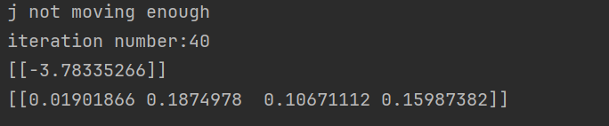
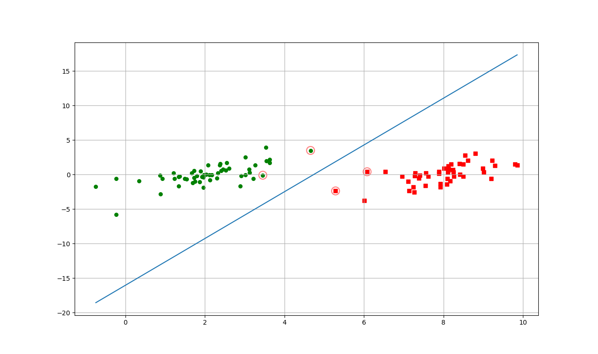
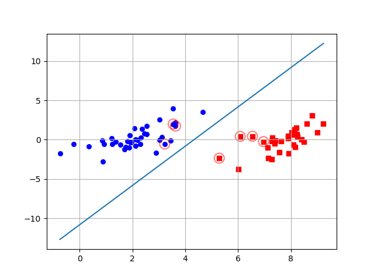
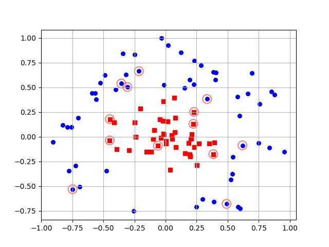

# 支持向量机

|          | 说明                                                         |
| -------- | ------------------------------------------------------------ |
| 适用类型 | 数值型和标称型                                               |
| 优点     | 泛化错误率低，计算开销不大，结果易于解释                     |
| 缺点     | 对参数调节和核函数的选择敏感，原始分类器不加修改只适合处理二类函数 |

**超平面**：分类的决策边界

**支持向量**：离超平面最近的点

支持向量机 学习的基本想法是找到一个超平面将不同类别的样本点分隔开来，并且使得**支持向量**到该**超平面**的距离**最大化**，也就是最难分的样本点（支持向量）也能有足够的确信度将他们分开。

## 数学推导

### 函数间隔

一个点到超平面的距离可以表示分类预测的置信度，|wx+b|可以表示点到超平面的距离，而 wx+b 的符号与**类标记y**的符号是否一致可以表示分类是否正确确，因此可以用 y(w·x+b) 来表示**分类的正确性和确信度**，这就是函数间隔。
$$
\gamma_i=y_i(w^Tx_i+b)
$$
但是该定义存在问题：即w和b同时缩小或放大m倍后，超平面并没有变化，但是函数间隔却变化了。所以，需要将w的大小固定，如|| w||=1，使得函数间隔固定，这时的间隔也就是几何间隔 。

### 几何间隔

**几何间隔就是点到超平面的距离**

任意超平面可以用下面这个线性方程来描述：
$$
wx+b=0
$$
在二维空间中点(x, y )到直线Ax+By+C=0 的距离公式：
$$
\frac{|Ax+By+C|}{\sqrt{A^2+B^2}}
$$
拓展到n维空间后，点x到超平面的距离表示为：
$$
d_i=\frac{|wx_i+b|}{||w||}
$$
定义超平面(w, b)与样本集的函数距离为与样本点的最小函数间隔，记作γ；与样本集的几何距离为与样本点的最小几何间隔，记作d

可以看出函数间隔和几何间隔的关系是：
$$
d=\frac{\gamma}{||w||}
$$
当||w||=1时，二者相等。

### 硬间隔最大化

现在假设数据是完全线性可分的，对训练数据集找到几何间隔最大的超平面，也就是以充分大的确信度对训练数据进行分类。

#### **1.最大间隔分离超平面**

$$
\max_{w,b} \quad d
$$

$$
s.t \quad y_i(\frac{w}{||w||}x_i+\frac{b}{||w||})\geq d\quad i=1,2,3...N
$$

考虑到几何间隔和函数间隔的关系上式又可以改写为
$$
\max_{w,b} \quad \frac{\gamma}{||w||}
$$

$$
s.t \quad y_i({w}x_i+{b})\geq\gamma\quad i=1,2,3...N
$$

正如上面所提到的，γ的取值并不影响最优化问题的解，它只会产生一个等价的优化问题。因此取 γ=1，这样上述问题就转换成
$$
\max_{w,b}\quad\frac{1}{||w||}
$$
也就是求
$$
\min_{w,b}\quad\frac{1}{2}||w||^2
$$

$$
s.t.\quad y_i({w}x_i+{b})\geq  1\quad i=1,2,3...N
$$

#### **2.带约束条件的优化问题**

##### **1）构造拉格朗日函数**

引入拉格朗日乘子αi≥0,定义拉格朗日函数：
$$
L(w,b,\alpha)=\frac{1}{2}||w||-\sum_{i=1}^{N}{\alpha_iy_i(wx_i+b)+\sum_{i=1}^{N}\alpha_i}
$$
##### **2）利用对偶性转换：**

根据拉格朗日对偶性，原始问题的对偶问题为：
$$
\max_\alpha \min_{w,b} L(w,b,\alpha)
$$
##### **3）求L(w,b,α)的极小值**

现对参数 w 和 b 求偏导数：
$$
\frac{\partial L}{\partial w} =w -\sum_{i=0}^n\alpha_ix_iy_i=0
$$

$$
\frac{\partial L}{\partial b} =\sum_{i=0}^n\alpha_iy_i=0
$$

可得：
$$
w =\sum_{i=0}^n\alpha_ix_iy_i
$$

$$
\sum_{i=0}^n\alpha_iy_i=0
$$

带回原式化简可得：
$$
\min_{w,b} L(w,b,\alpha)=-\frac{1}{2}\sum_{i=1}^N\sum_{j=1}^N\alpha_i\alpha_jy_iy_j+\sum_{i=1}^N\alpha_i
$$
##### **4）求min L(w,b,α)对α的极大值：**

$$
\max_\alpha\quad -\frac{1}{2}\sum_{i=1}^N\sum_{j=1}^N\alpha_i\alpha_jy_iy_j+\sum_{i=1}^N\alpha_i
$$

$$
s.t.\quad \sum_{i=1}^N\alpha_iy_i=0
$$

$$
\alpha_i\geq0
$$

##### 5）SMO优化

其**核心思想**是每次只优化**一个**参数，其他参数先固定住，仅求当前这个优化参数的极值。

但是由于优化目标有约束条件：
$$
s.t.\quad \sum_{i=1}^N\alpha_iy_i=0
$$
不可能改变一个参数，因此一次选择两个参数。

###### **SMO化简**

选择两个需要更新的参数α<sub>i</sub>和α<sub>j</sub>，固定其他参数。有以下束缚：
$$
\alpha_iy_i+\alpha_jy_j=c\quad \alpha_i\geq0,\alpha_j\geq0,
$$
其中
$$
c=-\sum_{k\neq i,j}\alpha_ky_k
$$
由此可以得出
$$
\alpha_j=\frac{c-\alpha_iy_i}{y_j}
$$
将上式带回目标函数，化简可得L(α<sub>j</sub>) :


也就是说可以用αi去表示αj，这样就把目标问题转换成了仅有一个约束条件的最优化问题，即αi≥0

###### **SMO求导**

对于仅有一个约束条件的最优化问题，我们完全可以在 α<sub>j</sub>上对优化目标求偏导，令导数为零，从而求出变量值 α<sub>j</sub><sup>new</sup> ，然后根据α<sub>j</sub><sup>new</sup> 求出 α<sub>i</sub><sup>new</sup> 
$$
\alpha_j^{new,unc}=\alpha_j^{old}+\frac{y2(E_i-E_j)}{\eta}
$$
其中：E1 = f(x1) - y1,E2 = f(x2) - y2,η = K<SUB>11 </SUB>+ K<SUB>22 </SUB>+ 2Kx`<SUB>12</SUB> (K<SUB>ij </SUB>= x<sub>i</sub><sup>T</sup>x<sub>j</sub>) 

######  剪辑最优解

同时，由于存在 α<sub>i</sub> y<sub>i </sub>+ α<sub>j</sub> α<sub>j</sub> = C，因此 α<sub>j</sub>本身也是存在约束的：

1.yi yj 异号
$$
有\alpha_i - \alpha_j = K，K等于C或-C
$$

$$
因为\alpha_i\in[0, C],\alpha_j = \alpha_i - K
$$

$$
故\alpha_j\in[-K, C-K]=[\alpha_j-\alpha_i,C+\alpha_j-\alpha_i]
$$

1.yi yj 同号
$$
有\alpha_i+\alpha_j = K，K等于C或-C
$$

$$
因为\alpha_i\in[0, C],\alpha_j =  K-\alpha_i
$$

$$
故\alpha_j\in[\alpha_j+\alpha_i	-C，C]
$$

###### 变量的选择方法

KKT条件
$$
当\alpha_i=0,y_if(x_i)\geq1
$$

$$
当0＜\alpha_i＜C,y_if(x_i)=1
$$

$$
当\alpha_i=C,y_if(x_i)\le1
$$

**第一个变量的选择**

首先遍历所有支持向量，检查是否满足KKT条件，如果都满足则遍历全部点

**第二个变量的选择**

假设已经找到了第一个变量 αi ,现在要在内层循环中找第二个变量 αj。而第二个变量选择的标准就是希望 αj能有足够大的变化。而根据前面的推导可得
$$
\alpha_j^{new,unc}=\alpha_j^{old}+\frac{y2(E_i-E_j)}{\eta}
$$
选择一种最简单的方法，找到一个 αj ,使得 |E1−E2| 最大。

如果遇到特殊的情况，通过上述方法选择的 αj 不能使目标函数有足够的下降，那就采用启发式规则继续选择 αj 。首先遍历在间隔边界上的支持向量点，依次作为 αj 试用，直到目标函数有足够的下降。若这样还找不到，那就遍历整个训练集。若仍然还是找不到，则放弃第一个 αi  ，重新找一个新的 αj  。

##### 6）求解w和b

求解偏导数时，得到：
$$
w =\sum_{i=0}^n\alpha_ix_iy_i
$$
α<sub>i</sub>>0对应的点都是支持向量，因此任意带入一个支持向量，可得：
$$
y_s(wx_s+b)=1
$$
通过上式求解出b：
$$
b=y_s-wx_s
$$
为了增强鲁棒性，可以求得支持向量的均值：
$$
b=\frac{1}{S}\sum_{s\in S}y_s-wx_s
$$

##### 7) 构造最佳超平面

最佳超平面为：w<sup>T</sup>x+b=0

分类决策函数：f(x)=sign(w<sup>T</sup>x+b)

### 软间隔最大化

#### **1.松弛变量**

现实中的数据有更多是不完全线性可分的，即存在一部分样本点 (xi,yi) 不能满足函数间隔大于等于1这个约束条件条件。为了解决这个问题，对每个样本点 (xi,yi) 引入一个**松弛变量**，使得函数间隔加上这个松弛变量满足约束条件，**即允许一部分点出去分割面错误的一侧**，这样约束条件就变为：
$$
\quad y_i({w}x_i+{b})\geq1-\xi_i
$$
同时，对于每一个松弛变量，支付一个代价，因此目标函数变为：
$$
\frac{1}{2}||w||+C\sum_{i=1}^{N}\xi_i
$$
这里C>0称为惩罚参数，C值大时对误分类的惩罚增加，C值小时惩罚减小，最小化目标函数的意义是：

- 1/2||w||尽可能小即间隔尽可能的大
- 使误分类的点尽可能的少

C是调和二者关系的系数，由于是乘的关系，当C无穷大时，松弛变量必然无穷小，因此C必须为有限制时才可以允许部分样本不满足原来的约束条件。

#### **2.优化问题**

 线性不可分的**线性支持向量机**的学习问题变成了如下的凸二次型规划问题：
$$
\min_{w,b,\xi}\quad\frac{1}{2}||w||+C\sum_{i=1}^{N}\xi_i
$$

$$
s.t. \quad y_i({w}x_i+{b})\geq1-\xi_i
$$

$$
\xi_i\geq0\quad\quad
$$

##### **1）构造拉格朗日函数**

$$
\min_{w,b,\xi}\max_{\alpha,\beta}=\frac{1}{2}||w||+C\sum_{i=1}^{N}\xi_i+\sum_{i=1}^{n}\alpha_i[1-\xi_i-y_i({w}x_i+{b})]-\sum_{i=1}^{n}\beta_i\xi_i
$$

##### **2）利用对偶性转换：**

它的对偶问题是：
$$
\max_{\alpha\beta}\min_{w,b,\xi}L(w,b,\xi,\alpha,\beta)
$$

##### 3）求L(w,b,xi,α,β)的极小值

分别对w，b，xi求偏导数，并令偏导等于0，可得：
$$
w=\sum_{i=1}^{m}\alpha_iy_ix_i
$$

$$
0=\sum_{i=1}^{m}\alpha_iy_i
$$

$$
C=\alpha_i+\beta_i
$$

带入拉格朗日函数得：
$$
\min_{w,b,\xi}L(w,b,\xi,\alpha,\beta)=\sum_{j=1}^{n}\alpha_i-\frac{1}{2}\sum_{i=1}^{n}\sum_{j=1}^{n}\alpha_i\alpha_jy_iy_j(x_i·x_j)
$$
由上式可知，最小化的结果里只有α没有β，因此只需要最大化α即可

##### 4）求 min L(w,b,xi,α,β) 对 α 的极大值

$$
\max_\alpha\quad -\frac{1}{2}\sum_{i=1}^N\sum_{j=1}^N\alpha_i\alpha_jy_iy_j+\sum_{i=1}^N\alpha_i
$$

$$
s.t.\quad \sum_{i=1}^N\alpha_iy_i=0
$$

$$
\quad\quad0\leq\alpha_i\leq C
$$

后续的步骤和硬间隔一样，利用smo算法求解α，利用求解出来的α得出w，再根据w带入支持向量求出b，最终求得超平面w<sup>T</sup>x+b=0

### 核函数

一些在低维度不可分的数据，在高纬度是可以分类的。利用核函数就可以将数据映射到高维空间。

**径向基函数**

径向基函数是一个采用向量作为自变量的函数，能够基于向量距离运算输出一个标量。这个距离可以是从<0,0>向量或者其他向量开始计算的距离。

接下来，径向基函数的高斯版本：
$$
K(x,y)=exp(\frac{-||x-y||^2}{2\sigma^2})
$$


## 序列最小优化算法SMO

工作原理： 每次只优化一对α 来逐渐逼近最终结果。如何取这一对α采用以下两条规则：

- 选取的两个α 必须要在边界之外
- 这两个α 还没有进行过区间化处理或者不在边界上
  

### 简化版SMO

如果随机选择一个α可能会导致无法满足约束条件，因此每次改变两个α。我们会遍历数据集上的每一个α，再在剩下的α合集中选择一个。

```python
def selectJrand(i, m):
    j = i
    while j == i:
        j = int(random.uniform(0, m))
    return j
```

同时构建一个辅助函数，避免α的值太大，限制其范围

```python
def clipAlpha(aj, h, l):
    if aj > h:
        aj = h
    if l > aj:
        aj = l
    return aj
```

**完整代码**

```python
import random
import numpy as np


def loadDataSet(filename):
    data_mat = []
    label_mat = []
    f = open(filename, 'r')
    for line in f.readlines():
        line = line.strip().split('\t')
        data_mat.append([float(line[0]), float(line[1])])
        label_mat.append(int(line[-1]))
    return data_mat, label_mat


"""
功能：随机选择另一个α
输入：当前α的下标，α的数目
输出：另一个α的下标
"""
def selectJrand(i, m):
    j = i
    while j == i:
        j = int(random.uniform(0, m))
    return j


"""
功能：限制α的大小
输入：α，上限，下限
输出：α
"""
def clipAlpha(aj, h, l):
    if aj > h:
        aj = h
    if l > aj:
        aj = l
    return aj


"""
输入：数据集，标签列表，常数C，容错率，最大循环次数
"""
def smoSimple(data_mat, class_label, c, toler, max_iter):
    # 将数据和标签列表转换成矩阵
    data_mat = np.mat(data_mat)
    label_mat = np.mat(class_label).transpose()
    b = 0
    m, n = np.shape(data_mat)
    alphas = np.mat(np.zeros((m, 1)))
    iter = 0
    while iter < max_iter:  # 大循环，控制循环次数
        alpha_pairs_changed = 0
        for i in range(m):  # 小循环，优化每一个α
            # 预测类别
            f_xi = float(np.multiply(alphas, label_mat).T *
                         (data_mat * data_mat[i, :].T)) + b
            # 预测误差
            ei = f_xi - float(label_mat[i])
            # 如果误差过大( < -toler 或者 > toler)且 α 满足 0 < α < c 的约束条件,对 α 进行优化.
            if ((label_mat[i] * ei < -toler) and (alphas[i] < c)) or \
                    ((label_mat[i] * ei) > toler and (alphas[i] > 0)):
                # 随机选择另一个样本
                j = selectJrand(i, m)
                # 预测类别
                f_xj = float(np.multiply(alphas, label_mat).T *
                             (data_mat * data_mat[j, :].T)) + b
                # 预测误差
                ej = f_xj - float(label_mat[j])
                # 保存旧值，方便后续做比较
                alpha_i = alphas[i].copy()
                alpha_j = alphas[j].copy()
                # 保证αj满足约束条件
                if label_mat[i] != label_mat[j]:
                    l = max(0, alphas[j] - alphas[i])
                    h = min(c, c + alphas[j] - alphas[i])
                else:
                    l = max(0, alphas[j] + alphas[i] - c)
                    h = min(c, alphas[j] + alphas[i])
                if l == h:
                    print('L == H')
                    continue
                # eta是alpha[j]的最佳修正量
                eta = 2.0 * data_mat[i, :] * data_mat[j,].T - \
                        data_mat[i, :] * data_mat[i,].T - \
                        data_mat[j, :] * data_mat[j,].T
                if eta >= 0:
                    print('eta >= 0')
                    continue
                # 获得alpha[j]的优化值
                alphas[j] -= label_mat[j] * (ei - ej) / eta
                alphas[j] = clipAlpha(alphas[j], h, l)
                # 对比原值，是否优化明显，不明显则退出
                if abs(alphas[j]) - alpha_j < 0.00001:
                    print('j not moving enough')
                    continue
                # 对alpha[i]、alpha[j]进行量相同、方向相反的优化
                alphas[i] += label_mat[j] * label_mat[i] * (alpha_j - alphas[j])
                b1 = b - ei - label_mat[i] * (alphas[i] - alpha_i) * \
                     data_mat[i, :] * data_mat[i,].T - \
                     label_mat[j] * (alphas[j] - alpha_j) * \
                     data_mat[i, :] * data_mat[j, :].T
                b2 = b - ej - label_mat[i] * (alphas[i] - alpha_i) * \
                     data_mat[i, :] * data_mat[j,].T - \
                     label_mat[j] * (alphas[j] - alpha_j) * \
                     data_mat[j, :] * data_mat[j, :].T
                if (0 < alphas[i]) and (c > alphas[i]):
                    b = b1
                elif (0 < alphas[j]) and (c > alphas[j]):
                    b = b2
                else:
                    b = (b1 + b2) / 2.0
                alpha_pairs_changed += 1
                print(f"iter:{iter} i:{i}, pairs changed {alpha_pairs_changed}")
        """
        如果所有向量都没有优化，则增加迭代数目，继续下一次循环
        当所有的向量都不再优化，并且达到最大迭代次数才退出，一旦有向量优化，iter都要归零
        """
        if alpha_pairs_changed == 0:
            iter += 1
        else:
            iter = 0
        print(f"iteration number:{iter}")
    return b, alphas


# 画图并圈出支持向量的数据点
def plotSupport(data_mat, label_mat, support_points, ws, b):
    import matplotlib.pyplot as plt
    data_arr = np.array(data_mat)
    xcord1 = []
    ycord1 = []
    xcord2 = []
    ycord2 = []
    m = len(label_mat)
    for i in range(m):
        if label_mat[i] == 1:
            xcord1.append(data_arr[i, 0])
            ycord1.append(data_arr[i, 1])
        else:
            xcord2.append(data_arr[i, 0])
            ycord2.append(data_arr[i, 1])
    fig = plt.figure()
    ax = fig.add_subplot(111)
    ax.scatter(xcord1, ycord1, s=30, c='red', marker='s')
    ax.scatter(xcord2, ycord2, s=30, c='blue')

    # 圈出支持向量
    for i in range(len(support_points)):
        x, y = support_points[i][0]
        plt.scatter([x], [y], s=150, c='none', alpha=.5, linewidth=1.5, edgecolor='red')

    # 绘制分离超平面
    x1 = max(data_mat)[0]
    x2 = min(data_mat)[0]
    b = float(b)
    a1 = float(ws[0][0])
    a2 = float(ws[1][0])
    y1, y2 = (-b - a1 * x1) / a2, (-b - a1 * x2) / a2
    plt.plot([x1, x2], [y1, y2])

    ax.grid(True)
    plt.show()


def calcWs(alphas, dataArr, classLabels):
    X = np.mat(dataArr)
    labelMat = np.mat(classLabels).transpose()
    m, n = np.shape(X)
    ws = np.zeros((n, 1))
    for i in range(m):
        # 大部分的alpha为0，少数几个是值不为0的支持向量
        ws += np.multiply(alphas[i] * labelMat[i], X[i, :].T)
    return ws


def getSupportPoints(data_mat, label_mat, alphas):
    support_points_list = []
    for i in range(100):
        if alphas[i] > 0.0:
            support_points_list.append([data_mat[i], label_mat[i]])
    return support_points_list


if __name__ == '__main__':
    data_matx, label_matx = loadDataSet('./testSet.txt')
    t_b, t_alphas = smoSimple(data_matx, label_matx, c=0.6, toler=0.001, max_iter=40)
    print(t_b)
    print(t_alphas[t_alphas>0])

    w = calcWs(t_alphas, data_matx, label_matx)
    support_points = getSupportPoints(data_matx, label_matx, t_alphas)
    plotSupport(data_matx, label_matx, support_points, w, t_b)

```

运行结果





### 完整版SMO

相比简化版，在α的选择方式上应用了一些能够提速的启发式方法

```python
import numpy as np
from svm_simple import selectJrand, clipAlpha

def loadDataSet(filename):
    data_mat = []
    label_mat = []
    f = open(filename, 'r')
    for line in f.readlines():
        line = line.strip().split('\t')
        data_mat.append([float(line[0]), float(line[1])])
        label_mat.append(int(float(line[-1])))
    return data_mat, label_mat


class optStruct:
    def __init__(self, data_mat_in, class_labels, C, toler):
        self.x = data_mat_in
        self.label_mat = class_labels
        self.C = C
        self.toler = toler
        self.m = np.shape(data_mat_in)[0]
        self.alphas = np.mat(np.zeros((self.m, 1)))
        self.b = 0
        # e_cache用于缓存误差，第一列是标志位，取值为0或者1，为1时表示已经算出来；第二列是实际的E值
        self.e_cache = np.mat(np.zeros((self.m, 2)))


# 计算E值
def calcEk(opt, k):
    f_xk = float(np.multiply(opt.alphas, opt.label_mat).T *
                 (opt.x * opt.x[k, :].T)) + opt.b
    ek = f_xk - float(opt.label_mat[k])
    return ek


# 用于选择第二个α值，返回索引和误差值
def selectJ(i, opt: optStruct, ei):
    max_k = -1
    max_delta_e = 0
    ej = 0
    opt.e_cache[i] = [1, ei]
    valid_ecache_list = np.nonzero(opt.e_cache[:, 0].A)[0]  # 获取有效值的行索引
    # 从现有的有效误差中寻找第二个alpha
    if len(valid_ecache_list) > 1:
        # 遍历，找到最大的Ek
        for k in valid_ecache_list:
            if k == i:
                continue
            ek = calcEk(opt, k)
            delta_e = abs(ei - ek)
            if delta_e > max_delta_e:
                max_k = k
                max_delta_e = delta_e
                ej = ek
        return max_k, ej
    else:
        # 如果现有有效误差只有1个（即第一个α），则说明这是第一次循环，直接在所有数据里面进行随机选择
        j = selectJrand(i, opt.m)
        ej = calcEk(opt, j)
    return j, ej


# 计算误差值，并存入缓存
def updateEk(opt, k):
    ek = calcEk(opt, k)
    opt.e_cache[k] = [1, ek]


# 内循环
def innerL(i, opt: optStruct):
    ei = calcEk(opt, i)
    if ((opt.label_mat[i] * ei < -opt.toler) and (opt.alphas[i] < opt.C)) or \
            ((opt.label_mat[i] * ei > opt.toler) and (opt.alphas[i] > 0)):
        j, ej = selectJ(i, opt, ei)
        alpha_i = opt.alphas[i].copy()
        alpha_j = opt.alphas[j].copy()
        if opt.label_mat[i] != opt.label_mat[j]:
            L = max(0, opt.alphas[j] - opt.alphas[i])
            H = min(opt.C, opt.C + opt.alphas[j] - opt.alphas[i])
        else:
            L = max(0, opt.alphas[i] + opt.alphas[j] - opt.C)
            H = min(opt.C, opt.alphas[i] + opt.alphas[j])
        if L == H:
            print("L == H")
            return 0
        # eta是alpha[j]的最优修改量
        eta = 2.0 * opt.x[i, :] * opt.x[j, :].T - opt.x[i, :] * opt.x[i, :].T - opt.x[j, :] * opt.x[j, :].T
        # eta >= 0的情况比较少，并且优化过程计算复杂，所以此处做了简化处理，直接跳过了
        if eta >= 0:
            print("eta >= 0")
            return 0
        opt.alphas[j] -= opt.label_mat[j] * (ei - ej) / eta
        opt.alphas[j] = clipAlpha(opt.alphas[j], H, L)
        updateEk(opt, j)
        # 比对原值，看变化是否明显，如果优化并不明显则退出
        if abs(opt.alphas[j] - alpha_j) <  0.00001:
            print("j not moving enough")
            return 0
        opt.alphas[i] += opt.label_mat[j] * opt.label_mat[i] * (alpha_j - opt.alphas[j])
        updateEk(opt, i)
        b1 = opt.b - ei - opt.label_mat[i] * (opt.alphas[i] - alpha_i) * opt.x[i, :] * opt.x[i, :].T \
             - opt.label_mat[j] * (opt.alphas[j] - alpha_j) * opt.x[i, :] * opt.x[j, :].T
        b2 = opt.b - ej - opt.label_mat[i] * (opt.alphas[i] - alpha_i) * opt.x[i, :] * opt.x[j, :].T \
             - opt.label_mat[j] * (opt.alphas[j] - alpha_j) * opt.x[j, :] * opt.x[j, :].T
        if (0 < opt.alphas[i]) and (opt.C > opt.alphas[i]):
            opt.b = b1
        elif (0 < opt.alphas[j]) and (opt.C > opt.alphas[j]):
            opt.b = b2
        else:
            opt.b = (b1 + b2) / 2.0
        return 1
    else:
        return 0


'''
外循环函数
参数：数据集，类别标签，松弛变量C，容错率， 总共最大的循环次数，核函数
C表示不同优化问题的权重，如果C很大，分类器会力图通过分离超平面将样例都正确区分，如果C很小又很难很好的分类，C值需要平衡两者
'''


def smoP(data_mat_in, class_labels, C, toler, max_iter):
    opt: optStruct = optStruct(np.mat(data_mat_in), np.mat(class_labels).transpose(), C, toler)
    iter = 0
    entire_set = True
    alpha_pairs_changed = 0
    # 循环条件1：iter未超过最大迭代次数
    # 循环条件2：上次循环有收获或者遍历方式为遍历所有值
    # 因为最终的遍历方式是趋向于遍历非边界值，如果仍在遍历所有值说明还需要更多的训练
    while iter < max_iter and ((alpha_pairs_changed > 0) or entire_set):
        alpha_pairs_changed = 0
        # 遍历所有的值
        if entire_set:
            for i in range(opt.m):
                alpha_pairs_changed += innerL(i, opt)
                print(f"full_set, iter:{iter} i: {i}, pairs changed: {alpha_pairs_changed}")
            iter += 1
        # 遍历非边界值
        else:
            # 取出非边界值的行索引
            non_bound_i_s = np.nonzero(np.array((opt.alphas.A > 0) * (opt.alphas.A < opt.C)))[0]
            for i in non_bound_i_s:
                alpha_pairs_changed += innerL(i, opt)
                print(f"non-bound, iter:{iter} i: {i}, pairs changed: {alpha_pairs_changed}")
            iter += 1
        # 如果上次循环是遍历所有值，那么下次循环改为遍历非边界值
        if entire_set:
            entire_set = False
        # 如果上次循环是遍历非边界值但没有收获，则改为遍历所有值
        elif alpha_pairs_changed == 0:
            entire_set = True
        print("iteration number: ", iter)

    return opt.b, opt.alphas


def plotSupport(data_mat, label_mat, supp_points, ws, b):
    import matplotlib.pyplot as plt
    data_arr = np.array(data_mat)
    xcord1 = []
    ycord1 = []
    xcord2 = []
    ycord2 = []
    m = len(label_mat)
    for i in range(m):
        if label_mat[i] == 1:
            xcord1.append(data_arr[i, 0])
            ycord1.append(data_arr[i, 1])
        else:
            xcord2.append(data_arr[i, 0])
            ycord2.append(data_arr[i, 1])
    fig = plt.figure()
    ax = fig.add_subplot(111)
    ax.scatter(xcord1, ycord1, s=30, c='red', marker='s')
    ax.scatter(xcord2, ycord2, s=30, c='blue')

    # 圈出支持向量
    for i in range(len(supp_points)):
        x, y = supp_points[i][0]
        plt.scatter([x], [y], s=150, c='none', alpha=.5, linewidth=1.5, edgecolor='red')

    # 绘制分离超平面
    x1 = max(data_mat)[0]
    x2 = min(data_mat)[0]
    b = float(b)
    a1 = float(ws[0][0])
    a2 = float(ws[1][0])
    y1, y2 = (-b - a1 * x1) / a2, (-b - a1 * x2) / a2
    plt.plot([x1, x2], [y1, y2])

    ax.grid(True)
    plt.show()


def calcWs(alphas, data_arr, class_labels):
    X = np.mat(data_arr)
    labelMat = np.mat(class_labels).transpose()
    m, n = np.shape(X)
    ws = np.zeros((n, 1))
    for i in range(m):
        # 大部分的alpha为0，少数几个是值不为0的支持向量
        ws += np.multiply(alphas[i] * labelMat[i], X[i, :].T)
    return ws


def getSupportPoints(data_mat, label_mat, alphas):
    support_points_list = []
    for i in range(len(label_mat)):
        if alphas[i] > 0.0:
            support_points_list.append([data_mat[i], label_mat[i]])
    return support_points_list


if __name__ == '__main__':
    data_arr, class_labels = loadDataSet('./testSet.txt')
    t_b, t_alphas = smoP(data_arr, class_labels, C=0.6, toler=0.001, max_iter=40)
    print(t_b)
    print(t_alphas[t_alphas > 0])

    w = calcWs(t_alphas, data_arr, class_labels)
    support_points = getSupportPoints(data_arr, class_labels, t_alphas)
    plotSupport(data_arr, class_labels, support_points, w, t_b)

```

**结果**



### 在复杂数据上应用核函数

```python
from svm_full import selectJ, clipAlpha, updateEk, loadDataSet
import numpy as np

"""
核转换函数
X是数据矩阵，A是单个数据向量
k_tup是一个元组，第一个参数是核函数类型，第二个参数是核函数可能需要的可选参数
"""
def kernelTrans(X, A, k_tup):
    m, n = np.shape(X)
    k = np.mat(np.zeros((m, 1)))
    if k_tup[0] == 'lin':
        k = X * A.T
    elif k_tup[0] == 'rbf':
        for j in range(m):
            delta_row = X[j, :] - A
            k[j] = delta_row * delta_row.T
        k = np.exp(k / (-1 * k_tup[1] ** 2))
    else:
        raise NameError('That Kernel is not recognized')
    return k


class optStruct:
    def __init__(self, data_mat_in, class_labels, C, toler, k_tup):
        self.x = data_mat_in
        self.label_mat = class_labels
        self.C = C
        self.toler = toler
        self.m = np.shape(data_mat_in)[0]
        self.alphas = np.mat(np.zeros((self.m, 1)))
        self.b = 0
        self.K = np.mat(np.zeros((self.m, self.m)))
        for i in range(self.m):
            self.K[:, i] = kernelTrans(self.x, self.x[i, :], k_tup)
        self.e_cache = np.mat(np.zeros((self.m, 2)))


# 计算E值并返回，由于该过程出现频繁，因此单独立为函数
def calcEk(opt, k):
    f_xk = float(np.multiply(opt.alphas, opt.label_mat).T * opt.K[:, k] + opt.b)
    ek = f_xk - float(opt.label_mat[k])
    return ek


# 内循环
# 原来的ent.X[i, :] * ent.X[j, :].T改成了 ent.K[j, j]，只有类似格式进行了变动，其他没变
def innerL(i, opt):
    ei = calcEk(opt, i)
    if ((opt.label_mat[i] * ei < -opt.toler) and (opt.alphas[i] < opt.C)) or \
            ((opt.label_mat[i] * ei > opt.toler) and (opt.alphas[i] > 0)):
        j, ej = selectJ(i, opt, ei)
        alpha_i = opt.alphas[i].copy()
        alpha_j = opt.alphas[j].copy()
        if opt.label_mat[i] != opt.label_mat[j]:
            L = max(0, opt.alphas[j] - opt.alphas[i])
            H = min(opt.C, opt.C + opt.alphas[j] - opt.alphas[i])
        else:
            L = max(0, opt.alphas[i] + opt.alphas[j] - opt.C)
            H = min(opt.C, opt.alphas[i] + opt.alphas[j])
        if L == H:
            print("L == H")
            return 0
        # eta是alpha[j]的最优修改量
        eta = 2.0 * opt.K[i, j] - opt.K[i, i] - opt.K[j, j]
        # eta >= 0的情况比较少，并且优化过程计算复杂，所以此处做了简化处理，直接跳过了
        if eta >= 0:
            print("eta >= 0")
            return 0
        opt.alphas[j] -= opt.label_mat[j] * (ei - ej) / eta
        opt.alphas[j] = clipAlpha(opt.alphas[j], H, L)
        updateEk(opt, j)
        # 比对原值，看变化是否明显，如果优化并不明显则退出
        if abs(opt.alphas[j] - alpha_j) < 0.00001:
            print("j not moving enough")
            return 0
        opt.alphas[i] += opt.label_mat[j] * opt.label_mat[i] * (alpha_j - opt.alphas[j])
        updateEk(opt, i)
        b1 = opt.b - ei - opt.label_mat[i] * (opt.alphas[i] - alpha_i) * opt.K[i, i] \
             - opt.label_mat[j] * (opt.alphas[j] - alpha_j) * opt.K[j, i]
        b2 = opt.b - ej - opt.label_mat[i] * (opt.alphas[i] - alpha_i) * opt.K[i, j] \
             - opt.label_mat[j] * (opt.alphas[j] - alpha_j) * opt.K[j, j]
        if (0 < opt.alphas[i]) and (opt.C > opt.alphas[i]):
            opt.b = b1
        elif (0 < opt.alphas[j]) and (opt.C > opt.alphas[j]):
            opt.b = b2
        else:
            opt.b = (b1 + b2) / 2.0
        return 1
    else:
        return 0


'''
外循环函数
参数：数据集，类别标签，松弛变量C，容错率， 总共最大的循环次数，核函数
C表示不同优化问题的权重，如果C很大，分类器会力图通过分离超平面将样例都正确区分，如果C很小又很难很好的分类，C值需要平衡两者
'''
def smoP(data_mat_in, class_labels, C, toler, max_iter, k_tup=('lin', 0)):
    opt = optStruct(np.mat(data_mat_in), np.mat(class_labels).transpose(), C, toler, k_tup)
    iter = 0
    entire_set = True
    alpha_pairs_changed = 0
    # 循环条件1：iter未超过最大迭代次数 && 循环条件2：上次循环有收获或者遍历方式为遍历所有值
    # 因为最终的遍历方式是趋向于遍历非边界值，如果仍在遍历所有值说明还需要更多的训练
    while iter < max_iter and ((alpha_pairs_changed > 0) or entire_set):
        alpha_pairs_changed = 0
        # 遍历所有的值
        if entire_set:
            for i in range(opt.m):
                alpha_pairs_changed += innerL(i, opt)
            print("fullSet, iter:", iter, ", i:", i, ", pairs changed:", alpha_pairs_changed)
            iter += 1
        # 遍历非边界值
        else:
            # 取出非边界值的行索引
            non_bound_is = np.nonzero((opt.alphas.A > 0) * (opt.alphas.A < opt.C))[0]
            for i in non_bound_is:
                alpha_pairs_changed += innerL(i, opt)
            print("non-bound, iter:", iter, ", i:", i, ", pairs changed: ", alpha_pairs_changed)
            iter += 1
        # 如果上次循环是遍历所有值，那么下次循环改为遍历非边界值
        if entire_set:
            entire_set = False
        # 如果上次循环是遍历非边界值但没有收获，则改为遍历所有值
        elif alpha_pairs_changed == 0:
            entire_set = True
        print("iteration number: ", iter)

    return opt.b, opt.alphas


def plotSupport(data_mat, label_mat, supp_points):
    import matplotlib.pyplot as plt
    data_arr = np.array(data_mat)
    xcord1 = []
    ycord1 = []
    xcord2 = []
    ycord2 = []
    m = len(label_mat)
    for i in range(m):
        if label_mat[i] == 1:
            xcord1.append(data_arr[i, 0])
            ycord1.append(data_arr[i, 1])
        else:
            xcord2.append(data_arr[i, 0])
            ycord2.append(data_arr[i, 1])
    fig = plt.figure()
    ax = fig.add_subplot(111)
    ax.scatter(xcord1, ycord1, s=30, c='red', marker='s')
    ax.scatter(xcord2, ycord2, s=30, c='blue')

    # 圈出支持向量
    for i in range(len(supp_points)):
        x, y = supp_points[i][0]
        plt.scatter([x], [y], s=150, c='none', alpha=.5, linewidth=1.5, edgecolor='red')

    ax.grid(True)
    plt.show()


def getSupportPoints(data_mat, label_mat, alphas):
    support_points_list = []
    for i in range(len(label_mat)):
        if alphas[i] > 0.0:
            support_points_list.append([data_mat[i], label_mat[i]])
    return support_points_list


def testRbf(k1=1.3):
    data_arr, label_arr = loadDataSet('./testSetRBF.txt')
    # 参数：数据集，类别标签，松弛变量C，容错率， 总共最大的循环次数，核函数
    b, alphas = smoP(data_arr, label_arr, 200, 0.0001, 10000, ('rbf', k1))
    data_mat = np.mat(data_arr)
    label_mat = np.mat(label_arr).transpose()
    supp_points = getSupportPoints(data_arr, label_arr, alphas)
    sv_ind = np.nonzero(alphas.A > 0.0)[0]  # 支持向量的行索引
    s_vs = data_mat[sv_ind]  # 支持向量的数据点
    label_sv = label_mat[sv_ind]  # 支持向量的类别标签
    print(f"有{ np.shape(s_vs)[0]}个支持向量")
    m, n = np.shape(data_mat)
    error_count = 0
    for i in range(m):
        kernel_eval = kernelTrans(s_vs, data_mat[i, :], ('rbf', k1))
        predict = kernel_eval.T * np.multiply(label_sv, alphas[sv_ind]) + b
        if np.sign(predict) != np.sign(label_arr[i]):
            error_count += 1
    print("训练的错误率", (float(error_count) / m))
    plotSupport(data_arr, label_arr, supp_points)

    data_arr, label_arr = loadDataSet('./testSetRBF2.txt')
    data_mat = np.mat(data_arr)
    m, n = np.shape(data_mat)
    error_count = 0
    for i in range(m):
        kernel_eval = kernelTrans(s_vs, data_mat[i, :], ('rbf', k1))
        predict = kernel_eval.T * np.multiply(label_sv, alphas[sv_ind]) + b
        if np.sign(predict) != np.sign(label_arr[i]):
            error_count += 1
    print("测试的错误率", (float(error_count) / m))


if __name__ == '__main__':
    testRbf()
```

**结果**



## 示例：手写识别问题

```python
from svm_kerbel import *
from numpy import *


# 将数字图像信息转换为矩阵
def img2vector(filename):
    return_vect = zeros((1, 1024))
    f = open(filename)
    for i in range(32):
        lineStr = f.readline()
        for j in range(32):
            return_vect[0, 32 * i + j] = int(lineStr[j])
    return return_vect


# 将手写识别问题转换为二分类问题，数字9类别为-1，不是数字9类别为1
def loadImage(dirName):
    from os import listdir
    hw_labels = []
    # 获取所有文件
    training_file_list = listdir(dirName)
    m = len(training_file_list)
    training_mat = zeros((m, 1024))
    for i in range(m):
        file_name_str = training_file_list[i]
        file_str = file_name_str.split('.')[0]
        class_num_str = int(file_str.split('_')[0])
        if class_num_str == 9:
            hw_labels.append(-1)
        else:
            hw_labels.append(1)
        training_mat[i, :] = img2vector(dirName + '/' + file_name_str)
    return training_mat, hw_labels


def a_testDigits(k_tup=('rbf', 10)):
    data_arr, label_arr = loadImage('../KNN/digits/trainingDigits')
    b, alphas = smoP(data_arr, label_arr, 200, 0.0001, 10000, k_tup)
    data_mat = mat(data_arr)
    label_mat = mat(label_arr).transpose()
    sv_ind = nonzero(alphas.A > 0)[0]
    s_vs = data_mat[sv_ind]
    label_sv = label_mat[sv_ind]
    print(f"这里有{shape(s_vs)[0]}支持向量")
    m, n = shape(data_mat)
    error_count = 0
    for i in range(m):
        kernel_eval = kernelTrans(s_vs, data_mat[i, :], k_tup)
        predict = kernel_eval.T * multiply(label_sv, alphas[sv_ind]) + b
        if sign(predict) != sign(label_arr[i]):
            error_count += 1
    print(f"训练错误率{(float(error_count) / m)}")

    data_arr, label_arr = loadImage('../KNN/digits/testDigits')
    data_mat = mat(data_arr)
    label_mat = mat(label_arr).transpose()
    m, n = shape(data_mat)
    error_count = 0
    for i in range(m):
        kernel_eval = kernelTrans(s_vs, data_mat[i, :], k_tup)
        predict = kernel_eval.T * multiply(label_sv, alphas[sv_ind]) + b
        if sign(predict) != sign(label_arr[i]):
            error_count += 1
    print(f"测试错误率{(float(error_count) / m)}")


if __name__ == "__main__":
    a_testDigits()
# 这里有298支持向量
# 训练错误率0.0
# 测试错误率0.006342494714587738
```

