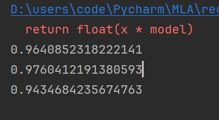

# 树回归

数据集中经常包含一些复杂的相互关系，使得输入数据和目标变量之间呈现非线性关系。对这些复杂的关系建模，一种可行的方式是使用树来对预测值分段，包括分段常数或分段直线。一般采用树结构来对这种数据建模。相应地，若叶节点使用的模型是分段常数则称为**回归树**，若叶节点使用的模型是线性回归方程则称为**模型树**。

|          | 说明                         |
| -------- | ---------------------------- |
| 优点     | 可以对复杂和非线性的数据建模 |
| 缺点     | 结果不易理解                 |
| 适用类型 | 数值型、标称型               |

之前学习过的**分类树**的构建树的算法是ID3，ID3 的做法是每次选取当前最佳的特征来分割数据，并按照该特征的所有可能取值来切分。它无法处理连续性的数据，必须将连续性转换成离散型才能使用，但这种方式无疑会损失连续性变量的内在性质。

## CART（ Classification And Regression Trees，分类回归树）

CART 是十分著名且广泛记载的树构建算法，它使用二元切分来处理连续型变量。二元切分的具体的处理方法是: 如果特征值大于给定值就走左子树，否则就走右子树。

```python
def bin_split_dataset(dataset, feature, value):
    mat0 = dataset[nonzero(dataset[:, feature] > value)[0], :]
    mat1 = dataset[nonzero(dataset[:, feature] <= value)[0], :]
    return mat0, mat1
```

## 构建树

在分类树中使用香农熵来度量集合的无组织程度。如果选用其他方法来代替香农熵，就可以使用树构建算法来完成回归。在这里，计算连续型数值的混乱度是非常简单的。首先计算所有数据的均值，然后计算每条数据的值到均值的差值。为了对正负差值同等看待，一般使用绝对值或平方值来代替上述差值。

上述做法有点类似于前面介绍过的统计学中常用的方差计算。唯一不同就是，方差是平方误差的均值(均方差)，而这里需要的是平方误差的总值(总方差)。总方差可以通过均方差乘以数据集中样本点的个数来得到。

```python
# 回归数的切分函数
# 生成叶节点
def reg_leaf(dataset):
    return mean(dataset[:, -1])

# 误差估计
def reg_err(dataset):
    return var(dataset[:, -1]) * shape(dataset)[0]

# 找到最佳二元切分方式
def choose_best_split(dataset, leaf_type=reg_leaf, err_type=reg_err, ops=(1,4)):
    tol_s = ops[0]
    tol_n = ops[1]
    if len(set(dataset[:, -1].T.tolist()[0])) == 1:
        return None, leaf_type(dataset)

    m, n = shape(dataset)
    s = err_type(dataset)
    best_s = inf
    best_index = 0
    best_value = 0
    for feat_index in range(n-1):
        for split_val in set(asarray(dataset[:, feat_index]).ravel()):
            mat0, mat1 = bin_split_dataset(dataset, feat_index, split_val)
            if shape(mat0)[0] < tol_n or shape(mat1)[0] < tol_n:
                continue
            new_s = err_type(mat0) + err_type(mat1)
            if new_s < best_s:
                best_index = feat_index
                best_value = split_val
                best_s = new_s

    if (s - best_s) < tol_s:
        return None, leaf_type(dataset)
    mat0, mat1 = bin_split_dataset(dataset, best_index, best_value)
    if shape(mat0)[0] < tol_n or shape(mat1)[0] < tol_n:
        return None, leaf_type(dataset)
    return best_index, best_value
```

```python
if __name__ == "__main__":
    # 1. 创建树
    my_dat = load_dataset('ex0.txt')
    my_mat = mat(my_dat)
    my_tree = create_tree(my_mat, ops=(0, 1))

    print(my_tree)
    
```

## 树剪枝

一棵树如果节点过多，表明该模型可能对数据进行了 “过拟合”。儿通过降低决策树的复杂度来避免过拟合的过程称为剪枝（ pruning）。

**预剪枝**

通过容许的误差下降值， 以及切分的最少样本数，来控制划分函数的停止。

**后剪枝**

使用后剪枝方法需要将数据集分成测试集和训练集。首先指定参数，使得构建出的树足够大、足够复杂，便于剪枝。接下来从上而下找到叶节点，用测试集来判断将这些叶节点合并是否能降低测试误差。如果是的话就合并。

```python
def is_tree(obj):
    # 判断对象是否是字典类型，即决策树节点
    return type(obj).__name__ == "dict"


def get_mean(tree):
    # 计算子树的平均值
    if is_tree(tree["right"]):
        tree["right"] = get_mean(tree["right"])
    if is_tree(tree["left"]):
        tree["left"] = get_mean(tree["left"])
    return (tree["left"] + tree["right"]) / 2.0


def prune(tree, test_data):
    # 如果测试数据为空，返回子树的平均值
    if shape(test_data)[0] == 0:
        return get_mean(tree)

    if is_tree(tree["right"]) or is_tree(tree["left"]):
        lset, rset = bin_split_dataset(test_data, tree["sp_ind"], tree["sp_val"])
    # 如果左子树为非叶子节点，递归剪枝左子树
    if is_tree(tree["left"]):
        tree["left"] = prune(tree["left"], lset)
    # 如果右子树为非叶子节点，递归剪枝右子树
    if is_tree(tree["right"]):
        tree["right"] = prune(tree["right"], rset)

    # 如果左右子树均为叶子节点
    if not is_tree(tree["left"]) and not is_tree(tree["right"]):
        lset, rset = bin_split_dataset(test_data, tree["sp_ind"], tree["sp_val"])
        # 计算未合并的误差
        error_no_merge = sum(power(lset[:, -1] - tree["left"], 2)) + sum(power(rset[:, -1] - tree["right"], 2))
        tree_mean = (tree["left"] + tree["right"]) / 2.0
        # 计算合并后的误差
        error_merge = sum(power(test_data[:, -1] - tree_mean, 2))
        # 如果合并后的误差小于未合并的误差，则进行合并操作
        if error_merge < error_no_merge:
            print("merging")  # 输出提示信息
            return tree_mean
    return tree


if __name__ == "__main__":
    # 创建树
    my_dat = load_dataset('exp2.txt')
    my_mat = mat(my_dat)
    my_tree = create_tree(my_mat, ops=(0, 1))
    
    # 剪枝
    my_dat_test = load_dataset('ex2test.txt')
    my_mat_test = mat(my_dat_test)
    result = prune(my_tree, my_mat_test)
    print(result)
```

## 模型树

用树来对数据建模，除了把叶节点简单地设定为常数值之外，还有一种方法是把叶节点设定为分段线性函数，这里所谓的 `分段线性（piecewise linear）` 是指模型由多个线性片段组成。

同时将误差的计算方法更新为：对于给定的数据集，应该先用模型来对它进行拟合，然后计算真实的目标值与模型预测值间的差值。最后将这些差值的平方求和求得。

```python
def linear_solve(dataset):
    m, n = shape(dataset)
    x = mat(ones((m, n)))
    y = mat(ones((m, 1)))
    x[:, 1:n] = dataset[:, 0:n-1]
    y = dataset[:, -1]
    xTx = x.T * x

    if linalg.det(xTx) == 0.0:
        raise NameError("This matrix is singular, cannot do inverse, try increasing the second value of ops")

    ws = xTx.I * (x.T * y)
    return ws, x, y


def model_leaf(dataset):
    ws, x, y = linear_solve(dataset)
    return ws


# 误差计算
def model_err(dataset):
    ws, x, y = linear_solve(dataset)
    y_hat = x * ws
    return sum(power(y - y_hat, 2))


if __name__ == "__main__":
    #模型树
    my_dat2 = load_dataset('exp2.txt')
    my_mat2 = mat(my_dat2)
    my_tree2 = create_tree(my_mat2, model_leaf, model_err, (1, 10))
    print(my_tree2)
    
```

## 比较方法R^2

R^2 判定系数就是拟合优度判定系数，它体现了回归模型中自变量的变异在因变量的变异中所占的比例。如 R^2=0.99999 表示在因变量 y 的变异中有 99.999% 是由于变量 x 引起。当 R^2=1 时表示，所有观测点都落在拟合的直线或曲线上；当 R^2=0 时，表示自变量与因变量不存在直线或曲线关系。因此， R^2 的值越接近 1.0 越好。

## 示例 人的智商骑和自行车的速度之间的关系

用树回归进行预测的代码

```python
def reg_tree_eval(model, in_dat):
    # 返回回归树模型的预测值
    return float(model)


def model_tree_eval(model, in_dat):
    n = shape(in_dat)[1]
    x = mat(ones((1, n+1)))
    x[:, 1:n+1] = in_dat
    return float(x * model)


def tree_fore_cast(tree, in_data, model_eval=reg_tree_eval):
    # 预测单个样本的输出值
    if not is_tree(tree):  # 如果不是树节点，直接返回模型评估值
        return model_eval(tree, in_data)

    if in_data[tree["sp_ind"]] > tree["sp_val"]:  # 根据分裂特征和阈值来选择分支方向
        if is_tree(tree["left"]):  # 如果左子树是树节点，则递归预测
            return tree_fore_cast(tree["left"], in_data, model_eval)
        else:  # 如果左子树是叶子节点，则返回模型评估值
            return model_eval(tree["left"], in_data)
    else:  # 根据分裂特征和阈值来选择分支方向
        if is_tree(tree["right"]):  # 如果右子树是树节点，则递归预测
            return tree_fore_cast(tree["right"], in_data, model_eval)
        else:  # 如果右子树是叶子节点，则返回模型评估值
            return model_eval(tree["right"], in_data)


def create_fore_cast(tree, test_data, model_eval=reg_tree_eval):
    m = len(test_data)
    y_hat = mat(zeros((m, 1)))
    for i in range(m):
        # 遍历测试数据集，预测输出值
        y_hat[i, 0] = tree_fore_cast(tree, mat(test_data[i]), model_eval)  
    return y_hat


if __name__ == "__main__":
    # 骑自行车的速度和人的智商之间的关系
    # 回归树
    train_mat = mat(load_dataset('bikeSpeedVsIq_train.txt'))
    test_mat = mat(load_dataset('bikeSpeedVsIq_test.txt'))
    my_tree = create_tree(train_mat, ops=(1, 20))
    y_hat = create_fore_cast(my_tree, test_mat[:, 0])
    print(corrcoef(y_hat, test_mat[:, 1], rowvar=0)[0, 1])

    # 模型树
    my_tree2 = create_tree(train_mat, model_leaf, model_err, ops=(1, 20))
    y_hat2 = create_fore_cast(my_tree2, test_mat[:, 0], model_tree_eval)
    print(corrcoef(y_hat2, test_mat[:, 1], rowvar=0)[0, 1])

    # 标准线性回归
    ws, x, y = linear_solve(train_mat)
    y_hat3 = y_hat2.copy()
    for i in range(shape(test_mat)[0]):
        y_hat3[i] = test_mat[i, 0] * ws[1, 0] + ws[0, 0]
    print(corrcoef(y_hat3, test_mat[:, 1], rowvar=0)[0, 1])
```

**测试结果**




从测试结果可以看出标准线性回归在R^2上的表现不如两种树回归计算方法。所以树回归在预测复杂数据时可能会比简单的线性模型更加有效。

