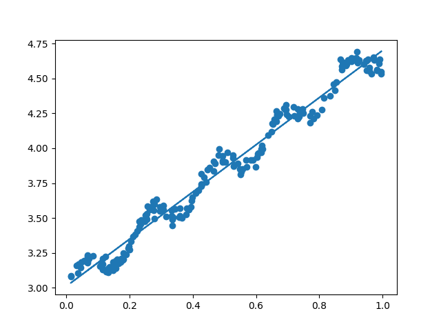

# 预测数值型数据：回归

## 线性回归

|          | 说明                     |
| -------- | ------------------------ |
| 优点     | 结果易于理解，计算较简单 |
| 缺点     | 对非线性数据拟合不好     |
| 适用类型 | 数值型和标称型数据       |

预测数值与分类的区别是，分类得到的是**离散的数据标签**而预测数值得到的是**连续型的数据**。

### 最佳拟合直线

预测数值最直接的办法就是依据输入写出一个目标值的计算公式，比如计算速度：
$$
v=v_0+at
$$
其中加速度a也就是回归系数，v0可以看做是回归系数为1的项，这样只要输入初速度和当前时间就可以求得当前的速度。


那么如何去确定一个合适的回归系数呢？


#### **普通最小二乘法OLS**

假定输入的数据矩阵为X，回归系数为w，则预测结果Y：
$$
Y=X^Tw
$$
要找到合适的w常见的方法就是找出一个使得预测值与真实值误差最小的w，因此采用平方误差：
$$
\sum_{i=1}^{m}{(y_i-x^T_iw)^2}
$$
还可以写作：
$$
(y-Xw)^T(y-Xw)
$$
对w求导并令其等于0,解得w如下：
$$
w=(X^TX)^{-1}X^Ty
$$
此时求出的w可能并非是实际值，它仅仅只是当前的最佳估计。同时，注意到式子中存在对矩阵求逆的操作，因此当且仅当逆矩阵存在时，上式成立。


#### **标准回归函数**

```python
# 计算最佳拟合直线
def stand_regress(x_arr, y_arr):
    x_mat = np.mat(x_arr)
    y_mat = np.mat(y_arr).T
    xTx = x_mat.T * x_mat

    #  如果行列式的值为0，则不可逆,无法求w
    if np.linalg.det(xTx) == 0.0:
        print("矩阵不可逆")
        return

    ws = xTx.I * (x_mat.T * y_mat)

    return ws
```

### 评价标注

为了评价拟合直线的效果好坏，我们需要计算预测值序列与真实值序列的匹配程度，也就是计算二者的相关系数。

在pyhton中可以使用nump库中的`corrcoef(y_est, y_actual)`函数去计算二者之间的相关系数。

### 示例ex0

```python
import numpy as np


def load_data_set(file_name):
    num_feat = len(open(file_name).readline().split('\t')) - 1
    data_mat = []
    label_mat = []
    f = open(file_name)

    for line in f.readlines():
        line_arr = []
        cur_line = line.strip().split('\t')
        for i in range(num_feat):
            line_arr.append(float(cur_line[i]))
        data_mat.append(line_arr)
        label_mat.append(float(cur_line[-1]))

    return data_mat, label_mat


# 计算最佳拟合直线
def stand_regress(x_arr, y_arr):
    x_mat = np.mat(x_arr)
    y_mat = np.mat(y_arr).T
    xTx = x_mat.T * x_mat

    #  如果行列式的值为0，则不可逆,无法求w
    if np.linalg.det(xTx) == 0.0:
        print("矩阵不可逆")
        return

    ws = xTx.I * (x_mat.T * y_mat)
	
    return ws


def plot_data_regression(x_arr, y_arr, ws):
    import matplotlib.pyplot as plt
    fig = plt.figure()

    # 书上代码：ax.scatter(x_mat[:, 1].flatten().A[0], y_mat[:, 0].flatten().A[0])
    n = len(x_arr)
    xcord = []
    ycord = []
    for i in range(n):
        xcord.append(x_arr[i][1])
        ycord.append(y_arr[i])
    ax = fig.add_subplot(111)
    ax.scatter(xcord, ycord)

    x_mat = np.mat(x_arr)
    # x_mat.sort(0)
    y_hat = x_mat * ws
    ax.plot(x_mat[:, 1], y_hat)
    plt.show()


if __name__ == '__main__':
    data_mat, label_mat = load_data_set('ex0.txt')
    ws = stand_regress(data_mat, label_mat)
    plot_data_regression(data_mat, label_mat, ws)
    y_hat = np.mat(data_mat) * ws
    # 计算相关系数
    print(np.corrcoef(y_hat.T, np.mat(label_mat)))

```

**运行结果**



拟合系数矩阵


上述矩阵表明预测值和真实值之间的相关系数为0.98，其中矩阵中(i,j)位上的元素表示第i个与第j个元素的相关系数。

## 局部加权线性回归

因为线性回归求的是具有小均方误差的无偏估计，它有可能出现欠拟合现象，所以有些方法允许在估计中引入一些偏差，从而降低预测的均方误差。

一种方法是局部加权线性回归(Locally Weighted Linear Regression，LWLR)。在该方法中，我们给待预测点附近的每个点赋予一定的权重。该算法解除回归系数W的形式如下：
$$
w=(X^TX)^{-1}X^TWy
$$
其中W是一个矩阵，用来给每个数据点赋予权重。

LWLR使用“核”来对点赋予权重，越近的点权重会越大。最常用的核是高斯核，对应如下：
$$
W(i,i)=exp(\frac{|x^{(i)}-x|}{-2k^2})
$$
权重矩阵W仅有对角线元素组成，在使用时需要指定参数k。

### 局部加权线性回归函数

```python
# 局部加权线性回归函数LWLR
def lwlr(test_point, x_arr, y_arr, k=1.0):
    x_mat = np.mat(x_arr)
    y_mat = np.mat(y_arr).T
    m, n = x_mat.shape
    weights = np.mat(np.eye(m))             # eye(m)用于创建一个m*m的对角矩阵，对角线上值全为1

    for i in range(m):
        diff_mat = test_point - x_mat[i, :]
        weights[i,i] = np.exp(diff_mat*diff_mat.T/(-2.0*k**2))  # |diff_mat| = diff_mat*diff_mat.T

    # 计算拟合直线
    xTx = x_mat.T * (weights * x_mat)
    if np.linalg.det(xTx) == 0.0:
        print("矩阵不可逆")
        return

    ws = xTx.I * (x_mat.T * (weights * y_mat))

    return test_point * ws


# 对每个点调用lwlr进行估计
def lwlr_test(test_arr, x_arr, y_arr, k=1.0):
    m = len(test_arr)
    y_hat = np.zeros(m)
    for i in range(m):
        y_hat[i] = lwlr(test_arr[i], x_arr, y_arr, k)
    return y_hat
```

**运行结果**

当k越小，拟合效果越好。但是当k过小，会出现过拟合的情况，例如k等于0.003的时候。

### 示例 预测鲍鱼的年龄

```python
import numpy as np


def load_data_set(file_name):
    num_feat = len(open(file_name).readline().split('\t')) - 1
    data_mat = []
    label_mat = []
    f = open(file_name)

    for line in f.readlines():
        line_arr = []
        cur_line = line.strip().split('\t')
        for i in range(num_feat):
            line_arr.append(float(cur_line[i]))
        data_mat.append(line_arr)
        label_mat.append(float(cur_line[-1]))

    f.close()
    return np.array(data_mat), np.array(label_mat)


# 局部加权线性回归函数LWLR
def lwlr(test_point, x_arr, y_arr, k=1.0):
    x_mat = np.mat(x_arr)
    y_mat = np.mat(y_arr).T
    m, n = x_mat.shape
    weights = np.mat(np.eye(m))             # eye(m)用于创建一个m*m的对角矩阵，对角线上值全为1

    for i in range(m):
        diff_mat = test_point - x_mat[i, :]
        weights[i,i] = np.exp(diff_mat*diff_mat.T/(-2.0*k**2))  # |diff_mat| = diff_mat*diff_mat.T

    # 计算拟合直线
    xTx = x_mat.T * (weights * x_mat)
    if np.linalg.det(xTx) == 0.0:
        print("矩阵不可逆")
        return

    ws = xTx.I * (x_mat.T * (weights * y_mat))
    y_hat = test_point * ws
    return y_hat


# 对每个点进行估计
def lwlr_test(test_arr, x_arr, y_arr, k=1.0):
    m = len(test_arr)
    y_hat = np.zeros(m)
    for i in range(m):
        y_hat[i] = lwlr(test_arr[i], x_arr, y_arr, k)
    return y_hat


def rss_error(y_arr, y_hat_arr):
    return ((y_arr - y_hat_arr) ** 2).sum()


if __name__ == '__main__':
    data_mat, label_mat = load_data_set('abalone.txt')
    y_hat_01 = lwlr_test(data_mat[0:99], data_mat[0:99], label_mat[0:99], 0.1)
    y_hat_1 = lwlr_test(data_mat[0:99], data_mat[0:99], label_mat[0:99], 1)
    y_hat_10 = lwlr_test(data_mat[0:99], data_mat[0:99], label_mat[0:99], 10)
    print("训练误差：")
    print('k=0.1时,误差大小为:',rss_error(label_mat[0:99], y_hat_01.T))
    print('k=1时,误差大小为:',rss_error(label_mat[0:99], y_hat_1.T))
    print('k=10时,误差大小为:',rss_error(label_mat[0:99], y_hat_10.T))

    y_hat_01 = lwlr_test(data_mat[100:199], data_mat[0:99], label_mat[0:99], 0.1)
    y_hat_1 = lwlr_test(data_mat[100:199], data_mat[0:99], label_mat[0:99], 1)
    y_hat_10 = lwlr_test(data_mat[100:199], data_mat[0:99], label_mat[0:99], 10)
    print("测试误差：")
    print('k=0.1时,误差大小为:',rss_error(label_mat[100:199], y_hat_01.T))
    print('k=1时,误差大小为:',rss_error(label_mat[100:199], y_hat_1.T))
    print('k=10时,误差大小为:',rss_error(label_mat[100:199], y_hat_10.T))

    ws = stand_regress(data_mat[0:99], label_mat[0:99])
    y_hat = np.mat(data_mat[100:199]) * ws
    print('简单线性回归的误差：', rss_error(label_mat[100:199], y_hat.T.A))
```

**运行结果**


从上面的结果可以看出，由于过拟合的原因，虽然较小的核在训练时可以做到更小的误差，但是在新数据集的表现上不一定能达到最好的效果。

除此之外，简单的线性回归做到了与局部加权线性回归接近的效果，说明模型的好坏必须在比较在未知数据集上的表现。

## 缩减系数来理解数据

当数据的**特征比样本多**时（n>m），再用上述方法就无法求解，因为此时的数据矩阵X不是一个满秩的矩阵，在计算X<sup>T</sup>X的逆是会出错。因此需要对特征进行缩减。


### 岭回归

岭回归就是在矩阵X<sup>T</sup>X上再加上一个λI矩阵，使得矩阵 X<sup>T</sup>X+λI 可逆，其中I是一个m阶的单位矩阵，λ是用户定义的一个值。通过引入λ来限制所有w之和，通过引入该惩罚项来减少不必要的参数，这个技术在统计学上就叫做**缩减**。此时回归系数w的计算公式为：
$$
w=(X^TX+\lambda I)^{-1}X^Ty
$$


**岭回归函数**

```python
# 岭回归
def ridge_regress(x_mat, y_mat, lam=0.2):
    xTx = x_mat.T * x_mat
    # denom = xTx + λI
    denom = xTx + np.eye(np.shape(x_mat)[1]) * lam
    if np.linalg.det(denom) == 0.0:
        print("矩阵不可逆")
        return
    ws = denom.I * (x_mat.T * y_mat)
    return ws


def ridgeTest(x_arr, y_arr):
    x_mat = np.mat(x_arr)
    y_mat = np.mat(y_arr).T
    y_mean = np.mean(y_mat, 0)

    # 将 y 向量中的每个样本减去均值，消除截距项的影响
    y_mat = y_mat - y_mean

    # 计算自变量各个特征的均值和方差
    x_means = np.mean(x_mat, 0)
    x_var = np.var(x_mat, 0)
    # 对自变量进行标准化
    x_mat = (x_mat - x_means) / x_var

    # 初始化权重矩阵30*n
    num_test_pts = 30
    w_mat = np.zeros((num_test_pts, np.shape(x_mat)[1]))

    # 循环计算不同λ下的权重系数
    for i in range(num_test_pts):
        ws = ridge_regress(x_mat, y_mat, np.exp(i - 10))
        w_mat[i, :] = ws.T
    return w_mat
```

计算不同λ下的回归系数

```python
if __name__ == '__main__':
    data_mat, label_mat = load_data_set('abalone.txt')
    ridge_w = ridgeTest(data_mat, label_mat)
    import matplotlib.pyplot as plt
    fig = plt.figure()
    ax = fig.add_subplot(111)
    ax.plot(ridge_w)
    plt.show()
```

运行结果如下


当λ的值较小时，可以得到与线性回归一致的原始值，而当λ变大时，系数全部会减为0。因此中间部分的某值可以得到最好的预测结果。


### lasso

[Lasso—原理及最优解 - 知乎 (zhihu.com)](https://zhuanlan.zhihu.com/p/116869931)

岭回归的限制条件是：
$$
\sum_{k=1}^{n}w_k^2≤\lambda
$$
lasso方法的限制条件是：
$$
\sum_{k=1}^{n}|w_k|≤\lambda
$$
在使用岭回归，对于不重要的系数w<sub>i</sub>的估计可能不够小，而用lasso方法，可以更好把这些不重要变量的系数压缩为0，既实现了较为准确的参数估计，也实现了变量选择（降维）。

但是lasso方法需要使用二次规划算法，计算复杂度极高。


### 前向逐步回归

前向逐步回归可以得到类似lasso差不多的结果，但是更为简单。它属于一种贪心算法，每一步都尽可能地减小误差即每一次都对某一个权重增加或者减少一个很小的值。

```python
# 逐步线性回归
def stage_wise(x_arr, y_arr, eps=0.01, num_it=100):
    x_mat = np.mat(x_arr)
    y_mat = np.mat(y_arr).T
    y_mean = np.mean(y_mat, 0)
    y_mat = y_mat - y_mean

    # 对 x 矩阵进行正则化处理
    x_mat = regularize(x_mat)
    m, n = np.shape(x_mat)
    return_mat = np.zeros((num_it, n))
    ws = np.zeros((n, 1))
    ws_test = ws.copy()
    ws_max = ws.copy()
    for i in range(num_it):
        print(ws.T)
        lowest_error = np.inf
        for j in range(n):
            for sign in [-1, 1]:
                ws_test = ws.copy()
                # 向两个方向微调回归系数
                ws_test[j] += eps * sign
                y_test = x_mat * ws_test
                # 计算预测值与实际值之间的误差
                rss_e = rss_error(y_mat.A, y_test.A)
                if rss_e < lowest_error:
                    lowest_error = rss_e
                    ws_max = ws_test
        ws = ws_max.copy()
        return_mat[i, :] = ws.T
    return return_mat
```

## 示例 预测乐高玩具价格

**数据的获取**

直接读取.html文件的内容

```python
# 从页面读取数据，生成retX和retY列表
def scrape_page(retX, retY, in_file, yr, num_pce, orig_prc):
    # 打开并读取HTML文件
    fr = open(in_file, encoding='utf-8')
    soup = BeautifulSoup(fr.read(), 'html.parser')
    i = 1

    # 根据HTML页面结构进行解析
    current_row = soup.findAll('table', r="%d" % i)
    while len(current_row) != 0:
        current_row = soup.findAll('table', r="%d" % i)
        title = current_row[0].findAll('a')[1].text
        lwrTitle = title.lower()

        # 查找是否有全新标签
        if (lwrTitle.find('new') > -1) or (lwrTitle.find('nisb') > -1):
            new_flag = 1.0
        else:
            new_flag = 0.0

        # 查找是否已经标志出售，我们只收集已出售的数据
        sold_unicde = current_row[0].findAll('td')[3].findAll('span')
        if len(sold_unicde) == 0:
            print("item #%d did not sell" % i)
        else:
            # 解析页面获取当前价格
            soldPrice = current_row[0].findAll('td')[4]
            price_str = soldPrice.text
            price_str = price_str.replace('$', '')  # strips out $
            price_str = price_str.replace(',', '')  # strips out ,
            if len(soldPrice) > 1:
                price_str = price_str.replace('Free shipping', '')
            selling_price = float(price_str)

            # 去掉不完整的套装价格
            if selling_price > orig_prc * 0.5:
                print("%d\t%d\t%d\t%f\t%f" % (yr, num_pce, new_flag, orig_prc, selling_price))
                retX.append([yr, num_pce, new_flag, orig_prc])
                retY.append(selling_price)
        i += 1
        current_row = soup.findAll('table', r="%d" % i)


# 设置数据集的信息
# 依次读取六种乐高套装的数据，并生成数据矩阵
def set_data_collect(retX, retY):
    scrape_page(retX, retY, 'setHtml/lego8288.html', 2006, 800, 49.99)
    scrape_page(retX, retY, 'setHtml/lego10030.html', 2002, 3096, 269.99)
    scrape_page(retX, retY, 'setHtml/lego10179.html', 2007, 5195, 499.99)
    scrape_page(retX, retY, 'setHtml/lego10181.html', 2007, 3428, 199.99)
    scrape_page(retX, retY, 'setHtml/lego10189.html', 2008, 5922, 299.99)
    scrape_page(retX, retY, 'setHtml/lego10196.html', 2009, 3263, 249.99)
```

**使用交叉验证**

```python
# 交叉验证函数
def cross_validation(x_arr, y_arr, num_val=10):
    # 获得数据点个数，x_arr和y_arr具有相同长度
    m = len(y_arr)
    index_list = list(range(m))
    error_mat = np.zeros((num_val, 30))

    # 主循环 交叉验证循环
    for i in range(num_val):
        # 随机拆分数据，将数据分为训练集（90%）和测试集（10%）
        train_x = []
        train_y = []
        test_x = []
        test_y = []

        # 对数据进行混洗操作
        np.random.shuffle(index_list)
        # 切分训练集和测试集
        for j in range(m):
            if j < m * 0.9:
                train_x.append(x_arr[index_list[j]])
                train_y.append(y_arr[index_list[j]])
            else:
                test_x.append(x_arr[index_list[j]])
                test_y.append(y_arr[index_list[j]])

        # 获得回归系数矩阵
        w_mat = ridge_test(train_x, train_y)
        # 循环遍历矩阵中的30组回归系数
        for k in range(30):
            # 读取训练集和数据集
            mat_test_x = np.mat(test_x)
            mat_train_x = np.mat(train_x)
            # 对数据进行标准化
            mean_train = np.mean(mat_train_x, 0)
            var_train = np.var(mat_train_x, 0)
            mat_test_x = (mat_test_x - mean_train) / var_train
            # 测试回归效果并存储
            y_est = mat_test_x * np.mat(w_mat[k, :]).T + np.mean(train_y)
            # 计算误差
            error_mat[i, k] = ((y_est.T.A - np.array(test_y)) ** 2).sum()


    # 计算误差估计值的均值
    mean_errors = np.mean(error_mat, 0)
    minMean = float(min(mean_errors))
    best_weights = w_mat[np.nonzero(mean_errors == minMean)]

    # 不要使用标准化的数据，需要对数据进行还原来得到输出结果
    x_mat = np.mat(x_arr)
    y_mat = np.mat(y_arr).T
    mean_x = np.mean(x_mat, 0)
    var_x = np.var(x_mat, 0)
    un_reg = best_weights / var_x

    # 输出构建的模型
    print("使用 Ridge 回归得到的最佳模型为:\n", un_reg)
    print("常数项为: ", -1 * sum(np.multiply(mean_x, un_reg)) + np.mean(y_mat))
```

**结果**

