# 使用FP-growth算法来高效发现频繁项集

## FP-growth算法

|              | 描述                                   |
| ------------ | -------------------------------------- |
| 优点         | 一般要快与Aprioti算法                  |
| 缺点         | 实现比较困难，在某些数据集上性能会下降 |
| 适用数据类型 | 标称型                                 |

**Apriori算法**：

回顾Apriori算法基本思想是：

(1) 先搜索出1项集及其对应的支持度，删除低于支持度的项集，得到频繁1项集L1；
(2) 对L1中的项集进行连接，得到一个候选集，删除其中低于支持度的项集，得到频繁1项集L2；
…
迭代下去，一直到无法找到L(k+1)为止，对应的频繁k项集集合就是最后的结果。

Apriori算法的缺点是对于候选项集里面的每一项都要扫描一次数据，从而需要**多次扫描数据**，效率低。为了解决这个问题，FP-growth算法采用了一些技巧，无论多少数据，只需要**扫描两次数据集**，因此提高了算法运行的效率。


**FP-Growth**算法发现频繁项集的过程包括：

1. 构建FP树
2. 从FP树中找出频繁项集


### 构建FP树

FP树和一般的树没有太大的差别，如下图所示：

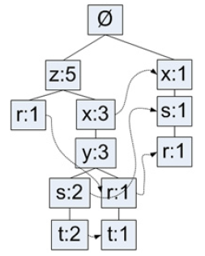

树的根节点为空，其它节点包含一个节点名称（这里是英文字母）和对应的出现次数，相同节点名称之间还有一个指针链接，这样可以容易找到相同的节点。

FP树在构建的时候会先筛选掉支持度低于阈值的项集，也就是非频繁项集。

#### 项头表

为了便于计算，需要一个头指针表（项头表）用来指向给定类型的第一个实例，

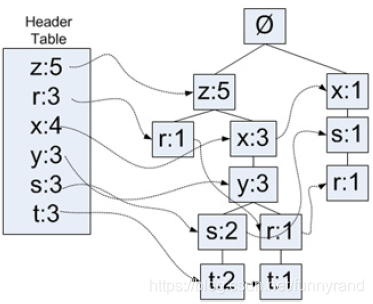

构建FP树的过程是，先计算数据集中的每个元素出现的频率，如果元素不满足最小支持度，则删掉此元素。然后对每个子集中的元素，按照元素出现的次数排序，例如：现有10条数据，**首先第一次扫描数据并对1项集计数，发现O，I，L，J，P，M, N都只出现一次，支持度低于20%的阈值，因此他们不会出现在下面的项头表中。**剩下的A,C,E,G,B,D,F按照支持度的大小降序排列，组成了项头表。

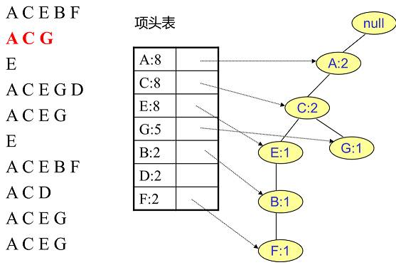

#### 构建树

开始构建FP树，从空树开始，不断增加FP树（让其生长），如果树中已经存在现有元素，则增加值，否则向树中增加一个分支。

这里继续沿用上面项头表的数据来作为示例。

首先，需要插入的第一条数据是ACEBF。此时FP树没有节点，因此ACEBF是一个独立的路径，所有节点计数为1, 项头表通过节点链表链接上对应的新增节点。

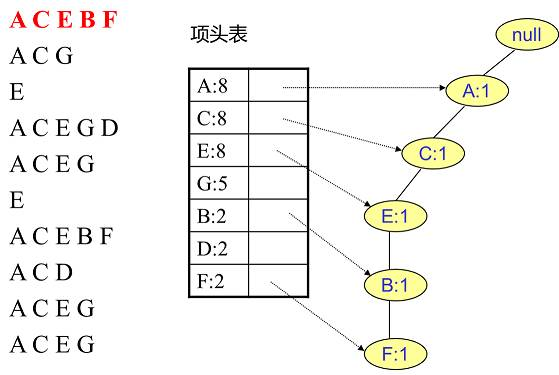

下一条数据是ACG。由于ACG和现有的FP树可以有共有的父节点序列AC，因此只需要增加一个新节点G，将新节点G的计数记为1。同时A和C的计数加1成为2。当然，对应的G节点的节点链表要更新。


同样的方式可以将剩下的8条数据读入，这里就不一一列举，下图是构建后的结果。

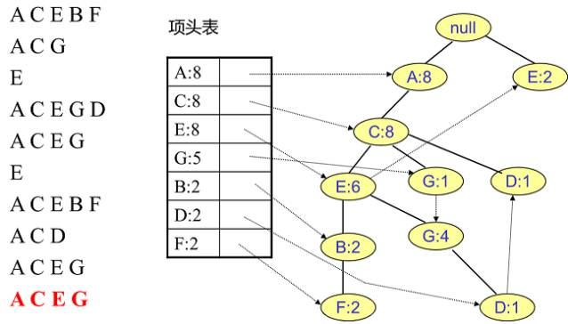

#### 代码

```python
class tree_node:
    def __init__(self, name, num_occur, parent_node):
        self.name = name  # 节点名称
        self.count = num_occur  # 计数
        self.node_link = None  # 链接到相似节点的链接
        self.parent = parent_node  # 父节点
        self.children = {}  # 子节点的字典

    def inc(self, num_occur):
        self.count += num_occur  # 计数增加

    def disp(self, ind=1):
        print('  ' * ind, self.name, ' ', self.count)
        for child in self.children.values():
            child.disp(ind + 1)


def create_tree(data_set, min_sup=1):
    header_table = {}  # 头表，存储频繁项及其出现次数
    for trans in data_set:
        for item in trans:
            header_table[item] = header_table.get(item, 0) + data_set[trans]

    # 删除不满足最小支持度的项
    for k in list(header_table.keys()):
        if header_table[k] < min_sup:
            header_table.pop(k)

    # 剩余频繁项集
    freq_item_set = set(header_table.keys())
    # 如果频繁项集为空，则返回空
    if len(freq_item_set) == 0:
        return None, None  
    
    for k in header_table:
        header_table[k] = [header_table[k], None]  # 初始化头表项
    ret_tree = tree_node('Null Set', 1, None)  # 创建根节点
    for tran_set, count in data_set.items():
        local_dataset = {}
        for item in tran_set:
            if item in freq_item_set:
                local_dataset[item] = header_table[item][0]  # 获取本地数据集
        if len(local_dataset) > 0:
            ordered_items = [v[0] for v in sorted(local_dataset.items(), key=lambda p: p[1], reverse=True)]  # 排序本地数据集
            update_tree(ordered_items, ret_tree, header_table, count)  # 更新树
    return ret_tree, header_table


def update_tree(items, in_tree, header_table, count):
    if items[0] in in_tree.children:
        in_tree.children[items[0]].inc(count)
    else:
        in_tree.children[items[0]] = tree_node(items[0], count, in_tree)  # 创建新节点
        if header_table[items[0]][1] is None:
            header_table[items[0]][1] = in_tree.children[items[0]]  # 更新头表
        else:
            update_header(header_table[items[0]][1], in_tree.children[items[0]])


def update_header(node_to_test, target_node):
    while node_to_test.node_link is not None:
        node_to_test = node_to_test.node_link
    node_to_test.node_link = target_node  # 更新链表
```

**简单的数据集及数据包装器**

```python
def load_simp_dat():
    simp_data = [['r', 'z', 'h', 'j', 'p'],
                 ['z', 'y', 'x', 'w', 'v', 'u', 't', 's'],
                 ['z'],
                 ['r', 'x', 'n', 'o', 's'],
                 ['y', 'r', 'x', 'z', 'q', 't', 'p'],
                 ['y', 'z', 'x', 'e', 'q', 's', 't', 'm']]
    return simp_data

def create_init_set(data_set):
    ret_dict = {}
    for trans in data_set:
        ret_dict[frozenset(trans)] = 1
    return ret_dict
```

**效果展示**

```python
def load_simp_dat():
    simp_data = [['r', 'z', 'h', 'j', 'p'],
                 ['z', 'y', 'x', 'w', 'v', 'u', 't', 's'],
                 ['z'],
                 ['r', 'x', 'n', 'o', 's'],
                 ['y', 'r', 'x', 'z', 'q', 't', 'p'],
                 ['y', 'z', 'x', 'e', 'q', 's', 't', 'm']]
    return simp_data

def create_init_set(data_set):
    ret_dict = {}
    for trans in data_set:
        ret_dict[frozenset(trans)] = 1
    return ret_dict


if __name__ == '__main__':
    # 简单数据集
    simp_dat = load_simp_dat()
    init_set = create_init_set(simp_dat)
    my_fp_tree, my_heat_tabel = create_tree(init_set, 3)
    my_fp_tree.disp()
```

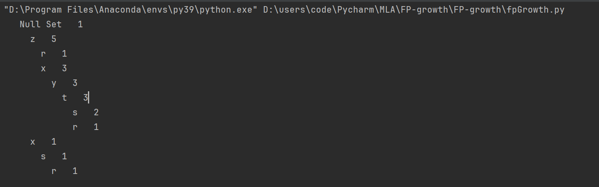

### 从一颗FP树种挖掘数据集

从FP树中发现频繁项集包含下面三个步骤：

1. 从FP树中获取条件模式基
2. 利用条件模式基构建一个条件FP树
3. 迭代重复步骤1和步骤2，直到树包含一个元素为止

#### 条件模式基

得到了FP树和项头表以及节点链表，首先要从项头表的**底部项依次向上挖掘**。对于项头表对应于FP树的每一项，我们要找到它的条件模式基。

所谓**条件模式基**是以条件模式基是以所有查询元素项为结尾的路径集合。每一条路径都是一条前缀路径，继续以上面的例子为例：


要底部项依次向上挖掘，因此先从**最底下的F节点**开始。

寻找F节点的条件模式基，由于F在FP树中只有一个节点，因此候选就只有下图左所示的一条路径，对应`{A:8,C:8,E:6,B:2, F:2}`。**接着将所有的祖先节点计数设置为叶子节点的计数**，即FP子树变成`{A:2,C:2,E:2,B:2, F:2}`。一般地，条件模式基可以不写叶子节点，因此最终的F的条件模式基如下图右所示。

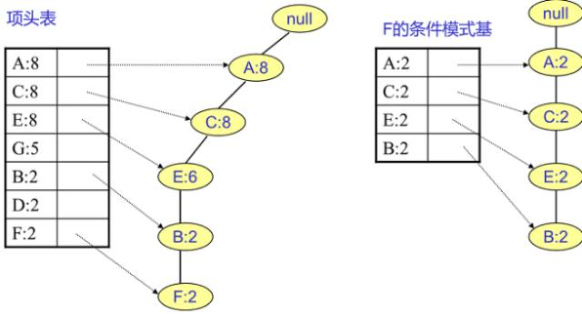

通过它很容易得到F的频繁2项集为`{A:2,F:2}`, `{C:2,F:2}`, `{E:2,F:2}`, `{B:2,F:2}`。递归合并二项集，得到频繁三项集为`{A:2,C:2,F:2}`，`{A:2,E:2,F:2}`, ... 。一直递归下去，最大的频繁项集为频繁5项集，为`{A:2,C:2,E:2,B:2,F:2}`。


F的上一个是D节点。**D节点比F节点复杂一些，因为它有两个叶子节点。**

首先得到的FP子树如下图。接着将所有的祖先节点计数设置为叶子节点的计数，即变成`{A:2, C:2,E:1 G:1,D:1, D:1}`此时E节点和G节点由于在条件模式基里面的支持度低于阈值，被我们删除，最终在去除低支持度节点并不包括叶子节点后D的条件模式基为`{A:2, C:2}`。通过它，我们很容易得到D的频繁2项集为`{A:2,D:2}`, `{C:2,D:2}`。递归合并二项集，得到频繁三项集为`{A:2,C:2,D:2}`。D对应的最大的频繁项集为频繁3项集。

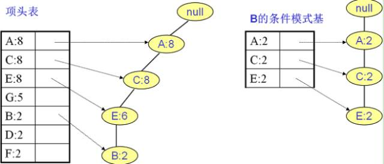

同理可得另一颗子树，如下图。递归挖掘到B的最大频繁项集为频繁4项集`{A:2, C:2, E:2,B:2}`。


按照上面的流程，我们就可以得到所有的频繁项集。

#### 创建条件FP树

对于每一个频繁项，都要创建一个条件FP树。例如，假定为频繁项 t 创建一个条件FP树，首先会得到（t，x），（t，y），（t，z），

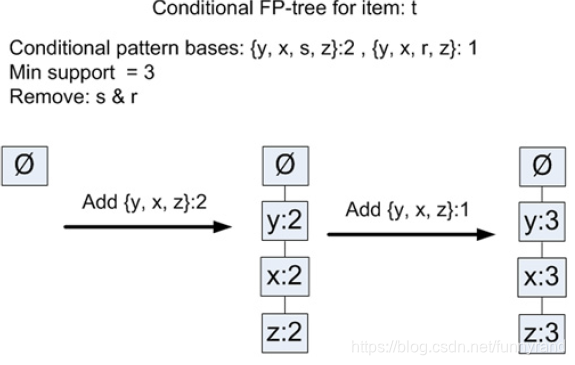

由于s和r不满足最小支持度3，因此需要去掉，可以看出（t，s）和（t，r）的组合并不满足最小支持度，虽然单独的s或t都满足最小支持度3。得到（t，z），（t，y），（t，x）以后，需要进一步挖掘对应的条件树，这会产生更多复杂的频繁项。

#### 代码

```python
def ascend_tree(leaf_node, pre_fix_path):
    # 如果叶子节点有父节点，则向上遍历至根节点，并记录路径
    if leaf_node.parent is not None:
        pre_fix_path.append(leaf_node.name)  # 将当前节点名称添加到路径中
        ascend_tree(leaf_node.parent, pre_fix_path)  # 递归向上遍历父节点


# 发现以给定元素项为结尾的所有路径
def find_pre_fix_path(base_pat, tree_node):
    cond_pats = {}  # 条件模式基
    while tree_node is not None:
        pre_fix_path = []  # 前缀路径
        ascend_tree(tree_node, pre_fix_path)  # 调用ascend_tree函数获取路径
        if len(pre_fix_path) > 1:
            cond_pats[frozenset(pre_fix_path[1:])] = tree_node.count  # 存储以给定元素项为结尾的路径和对应的计数
        tree_node = tree_node.node_link  # 移动到下一个相似节点
    return cond_pats


# 递归查找频繁项集的minTree
def mine_tree(in_tree, header_table, min_sup, pre_fix, freq_item_list):
    bigL = [v[0] for v in sorted(header_table.items(), key=lambda p: p[1][0])]  # 根据头表项的计数排序

    # 从低到高排序之后，遍历bigL中的每一项，即自底向上
    for base_pat in bigL:
        new_freq_set = pre_fix.copy()  # 复制前缀
        new_freq_set.add(base_pat)  # 添加当前项作为新的频繁项集
        freq_item_list.append(new_freq_set)  # 将新的频繁项集添加到列表中

        # 根据当前项生成条件模式基
        cond_patt_bases = find_pre_fix_path(base_pat, header_table[base_pat][1])
        # 创建条件FP树
        my_cond_tree, my_head = create_tree(cond_patt_bases, min_sup)
        if my_head is not None:
            # 递归挖掘条件FP树
            mine_tree(my_cond_tree, my_head, min_sup, new_freq_set, freq_item_list)

```

**效果展示**

```python
if __name__ == '__main__':

    # 挖掘频繁项目
    simp_dat = load_simp_dat()
    init_set = create_init_set(simp_dat)
    my_fp_tree, my_heat_tabel = create_tree(init_set, 3)
    freq_items = []
    mine_tree(my_fp_tree, my_heat_tabel, 3, set([]), freq_items)
    print("Frequent items:")
    print(freq_items)
```

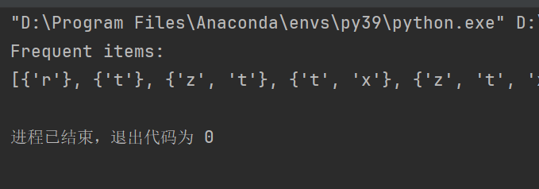

## 示例 从新闻网站点击流中挖掘

```python
if __name__ == '__main__':
    # 从新闻网站点击流中发掘
    with open('kosarak.dat') as f:
        parse_dat = [line.split() for line in f.readlines()]
    init_set = create_init_set(parse_dat)
    my_fp_tree, my_heat_tabel = create_tree(init_set, 100000)   # 查看超过十万人浏览过的新闻
    freq_list = []
    mine_tree(my_fp_tree, my_heat_tabel, 100000, set([]), freq_list)
    print(len(freq_list))
    print("Frequent list:")
    print(freq_list)

```

结果为freq_list长度为9，即有9条新闻浏览人数超过10万：

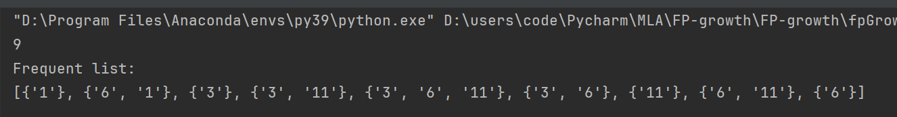