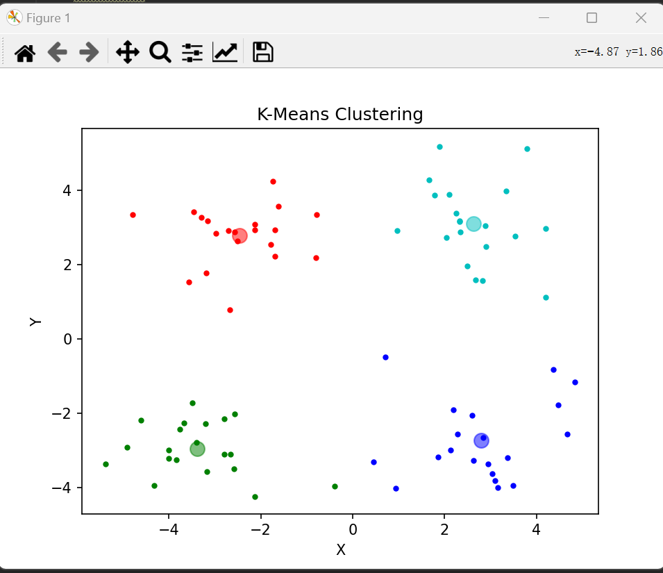
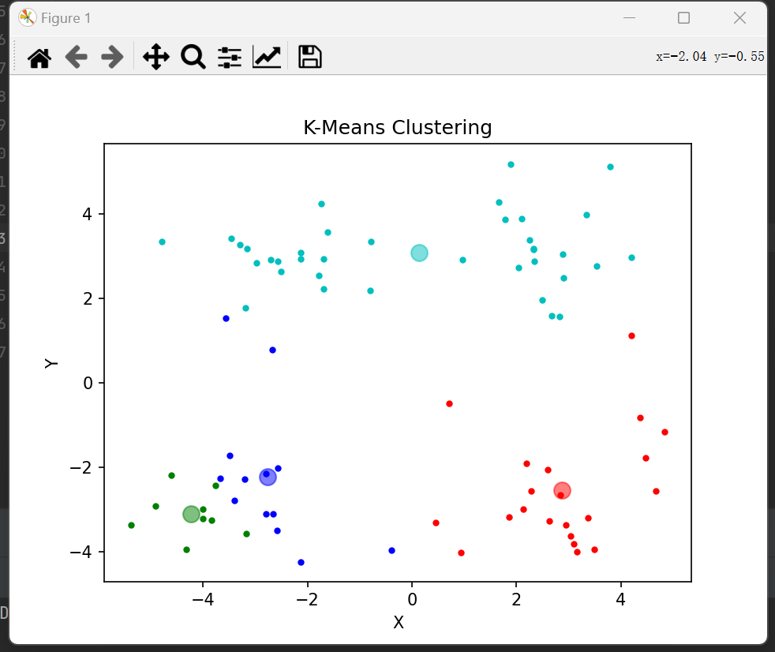
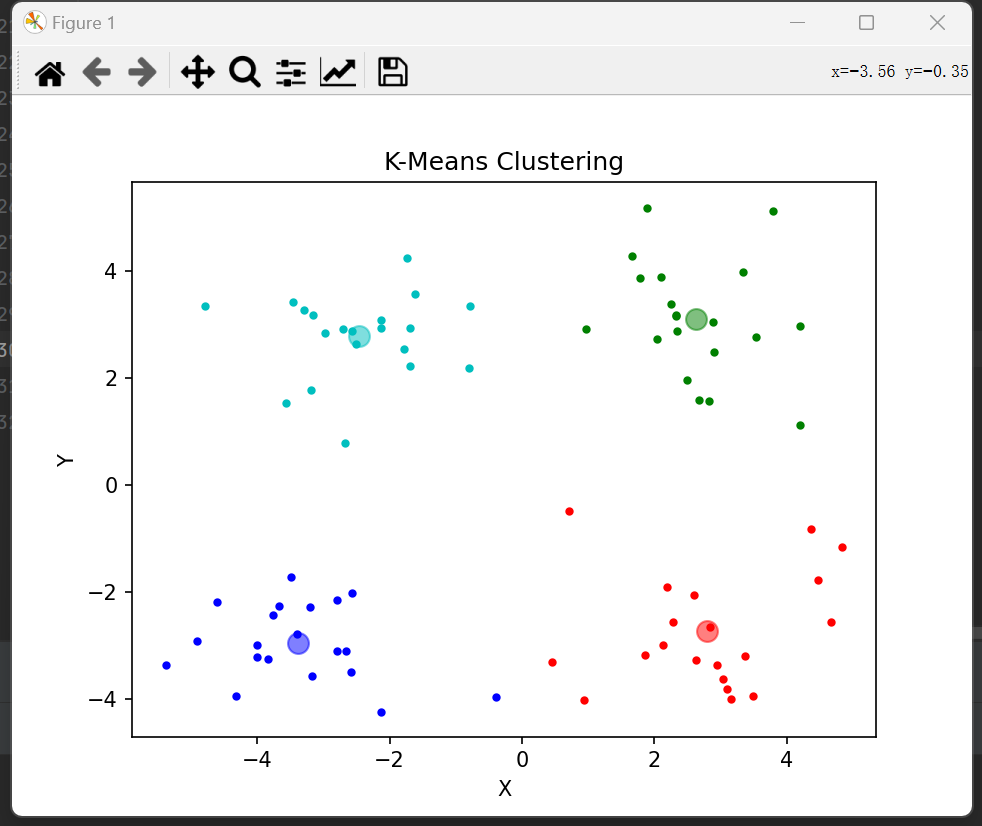
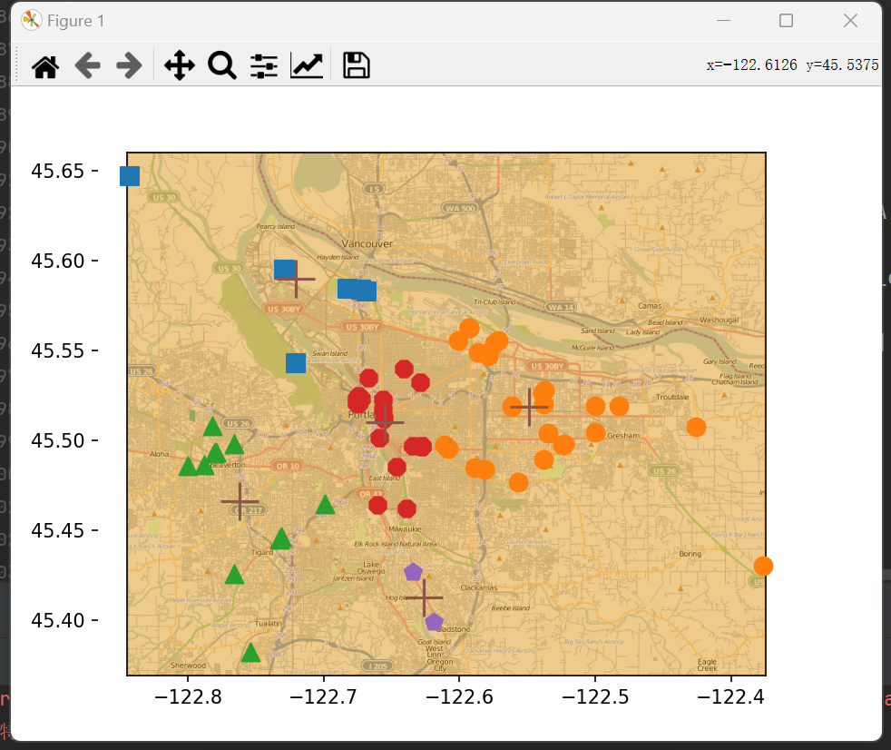
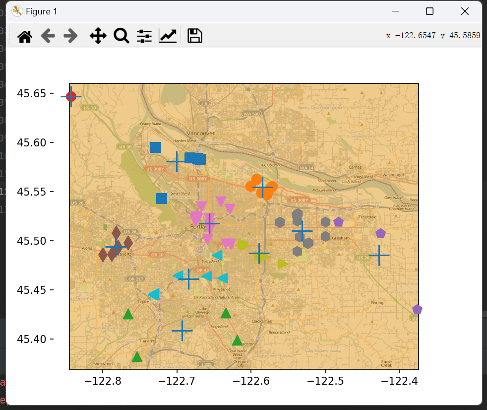

# KMeans

|          | 描述                                     |
| -------- | ---------------------------------------- |
| 优点     | 容易实现                                 |
| 缺点     | 可能收敛到局部最小值，大数据集收敛速度慢 |
| 适用类型 | 数值型                                   |

## 聚类

就是将一个庞杂数据集中具有相似特征的数据自动归类到一起，称为一个簇，簇内的对象越相似，聚类的效果越好。

它是一种**无监督的学习**方法,不需要预先标注好的训练集。聚类与分类最大的区别就是分类的目标是否事先已知，即事先知道猫和狗，把一些动物分向猫和狗以及在什么都不知道的情况下，把一些有相同特征的动物分在一起（簇），再把其中一部分叫做猫，一部分叫做狗。

## K-Means 算法

K-Means 是发现给定数据集的 K 个簇的聚类算法, 之所以称之为 K-均值 是因为它可以发现 K 个不同的簇, 且每个簇的中心采用簇中所含值的均值计算而成.簇的个数 K 是用户指定的, 每一个簇通过其质心（centroid）, 即簇中所有点的中心来描述。
聚类与分类算法的最大区别在于, 分类的目标类别已知, 而聚类的目标类别是未知的。

### K-Means 算法

```python
def load_data_set(file_name):
    data_mat = []
    with open(file_name) as fr:
        for line in fr.readlines():
            cur_line = line.strip().split('\t')
            flt_line = [float(x) for x in cur_line]  # 使用列表推导式将字符串列表转换为浮点数列表
            data_mat.append(flt_line)
    return array(data_mat)


# 计算欧式距离
def dist_eclud(vec_a, vec_b):
    return sqrt(sum(power(vec_a - vec_b, 2)))


# 随机初始化质心
def rand_cent(data_set, k):
    m, n = shape(data_set)
    centroids = mat(zeros((k, n)))  # 随机初始化质心
    for j in range(n):
        min_j = min(data_set[:, j])
        range_j = float(max(data_set[:, j]) - min_j)  # 特征值的取值范围
        centroids[:, j] = mat(min_j + range_j * random.rand(k, 1))  # 在特征值的取值范围内随机初始化质心
    return centroids


# k-means 聚类算法
def k_means(data_set, k, dist_meas=dist_eclud, create_cent=rand_cent):
    m, n = shape(data_set)
    cluster_assment = mat(zeros((m, 2)))  # 一列记录簇索引值，第二列存储误差。误差是指当前点到簇质心的距离

    centroids = create_cent(data_set, k)  # 随机创建k个质心
    cluster_changed = True
    while cluster_changed:
        cluster_changed = False
        # 循环每一个数据点
        for i in range(m):
            min_dist = inf
            min_index = -1
            # 循环每一个质心，计算距离
            for j in range(k):
                dist_ji = dist_meas(centroids[j, :], data_set[i, :])    # 计算数据点到质心的距离
                if dist_ji < min_dist:  # 如果距离比 minDist（最小距离）还小
                    min_dist = dist_ji  # 更新minDist（最小距离）
                    min_index = j       # 更新最小质心的 index（索引）
            if cluster_assment[i, 0] != min_index:  # 簇的分配结果发生了改变
                cluster_changed = True
            cluster_assment[i, :] = min_index, min_dist ** 2
        # print(centroids)

        # 更新质心
        for cent in range(k):
            pts_in_clust = data_set[nonzero(cluster_assment[:, 0].A == cent)[0]]    # 通过数据过滤来获取获得给定簇的所有的点
            centroids[cent, :] = mean(pts_in_clust, axis=0)     # 计算所有点的平均值
    return centroids, cluster_assment
```

### **结果**

下图给出了一个聚类结果的图



## 使用后处理提高聚类性能

### **算法缺陷**

在 k-Means 的函数测试中，可能偶尔会陷入局部最小值（局部最优的结果，但不是全局最优的结果）
局部最小值的的情况如下:



出现这个问题有很多原因，可能是k值取的不合适，可能是距离函数不合适，可能是最初随机选取的质心靠的太近，也可能是数据本身分布的问题。

为了解决这个问题，我们可以对生成的簇进行后处理，一种方法是将具有最大SSE值的簇划分成两个簇。具体实现时可以将最大簇包含的点过滤出来并在这些点上运行K-均值算法，令k设为2。

为了保持簇总数不变，可以将某两个簇进行合并。从上图中很明显就可以看出，应该将上图下部两个出错的簇质心进行合并。那么问题来了，我们可以很容易对二维数据上的聚类进行可视化， 但是如果遇到40维的数据应该如何去做？

有两种可以量化的办法：

- 合并最近的质心
- 合并两个使得SSE增幅最小的质心

第一种思路通过计算所有质心之间的距离， 然后合并距离最近的两个点来实现。第二种方法需要合并两个簇然后计算总SSE值。必须在所有可能的两个簇上重复上述处理过程，直到找到合并最佳的两个簇为止。

因为上述后处理过程实在是有些繁琐，所以提出了另一个称之为二分K-均值（bisecting K-Means）的算法.

## 二分K-均值算法

该算法首先将所有点作为一个簇，然后将该簇一分为二。之后选择其中一个簇继续进行划分，选择哪一个簇进行划分取决于对其划分时候可以最大程度降低 SSE（平方和误差）的值。上述基于 SSE 的划分过程不断重复，直到得到用户指定的簇数目为止。

```python
# 二分 KMeans 聚类算法
def bi_k_means(data_mat, k, dist_meas=dist_eclud):
    m,n = shape(data_mat)
    cluster_assment = mat(zeros((m, 2)))
    centroid0 = mean(data_mat, axis=0).tolist()[0]  # 质心初始化为所有数据点的均值
    cent_list = [centroid0]  # 初始化只有 1 个质心的 list

    # 计算所有数据点到初始质心的距离平方误差
    for j in range(m):
        cluster_assment[j, 1] = dist_meas(mat(centroid0), data_mat[j, :]) ** 2

    # 当质心数量小于 k 时
    while len(cent_list) < k:
        best_new_cents = mat([])
        best_clust_ass = mat([])
        best_cent_to_split = -1
        lowest_sse = inf
        # 对每一个质心
        for i in range(len(cent_list)):
            pts_in_curr_cluster = data_mat[nonzero(cluster_assment[:, 0].A == i)[0], :]  # 筛选出当前簇下的所有点
            centroid_mat, split_clust_ass = k_means(pts_in_curr_cluster, 2, dist_meas)  # 对当前簇进行二分KMeans处理
            sse_split = sum(split_clust_ass[:, 1])  # 将二分KMeans结果中的平方和的距离进行求和
            sse_not_split = sum(cluster_assment[nonzero(cluster_assment[:, 0].A != i)[0], 1])
            if (sse_split + sse_not_split) < lowest_sse:
                best_cent_to_split = i
                best_new_cents = centroid_mat
                best_clust_ass = split_clust_ass.copy()
                lowest_sse = sse_split + sse_not_split
        # 找出最好的簇分配结果
        best_clust_ass[nonzero(best_clust_ass[:, 0].A == 1)[0], 0] = len(cent_list)  # 调用二分 kMeans 的结果，默认簇是 0,
        best_clust_ass[nonzero(best_clust_ass[:, 0].A == 0)[0], 0] = best_cent_to_split  # 更新为最佳质心
        print('the best_cent_to_split is: ', best_cent_to_split)
        print('the len of best_clust_ass is: ', len(best_clust_ass))
        # 更新质心列表(二分类会选出两个质心，当前索引的质心更新为最佳质心，再添加 best_new_cents 的第二质心)
        cent_list[best_cent_to_split] = best_new_cents[0, :].tolist()[0]  # 更新
        cent_list.append(best_new_cents[1, :].tolist()[0])  # 添加 best_new_cents 的第二个质心
        cluster_assment[nonzero(cluster_assment[:, 0].A == best_cent_to_split)[0], :] = best_clust_ass  # 重新分配最好簇下的数据（质心）以及SSE
    return array(cent_list), cluster_assment
```

### 结果

多次运行程序生成的簇的质心都是比较不错的，避免了之前出现陷入局部最小值的情况。



# 示例 对地图上的点进行聚类

## 数据准备

```python
def geo_grab(stAddress, city):
    api_stem = 'http://where.yahooapis.com/geocode?'
    params = {
        'flags': 'J',
        'appid': 'aaa0VN6k',
        'location': '%s %s' % (stAddress, city)
    }
    url_params = urlencode(params)
    yahoo_api = api_stem + url_params
    print(yahoo_api)
    c = urlopen(yahoo_api)
    return json.loads(c.read().decode())


def mass_place_find(file_name):
    fw = open('places.txt', 'w', encoding='utf-8')
    for line in open(file_name, encoding='utf-8').readlines():
        line = line.strip()
        line_arr = line.split('\t')
        ret_dict = geo_grab(line_arr[1], line_arr[2])
        if ret_dict['ResultSet']['Error'] == 0:
            lat = float(ret_dict['ResultSet']['Results'][0]['latitude'])
            lng = float(ret_dict['ResultSet']['Results'][0]['longitude'])
            print("%s\t%f\t%f" % (line_arr[0], lat, lng))
            fw.write('%s\t%f\t%f\n' % (line, lat, lng))
        else:
            print("error fetching")
        sleep(1)
    fw.close()
```

## 测试算法

```python
def dist_slc(vecA, vecB):
    a = sin(vecA[0, 1] * pi / 180) * sin(vecB[0, 1] * pi / 180)
    b = cos(vecA[0, 1] * pi / 180) * cos(vecB[0, 1] * pi / 180) * \
        cos(pi * (vecB[0, 0] - vecA[0, 0]) / 180)
    return arccos(a + b) * 6371.0


# 簇绘图
def cluster_clubs(num_clust=5):
    dat_list = []
    for line in open('places.txt', 'r', encoding='utf-8').readlines():
        line_arr = line.split('\t')
        dat_list.append([float(line_arr[4]), float(line_arr[3])])
    dat_mat = mat(array(dat_list))
    my_centroids, clust_assing = bi_k_means(dat_mat, num_clust, dist_meas=dist_slc)

    fig = plt.figure()
    rect = (0.1, 0.1, 0.8, 0.8)
    scatter_markers = ['s', 'o', '^', '8', 'p', 'd', 'v', 'h', '>', '<']
    axprops = dict(xticks=[], yticks=[])
    ax0 = fig.add_axes(rect, label='ax0', **axprops)
    img_p = imread('Portland.png')
    ax0.imshow(img_p)
    ax1 = fig.add_axes(rect, label='ax1', frameon=False)
    for i in range(num_clust):
        pts_in_curr_cluster = dat_mat[np.nonzero(clust_assing[:, 0].A == i)[0], :]
        marker_style = scatter_markers[i % len(scatter_markers)]
        ax1.scatter(pts_in_curr_cluster[:, 0].flatten().A[0], pts_in_curr_cluster[:, 1].flatten().A[0], marker=marker_style,
                    s=90)
    ax1.scatter(my_centroids[:, 0].flatten().A[0], my_centroids[:, 1].flatten().A[0], marker='+', s=400)
    plt.show()
```

## 使用算法

```python
if __name__ == "__main__":
    # k-means
    # data_mat = load_data_set('testSet.txt')
    # centroids, clust_assing = k_means(data_mat, 4)
    # plot1(data_mat, centroids, clust_assing, 4)

    # bi_k_means
    # data_mat = load_data_set('testSet.txt')
    # centroids, clust_assing = bi_k_means(data_mat, 4)
    # plot1(data_mat, centroids, clust_assing, 4)

    # 地图实例
    cluster_clubs(5)
    cluster_clubs(10)
```

## 结果

K=5



K=10

