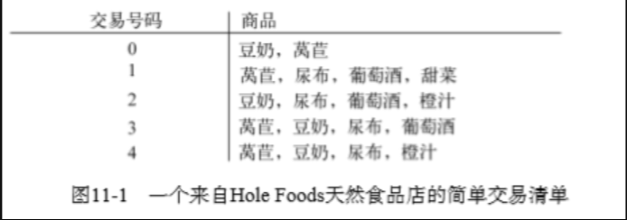
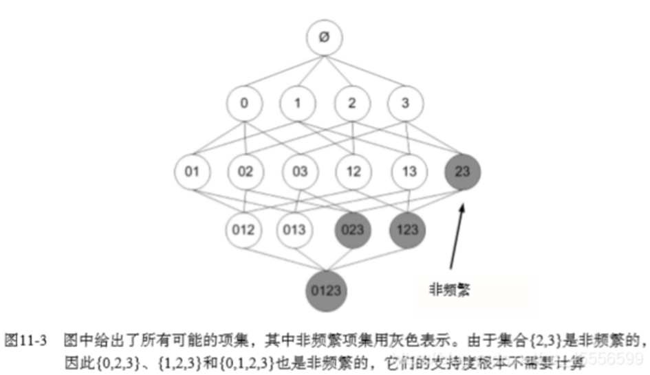

# Apriori算法

|              | 描述                 |
| ------------ | -------------------- |
| 优点         | 易编码实现           |
| 缺点         | 在大数据集上可能较慢 |
| 适用数据类型 | 数值型或标称型       |

### 关联分析

关联分析是一种在大规模数据集中寻找有趣关系的任务。 这些关系可以有两种形式:

- 频繁项集（frequent item sets）: 经常出现在一块的物品的集合。
- 关联规则（associational rules）: 暗示两种物品之间可能存在很强的关系。



 {葡萄酒, 尿布, 豆奶} 就是一个频繁项集的例子。而`尿布 -> 葡萄酒` 就是一个关联规则。这意味着如果顾客买了尿布，那么他很可能会买葡萄酒。


那么**频繁**的定义是什么呢？怎么样才算频繁呢？ 度量它们的方法有很多种，这里我们来简单的介绍下支持度和可信度。

- 支持度: 数据集中包含该项集的记录所占的比例，即P(A)
- 可信度:  {尿布} -> {葡萄酒} 的可信度 被定义为 支持度({尿布, 葡萄酒})/支持度({尿布}),即A->B的条件概率P(B|A)

例如上图中，{豆奶} 的支持度为 4/5。{豆奶, 尿布} 的支持度为 3/5。而支持度({尿布, 葡萄酒}) = 3/5，支持度({尿布}) = 4/5，所以 {尿布} -> {葡萄酒} 的可信度 = 3/5 / 4/5 = 3/4 = 0.75。


支持度 和 可信度 是用来量化 关联分析 是否成功的一个方法。 假设想找到支持度大于 0.8 的所有项集，应该如何去做呢？ 一个办法是生成一个物品所有可能组合的清单，然后对每一种组合统计它出现的频繁程度，但是当物品成千上万时，上述做法就非常非常慢了。 因此引入 Apriori 原理，该原理会减少关联规则学习时所需的计算量。

## Apriori 原理

为了降低计算次数和时间，研究人员发现了一种所谓的 Apriori 原理，即某个项集是频繁的，那么它的所有子集也是频繁的。 例如，如果 {0, 1} 是频繁的，那么 {0}, {1} 也是频繁的。 该原理直观上没有什么帮助，但是如果反过来看就有用了，也就是说如果**一个项集是非频繁项集**，那么它的所有**超集**（A是B的子集，B就称为A的超集）也是非频繁项集，如下图所示:



当我们计算出 {2,3} 的支持度，知道它是 非频繁的之后，就不需要再计算 {0,2,3} {1,2,3} {0,1,2,3} 的支持度，因为我们知道这些集合不会满足我们的要求。 使用该原理就可以避免项集数目的指数增长，从而在合理的时间内计算出频繁项集。

## 使用Apriori算法来发现频繁集

前面提到，关联分析的目标包括两项: 发现 频繁项集 和发现 关联规则。 首先需要找到 频繁项集，然后才能发现 关联规则。

Apriori 算法是发现 频繁项集 的一种方法。 Apriori 算法的两个输入参数分别是最小支持度和数据集。 该算法首先会生成所有单个物品的项集列表。 接着扫描交易记录来查看哪些项集满足最小支持度要求，那些不满足最小支持度要求的集合会被去掉。 燃尽后对生下来的集合进行组合以声场包含两个元素的项集。 接下来再重新扫描交易记录，去掉不满足最小支持度的项集。 该过程重复进行直到所有项集被去掉。

### **生成候选项集**

```python
def load_data_set():
    return [[1, 3, 4], [2, 3, 5], [1, 2, 3, 5], [2, 5]]


# 生成候选项集 C1
def load_data_set_c1(data_set):
    c1 = []  # 用于存储所有单个商品
    for transaction in data_set:
        for item in transaction:
            if [item] not in c1:
                c1.append([item])

    c1.sort()
    return list(map(frozenset, c1))


# 发现频繁项集
def load_data_set_scan(d, ck, min_support):
    ss_cnt = {}     # 选项集的支持度计

    # 遍历数据集中的每个交易和候选项集
    for tid in d:
        for can in ck:
            # 如果候选集包含在交易中，对它进行计数
            if can.issubset(tid):
                if can not in ss_cnt:
                    ss_cnt[can] = 1
                else:
                    ss_cnt[can] += 1

    num_items = float(len(d))
    ret_list = []
    support_data = {}
    for key in ss_cnt:
        support = ss_cnt[key] / num_items
        if support >= min_support:  # 选择大于最小支持度的项集
            ret_list.insert(0, key)
        support_data[key] = support
    return ret_list, support_data
```

### 完整的apriori算法

```python
# 生成候选项集 C1
def create_c1(data_set):
    c1 = []  # 用于存储所有单个商品
    for transaction in data_set:
        for item in transaction:
            if [item] not in c1:
                c1.append([item])

    c1.sort()
    return list(map(frozenset, c1))    # frozenset 表示冻结的 set 集合，元素无改变；可以把它当字典的 key 来使用


# 发现频繁项集
def scan_d(d, ck, min_support):
    ss_cnt = {}     # 选项集的支持度计

    # 遍历数据集中的每个交易和候选项集
    for tid in d:
        for can in ck:
            # 如果候选集包含在交易中，对它进行计数
            if can.issubset(tid):
                if can not in ss_cnt:
                    ss_cnt[can] = 1
                else:
                    ss_cnt[can] += 1

    num_items = float(len(d))
    ret_list = []
    support_data = {}
    for key in ss_cnt:
        support = ss_cnt[key] / num_items
        if support >= min_support:  # 选择大于最小支持度的项集
            ret_list.insert(0, key)
        support_data[key] = support
    return ret_list, support_data


# 输出所有可能的候选项集 Ck
# 例如lk={0}{1}{2},若k=2,则Ck={0,1}{0,2}{1,2};若k=3,则Ck={0,1,2}
def apriori_gen(lk, k):
    ret_list = []
    len_lk = len(lk)
    for i in range(len_lk):
        for j in range(i + 1, len_lk):
            l1 = list(lk[i])[:k - 2]
            l2 = list(lk[j])[:k - 2]
            l1.sort()
            l2.sort()
            if l1 == l2:  # if first k-2 elements are equal
                ret_list.append(lk[i] | lk[j])  # set union
    return ret_list


# Apriori 算法
def apriori(data_set, min_support=0.5):
    c1 = create_c1(data_set)    # 生成初始候选项集 C1
    d = list(map(set, data_set))  # 将数据集中的每个事务映射为集合
    l1, support_data = scan_d(d, c1, min_support)   # 扫描数据集，得到频繁项集 l1和其对应的支持度
    l = [l1]
    k = 2

    # 循环生成频繁 k-项集
    while len(l[k - 2]) > 0:    # 上一次构建出的集合CN的LN长度大于0
        ck = apriori_gen(l[k - 2], k)
        lk, sup_k = scan_d(d, ck, min_support)
        support_data.update(sup_k)  # 保存所有候选项集的支持度，如果字典没有，就追加元素，如果有，就更新元素
        l.append(lk)
        k += 1
    return l, support_data


# 生成关联规则
def generate_rules(l, support_data, min_conf=0.7):
    big_rule_list = []
    for i in range(1, len(l)):
        # 获取频繁项集中每个组合的所有元素
        for freq_set in l[i]:
            H1 = [frozenset([item]) for item in freq_set]   # 转换为只包含单个元素的集合列表
            if i > 1:   # 两个以上的组合
                rules_from_conseq(freq_set, H1, support_data, big_rule_list, min_conf)
            else:   # 只有两个的组合
                calc_conf(freq_set, H1, support_data, big_rule_list, min_conf)
    return big_rule_list


# 计算可信度
def calc_conf(freq_set, H, support_data, brl, min_conf=0.7):
    pruned_H = []
    for conseq in H:
        # 关联规则的置信度
        # freq_set - conseq 表示的是从频繁项集 freq_set 中包含在规则右部 conseq 中的元素去除，得到的新集合
        # 例如，freq_set={2, 3},conseq={3}，则规则为2->3,因此计算的是support(2,3)/support(2)
        # freq_set - conseq 表示的正是从{2,3}中去除3
        conf = support_data[freq_set] / support_data[freq_set - conseq]
        if conf >= min_conf:
            print(freq_set - conseq, '-->', conseq, 'conf:', conf)
            brl.append((freq_set - conseq, conseq, conf))
            pruned_H.append(conseq)
    return pruned_H


# 递归计算频繁项集的规则
def rules_from_conseq(freq_set, H, support_data, brl, min_conf=0.7):
    m = len(H[0])
    if len(freq_set) > (m + 1):     # 保证右部元素组合的长度能够继续增加
        hmp1 = apriori_gen(H, m+1)  # 生成新的候选项集
        hmp1 = calc_conf(freq_set, hmp1, support_data, brl, min_conf)
        if len(hmp1) > 1:
            rules_from_conseq(freq_set, hmp1, support_data, brl, min_conf)
```


